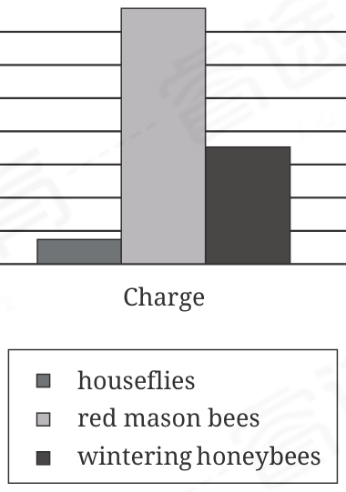

:::q {#Q001 sec=rw no=1}
@material
The unique subak water management system used to irrigate the rice paddy fields of the Indonesian island of Bali has a rich cultural, philosophical, and historical significance dating back to the ninth century. The many elements of subak—terraces, canals, and water temples—are ______ : they are joined together into a single cohesive unit.

@stem
Which choice completes the text with the most logical and precise word or phrase?

- A. informal
- B. outmoded
- C. interconnected
- D. optional
! source: p.1
! answer: C
:::

:::q {#Q002 sec=rw no=2}
@material
The minaret (or tower) is one of many features that are foundational to traditional mosque architecture and is therefore considered ______ aspect of mosque design. Even mosques that exhibit elements of multiple architectural styles, such as the Great Mosque of Central Java, which incorporates elements from the Javanese and Greek revival styles, will also include several of these standard features.

@stem
Which choice completes the text with the most logical and precise word or phrase?

- A. an embellished
- B. a quintessential
- C. an imposing
- D. an unprecedented
! source: p.1
! answer: B
:::

:::q {#Q003 sec=rw no=3}
@material
The Egyptian plover—a bird native to Africa—has a symbiotic relationship with the Nile crocodile. While a crocodile rests on land with its mouth open for extended periods of time, the plover eats the food that is stuck in the crocodile's teeth. This ______ relationship provides a nutritious meal for the bird and removes potentially dangerous bacteria from the crocodile's mouth.

@stem
Which choice completes the text with the most logical and precise word or phrase?

- A. inefficient
- B. interchangeable
- C. reciprocal
- D. unequal
! source: p.2
! answer: C
:::

:::q {#Q004 sec=rw no=4}
@material
Until 1917, there was no formal measure in the United States Senate that could be ______ to end a debate that had been excessively prolonged as a tactic to block voting on a matter. In that year, a procedure was created to allow a majority of senators to curtail deliberation and force a vote.

@stem
Which choice completes the text with the most logical and precise word or phrase?

- A. invoked
- B. abolished
- C. improvised
- D. partitioned
! source: p.2
! answer: A
:::

:::q {#Q005 sec=rw no=5}
@material
The following text is adapted from Akwaeke Emezi's 2019 novel Pet. Jam is a teenager who lives with her father, Aloe, and her mother, Bitter, who is a painter.

Bitter finished the painting in the dark morning of a day—it was well past midnight when Jam heard the studio door creak open. She stared into the velvet black of her room and listened to her mother's footsteps walking in her [mother] and Aloe's bedroom. There was a weight thrumming through the floorboards in a low song, and that was how Jam knew the painting was done. Bitter's feet were singing the news.

@stem
Which choice best states the function of the underlined sentence in the text as a whole?

- A. It indicates that Jam is more interested in music than in art.
- B. It adds to the idea that Bitter's footsteps reveal something to Jam.
- C. It describes Aloe's reaction upon seeing the painting for the first time.
- D. It indicates that Bitter always sings when working on a painting.
! source: p.3
! answer: B
:::

:::q {#Q006 sec=rw no=6}
@material
In 2011 Ingrid L. Cripps and colleagues published a study concluding that ocean acidification has a strong effect on the behavior of Pseudochromis fuscus, a species of fish. However, Cripps and colleagues' study relied on a mean sample size of only about 9 fish. In a 2022 review of various scientists' conclusions about the impacts of ocean acidification on fish behavior, Josefin Sundin and colleagues caution that relying on such a relatively small sample size can increase the potential for biased analysis. Such analysis, in turn, can contribute to reports of exaggerated effects.

@stem
Which choice best states the main purpose of the text?

- A. To discuss an aspect of ocean acidification that is frequently overlooked
- B. To explain how the behavior of a fish species has changed over time
- C. To present a debate between two research teams about a cause of ocean acidification
- D. To note a potential concern about the findings of a scientific study
! source: p.3
! answer: D
:::

:::q {#Q007 sec=rw no=7}
@material
Habitat navigation is a skill that helps animals reach food or safety. To test how navigation works in fish, Shachar Givon and colleagues taught goldfish to drive a vehicle—a motorized fish tank with wheels—on land. The vehicle was programmed to move in the same direction that the fish swam in within the tank. In the experiment, the fish were tasked with driving their tank to a pink board. They received a treat when they succeeded, and they often did. Because the fish could move their tank to the board, Givon concludes that their navigational skills aren't specific to an aquatic environment.

Examples of Hoards found in Ireland and Northern Ireland

Hoard name Date of contents Year of discovery Description

Coggalbeg Hoard 24th–19th century BCE 1945 gold pieces

Dooyork Hoard 3rd century BCE–2nd century 2001 gold, bronze, and beads

@stem
Which choice best states the main idea of the text?

- A. Fish can navigate only within their natural aquatic environment in order to find food and safety.
- B. Researchers can train animals to complete many different tasks when they offer the animals treats.
- C. Research shows that although they live in the water, fish can navigate on land with a little mechanical help.
- D. An animal's navigational skills directly depend on that animal's particular environment.
! source: p.4
! answer: C
:::

:::q {#Q008 sec=rw no=8}
@material
Coleraine Hoard 5th century CE 1854 silver pieces

Deposits of valuable objects, or hoards, have been unearthed in many different parts of Ireland and Northern Ireland. Some of these hoards were discovered before 2000; for example, ______

@stem
Which choice most effectively uses data from the table to complete the statement?

- A. the Coleraine Hoard was one of several hoards discovered in the 1800s.
- B. the Dooyork Hoard was discovered in 1945, and the Coggalbeg Hoard was discovered in 2001.
- C. the Coleraine Hoard was discovered in 1854, and the Coggalbeg Hoard was discovered in 1945.
- D. the Coggalbeg Hoard and the Dooyork Hoard were both discovered in the 2000s.
! source: p.4
! answer: C
:::

:::q {#Q009 sec=rw no=9}
@material
Banded Sand Catsharks Found in Three Sponges

Number of sharks

0 2 4 6 8 10 12 14 16 18

male

undetermined

female

sponge 1

sponge 2

sponge 3

Researcher Helen O'Neill and her team were studying sponges in the family Irciniidae when they discovered that three of the sponges were functioning as microhabitats for banded sand catsharks (Atelomycterus fasciatus). Additionally, the team found that male and female A. fasciatus share the same sponge (the same microhabitat), a behavior not found among Port Jackson sharks (Heterodontus portusjacksoni), another seabed-dwelling species.

@stem
Which choice best describes data from the graph that support the underlined claim?

- A. Each of the three sponges was inhabited by at least one male A. fasciatus and at least one undetermined A. fasciatus.
- B. Sponge 1 was inhabited by 13 female A. fasciatus.
- C. Sponge 1 was inhabited by 17 male A. fasciatus.
- D. Each of the three sponges was inhabited by at least one male A. fasciatus and at least one female A. fasciatus.
! source: p.5
! answer: D
:::

:::q {#Q010 sec=rw no=10}
@material
Olms are salamanders that live in underwater caves. Scientists once thought that olms stay in their caves all their lives. However, Raoul Manenti and team claim that olms regularly come to the surface to perform important activities such as finding food.

@stem
Which finding, if true, would most strongly support the underlined claim?

- A. Researchers discover that earthworms from surface soils are a major part of olms' diet.
- B. Researchers determine that olms don't breed often.
- C. Researchers confirm that olms live in only a few cave systems.
- D. Researchers learn that olms' brains differ from other salamanders' brains.
! source: p.5
! answer: A
:::

:::q {#Q011 sec=rw no=11}
@material
Maximum Charge Measured

for Various Pollinators

Picocoulombs (pC)

0 100 200 300 400 500 600 700 800

Charge

houseflies

red mason bees

wintering honeybees

Studies have shown that plants usually have a negative electrical charge, while bees and other pollinators tend to have a positive charge. Because negatively and positively charged objects attract, a team of researchers examined whether this mechanism plays a role in the transmission of pollen between plants and pollinators. The researchers'experiments showed that positive charges above 300 picocoulombs (pC) could draw pollen grains to a pollinator, so they concluded that both red mason bees and wintering honeybees can attract pollen.

@stem
Which choice best describes data from the graph that support the team's conclusion?

- A. The red mason bees were found to have a maximum charge many times greater than that found for the houseflies.
- B. The houseflies were found to have a maximum charge below 300 pC.
- C. Both the red mason bees and the wintering honeybees were found to have maximum charges greater than 300 pC.
- D. The wintering honeybees were found to have a greater maximum charge than the red mason bees and the houseflies were found to have.
! source: p.6
! answer: C
:::

:::q {#Q012 sec=rw no=12}
@material
Twinflower (Linnaea borealis) plants are native to Alaska, where harsh conditions have historically impeded potential invasive species. As the boreal climate has warmed in recent decades, however, pineappleweed (Matricaria discoidea) plants have established themselves in Alaska. It has been suggested that warming-induced delays in the onset of subfreezing temperatures in autumn can benefit invasives more than native species; to evaluate this possibility, biologists Christa Mulder and Katie Spellman tracked L. borealis and M. discoidea, along with other native and invasive species, over several years, concluding that invasives are advantaged by delays in subfreezing temperature onset in Alaska.

@stem
Which finding, if true, would most directly support Mulder and Spellman's conclusion?

- A. Although L. borealis and M. discoidea tended to stop producing leaves at about the same time in years with historically typical temperature patterns, M. discoidea stopped producing leaves sooner than L. borealis did in years with late subfreezing temperature onset.
- B. Although significant interannual variations in subfreezing temperature onset were observed during the study, neither M. discoidea nor L. borealis showed any significant interannual variation in the cessation of leaf production.
- C. Although L. borealis and M. discoidea both tended to produce leaves later into autumn in years with late subfreezing temperature onset, the extension was much greater for M. discoidea than for L. borealis.
- D. Although L. borealis and M. discoidea both tended to produce more leaves overall in years with late subfreezing temperature onset than they did in years with historically typical temperature patterns, the years with late subfreezing temperature onset also had early growing season onset in spring.
! source: p.7
! answer: C
:::

:::q {#Q013 sec=rw no=13}
@material
A group of primate conservationists recently began a long-term study of the effects of different conservation strategies on the white-headed langur (Trachypithecus poliocephalus). The species population is currently estimated to be around 1,000. It is challenging to accurately count these primates, however, which makes it difficult to tell whether the population is increasing, decreasing, or staying stable. The study may thus ______

@stem
Which choice most logically completes the text?

- A. risk making inaccurate conclusions about the effectiveness of different conservation strategies.
- B. cause other conservationists to adopt a new methodology for counting populations.
- C. benefit from including species beyond the white-headed langur.
- D. fail to consider less-well-known conservation approaches for the white-headed langur.
! source: p.8
! answer: A
:::

:::q {#Q014 sec=rw no=14}
@material
Eastern Ohio's Monroe County is among the most rural counties in the United States: the US Census Bureau classified it as 97.7% rural in 2010. Researchers studying populations of counties like Monroe often struggle to recruit and retain participants. Melissa Valerio and colleagues tested whether a method called snowball sampling could improve recruitment and retention. Working in two rural counties, the researchers identified a small number of people who had the characteristics desired for a proposed study and asked them to recruit additional participants from their social networks. Valerio and colleagues found that participants recruited via snowball sampling showed a much higher retention rate than did people recruited by strangers, suggesting that ______

@stem
Which choice most logically completes the text?

- A. being recruited to participate in a study by someone with whom one is socially connected may impart a feeling of obligation to persist with participation in the study.
- B. snowball sampling is more likely to improve retention rates among rural participants than among nonrural participants.
- C. social networks can become large enough that two people can share a network but nevertheless regard each other as strangers.
- D. people with relatively small social networks are inherently less likely to be recruited to participate in a study via snowball sampling than are people with relatively large social networks.
! source: p.8
! answer: A
:::

:::q {#Q015 sec=rw no=15}
@material
In the periodic table, an element's atomic number indicates how many protons there are in an atom of the element. For example, a titanium atom ______ 22 protons. Professor Raymond Chang explains this concept in more detail in the textbook Chemistry.

@stem
Which choice completes the text so that it conforms to the conventions of Standard English?

- A. has
- B. has had
- C. had
- D. is having
! source: p.9
! answer: A
:::

:::q {#Q016 sec=rw no=16}
@material
Abdulai Silá, born in 1958, is a novelist from Catió, Guinea-Bissau. In recent years more writers from Guinea-Bissau, including Silá, ______ to reach audiences beyond the African nation's borders.

@stem
Which choice completes the text so that it conforms to the conventions of Standard English?

- A. is beginning
- B. begins
- C. has begun
- D. have begun
! source: p.9
! answer: D
:::

:::q {#Q017 sec=rw no=17}
@material
The Hereford map is a mappa mundi from the fourteenth century. Currently held at Hereford Cathedral in Hereford, England, it is one of over 1,000 such world maps from the European Middle Ages still remaining, with the even older Vercelli map from the thirteenth century (now held at the Archivio Capitolare in Vercelli, Italy) ______ another one.

@stem
Which choice completes the text so that it conforms to the conventions of Standard English?

- A. has been
- B. was
- C. being
- D. is
! source: p.10
! answer: C
:::

:::q {#Q018 sec=rw no=18}
@material
The bald cypress (Taxodium distichum) known as BLK232, located in the United States, is one of the oldest known trees in the world, at 2,089 years old. With over two millennia of climate data in its tree ______ single tree like this, claims dendrochronologist Valerie Trouet, can tell the history of the world.

@stem
Which choice completes the text so that it conforms to the conventions of Standard English?

- A. rings and a
- B. rings. A
- C. rings; a
- D. rings, a
! source: p.10
! answer: D
:::

:::q {#Q019 sec=rw no=19}
@material
The radial velocity method, a means of indirect planetary discovery, has detected previously unknown exoplanets at vast distances from ______ the gas giant 24 Bootis b; at 522 light-years away, the Neptunelike planet CoRoT-7 c; and, as of 2023, over 1,000 other exoplanets that are too far away and dim to be observed directly.

@stem
Which choice completes the text so that it conforms to the conventions of Standard English?

- A. Earth at 313 light-years away,
- B. Earth: at 313 light-years away,
- C. Earth at 313 light-years away:
- D. Earth, at 313 light-years away,
! source: p.11
! answer: B
:::

:::q {#Q020 sec=rw no=20}
@material
L. Leann Kanda, a researcher and sewing enthusiast, experimented with several techniques in her attempt to replicate the famous pleating of the Fortuny Delphos gown. The specific method, which the fashion ______ developed in the early twentieth century, is considered lost.

@stem
Which choice completes the text so that it conforms to the conventions of Standard English?

- A. designers Henriette Nigrin and Mariano Fortuny y Madrazo,
- B. designers, Henriette Nigrin and Mariano Fortuny y Madrazo,
- C. designers, Henriette Nigrin and Mariano Fortuny y Madrazo
- D. designers Henriette Nigrin and Mariano Fortuny y Madrazo
! source: p.11
! answer: D
:::

:::q {#Q021 sec=rw no=21}
@material
While studying jorō spiders, a large species originally from East Asia, University of Georgia researchers wondered if the spiders' rapid spread throughout the southeastern US was a result of aggressive behavior. ______ they discovered that jorō spiders are gentle giants who react to even minor disturbances by"freezing" in place for an hour or more.

@stem
Which choice completes the text with the most logical transition?

- A. Therefore,
- B. For example,
- C. Instead,
- D. In other words,
! source: p.12
! answer: C
:::

:::q {#Q022 sec=rw no=22}
@material
Some bands choose a name that's as unique as possible to distinguish themselves from other bands. The rock band Deep Purple, ______ took a different approach. They chose to name themselves after a song by a well-known composer, Peter DeRose.

@stem
Which choice completes the text with the most logical transition?

- A. by contrast,
- B. therefore,
- C. secondly,
- D. for example,
! source: p.12
! answer: A
:::

:::q {#Q023 sec=rw no=23}
@material
Portuguese researcher Isabel C.F.R. Ferreira reports that the cinnamic acid in almond mushrooms benefits the mushroom by combating harmful molecules called free radicals. ______ Ferreira suggests that the acid can promote cellular health in humans, who also experience free radical damage.

@stem
Which choice completes the text with the most logical transition?

- A. Rather,
- B. For example,
- C. Moreover,
- D. Conversely,
! source: p.13
! answer: C
:::

:::q {#Q024 sec=rw no=24}
@material
The Eloi are not real: they are fictional creatures that feature in H.G. Wells's acclaimed science fiction novella The Time Machine. ______ the Eloi were prime candidates for inclusion in Jorge Luis Borges and Margarita Guerrero's The Book of Imaginary Beings, a compendium of fantastical entities from legend and literature.

@stem
Which choice completes the text with the most logical transition?

- A. As such,
- B. In reality,
- C. Granted,
- D. For example,
! source: p.13
! answer: A
:::

:::q {#Q025 sec=rw no=25}
@material
While researching a topic, a student has taken the following notes:

• A supercontinent is a single landmass made up of most or all of Earth's continents.

• Over time, continents merge together to form supercontinents, which then break apart.

• This process is believed to take hundreds of millions of years and is known as the supercontinent cycle.

• Ur was a supercontinent that formed about 3.1 billion years ago.

• Gondwana was a supercontinent that formed about 510 million years ago.

@stem
The student wants to emphasize the order in which the supercontinents were formed. Which choice most effectively uses relevant information from the notes to accomplish this goal?

- A. Ur and Gondwana were both supercontinents, single landmasses made up of most or all of Earth's continents.
- B. Forming and breaking apart over hundreds of millions of years, supercontinents are made up of most or all of Earth's continents.
- C. The supercontinent Gondwana formed long after the supercontinent Ur.
- D. Ur formed about 3.1 billion years ago but eventually broke apart.
! source: p.14
! answer: C
:::

:::q {#Q026 sec=rw no=26}
@material
While researching a topic, a student has taken the following notes:

• Benjamin Griffith Brawley (1882–1939) was an African American poet.

• Brawley also worked as a historian and educator.

•"Shakespeare" is a poem by Brawley.

• It was published in the May 1915 issue of The Crisis.

• The Crisis is an influential Black literary magazine.

@stem
The student wants to provide an example of a poem by Brawley. Which choice most effectively uses relevant information from the notes to accomplish this goal?

- A. Brawley was an African American poet, historian, and educator.
- B. One example of a poem by Brawley is"Shakespeare" (1915).
- C. Brawley published poetry in a literary magazine called The Crisis.
- D. The Crisis is an influential Black literary magazine that has published poetry.
! source: p.14
! answer: B
:::

:::q {#Q027 sec=rw no=27}
@material
While researching a topic, a student has taken the following notes:

• Body positions are an important part of dance.

• In Royal Academy of Dance ballet, there is a position called demi-seconde position.

• It is one of several positions for the dancer's arms.

@stem
The student wants to provide an example of a position in Royal Academy of Dance ballet. Which choice most effectively uses relevant information from the notes to accomplish this goal?

- A. Royal Academy of Dance ballet includes several dance positions for the dancer's arms.
- B. Demi-seconde position is an example of a position in Royal Academy of Dance ballet.
- C. In dance, some positions are for the dancer's arms.
- D. Body positions are an important part of dance, including Royal Academy of Dance ballet.
! source: p.15
! answer: B
:::
