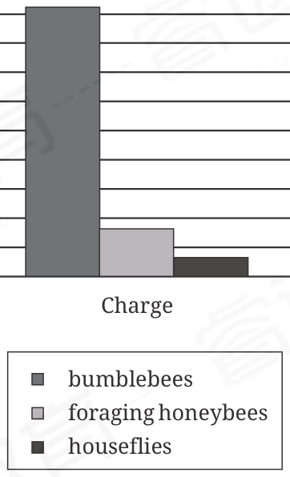

:::q {#Q001 sec=rw no=1}
@material
A rising illustrator of children's books spoke at a recent publishing conference about what motivated her to pursue a career in children's literature. The presenter credited much of her inspiration to ______ Kathleen Atkins Wilson's work in The Origin of Life on Earth: An African Creation Myth, which was among the presenter's favorite books as a child.

@stem
Which choice completes the text with the most logical and precise word or phrase?

- A. a complacency about
- B. an ambivalence toward
- C. a stipulation about
- D. an affinity for
! source: p.1
! answer: D
:::

:::q {#Q002 sec=rw no=2}
@material
The Art Institute of Chicago houses nearly 300,000 works from around the world. Museum visitors looking to ______ their art-viewing experience should turn to Chicago's streets, where they can find works ranging from Marc Chagall's mosaic Four Seasons at Chase Tower to Joseph "Sentrock" Perez's mural Fly Higher on South Wood Street.

@stem
Which choice completes the text with the most logical and precise word or phrase?

- A. provoke
- B. mitigate
- C. supplement
- D. satisfy
! source: p.1
! answer: C
:::

:::q {#Q003 sec=rw no=3}
@material
The people inhabiting the Ice Age sites now known as Potočka Cave and Ust-Kova likely began wearing clothing as a defense against the cold, but Ian Gilligan et al. argue that as clothing became ______, its purpose shifted from the purely practical. Once wearing clothing turned into a widespread, familiar practice, differences in clothes could take on social and cultural significance.

@stem
Which choice completes the text with the most logical and precise word or phrase?

- A. ubiquitous
- B. divisive
- C. feasible
- D. provisional
! source: p.2
! answer: A
:::

:::q {#Q004 sec=rw no=4}
@material
Some researchers posit that the species inhabiting the South Pacific island of Grande Terre belong to clades that predate the island's split from remnants of the former supercontinent Gondwana around 80 million years ago. A study conducted by Michael Balke et al. found, however, that the crown age (the age of the most recent common ancestor of all living and extinct species in the clade) of the clade of beetles on Grande Terre is 9.0 million years; Balke et al. further found that the crown age of the clade of beetles in the South Pacific generally is also approximately 9.0 million years.

@stem
Which choice best describes the overall structure of the text?

- A. It describes an idea that some researchers have put forward, then presents study results that are incompatible with that idea.
- B. It explains a view some researchers have advanced, then discusses study results that led them to reconsider that view.
- C. It presents a possibility that some researchers have raised, then describes a study that clarifies their reasons for doing so.
- D. It identifies a discrepancy between a hypothesis some researchers have proposed and related research findings, then explains that discrepancy.
! source: p.2
! answer: A
:::

:::q {#Q005 sec=rw no=5}
@material
The following text is from Anne Spencer's 1922 poem"Translation."

We trekked into a far country, My friend and I. Our deeper content was never spoken, But each knew all the other said. He told me how calm his soul was laid By the lack of anvil and strife."The wooing kestrel," I said, "mutes his matingnote To please the harmony of this sweet silence."

@stem
Which choice best describes the function of the reference to "anvil and strife" in the text as a whole?

- A. It emphasizes how the speaker and her friend perceive their friendship as being different than anything they see in nature.
- B. It illustrates how the speaker and her friend have developed such a firm friendship despite rarely discussing their feelings.
- C. It represents a strong contrast to the speaker's friend's current experience of tranquility.
- D. It symbolizes the speaker's friend's view that meaningful work and social engagement are core components of a fulfilling life.
! source: p.3
! answer: C
:::

:::q {#Q006 sec=rw no=6}
@material
The scenario of a lone wolverine encountering an intrusion on its territory by another wolverine illustrates a major dimension of social life across animal species, from the solitary to those with complex sociality: intraspecific contact with perceived outsiders. Though one prominent hypothesis posits that sophisticated cognitive adaptations are primarily driven by the demands of various behaviors within established social groups (e.g., tactical deception), interactions with same-species outsiders arguably contribute comparably by favoring nuanced analysis (e.g., evaluation of relative physical status).

@stem
Which choice best describes the function of the underlined portion in the text as a whole?

- A. It establishes that perceiving an individual of the same species as an outsider exemplifies the kind of analysis mentioned later in the text.
- B. It defines a scientific term central to the text's discussion of the role of complex sociality in driving cognitive adaptations in animals.
- C. It narrows the text's focus from the full complement of social life dimensions across species to one applicable to only a subset of species.
- D. It identifies a particular type of social interaction whose relevance to higher cognition in animals is the overall focus of the text.
! source: p.3
! answer: D
:::

:::q {#Q007 sec=rw no=7}
@material
Text 1 For decades, ornithologists assumed that if they saw a singing gray vireo—a bird species found in temperate North America—they must be observing a male. That's because birdsong has long been considered a male trait; researchers have argued that singing enables males to attract mates and claim territory.

Text 2 Recent evidence shows that a female gray vireo is as capable of song as a male is. In fact, Karan J. Odom and colleagues found evidence of female song in 71% of the 323 species they examined. They claim that the historical mischaracterization of birdsong as a male trait is largely the result of bias: much of the research ornithologists have carried out has been near universities in the temperate northern hemisphere, where female birdsong is less common than it is in the tropics.

@stem
Based on the texts, how would Odom and colleagues (Text 2) most likely respond to the view of birdsong presented in Text 1?

- A. They would argue that it was influenced by the kinds of study sites researchers tended to select.
- B. They would suggest that it reflects a tendency to study male birds rather than female birds.
- C. They would claim that other factors than mate attraction and territorial defense have driven the evolution of singing in male birds.
- D. They would underscore that male songbirds in temperate zones are likely using their songs for different purposes than are male songbirds in the tropics.
! source: p.4
! answer: A
:::

:::q {#Q008 sec=rw no=8}
@material
Although notorious for its strict formal requirements, the sonnet is nevertheless represented by such wide-ranging examples as June Jordan's "Sunflower Sonnet Number Two" and Brandy Nālani McDougall's"'elima"—poems that differ remarkably in subject, rhythm, and structure. It may seem counterintuitive that the sonnet—ostensibly rigid and timeworn— could accommodate such variety, but poet Carl Phillips contends that the form invites experimentation: when a genre's conventions are as recognizable as those of the sonnet, the opportunity to subvert them is especially irresistible.

@stem
Which choice best states the main idea of the text?

- A. Although the sonnet is now recognized for the way it facilitates experimentation, there was a long period in its history in which very little innovation occurred.
- B. That the sonnet remains as popular as it is today is unexpected, given that many of the features associated with the form have long since seemed antiquated to readers.
- C. As a form, the sonnet encourages a surprising amount of variety, even though certain characteristics associated with it suggest this would be unlikely.
- D. Although Jordan's and McDougall's sonnets are both widely celebrated for their striking originality, most modern examples of the form are generally regarded as conventional.
! source: p.4
! answer: C
:::

:::q {#Q009 sec=rw no=9}
@material
Economist Gabriel Zucman finds that 8% of worldwide household wealth is held in tax havens (territories such as Singapore with low tax rates for investors who reside outside those territories). Zucman also finds that use of tax havens differs between countries—they are rarely used by investors living in Japan, while many investors who utilize tax havens reside in Saudi Arabia or Venezuela. Philosopher Ingrid Robeyns disapproves of the use of tax havens as a method of tax avoidance that, though legally permissible, nonetheless helps investors to sidestep payment toward government upkeep.

@stem
Based on the text, what does Zucman's research suggest about investors residing in Japan?

- A. They are less likely than investors residing in Saudi Arabia to store wealth in Singapore.
- B. They are more likely than residents of Singapore to utilize investment strategies that might yield greater returns but that might also result in greater losses.
- C. They are engaging in investment practices that Robeyns would acknowledge as beneficial because they are legally permissible.
- D. They are more likely than residents of Venezuela to engage in tax avoidance.
! source: p.5
! answer: A
:::

:::q {#Q010 sec=rw no=10}
@material
Maximum Charge Measured

for Various Pollinators

Picocoulombs (pC)

0 100 200 300 400 500 600 700 800 900 1,000

Charge

bumblebees

foraging honeybees

houseflies

Terrestrial plants typically carry a negative electrical charge, while bees and other pollinators tend to accumulate a positive charge. A team of researchers therefore hypothesized that electrostatic attraction (mutual attraction between objects with opposite charges) might enhance pollen transmission between plants and their pollinator species. The team's experiments showed that the maximum positive charge of foraging honeybees is sufficiently high to facilitate electrostatic pollen transfer, a finding that suggests that

@stem
Which choice most effectively uses data from the graph to complete the text?

- A. the minimum positive charge necessary for a pollinator to induce electrostatic attraction must be greater than 100 pC.
- B. houseflies should demonstrate the opposite tendency.
- C. bumblebees should also demonstrate this capacity.
- D. bumblebees and houseflies, having greater maximum charges than foraging honeybees have, should not demonstrate this capacity.
! source: p.6
! answer: C
:::

:::q {#Q011 sec=rw no=11}
@material
In medieval England, jesters and minstrels made livings as traveling performers, but the pieces they performed have been a mystery, thought to be lost or never committed to paper at all. Recently, however, James Wade has argued that a manuscript collection compiled in the fifteenth century by Richard Heege contains three pieces likely copied from a repertoire book belonging to a minstrel working in the area around Heege's home. Wade cites features of the texts indicative of live performance, such as directly appealing to the audience, extensive use of repetition (allowing for easy memorization), and requests for tips (payment)from listeners.

@stem
Which statement, if true, would most strongly support Wade's argument?

- A. Traveling minstrels are thought to have performed mainly for elite audiences, and other parts of Heege's collection reflect his interest in works with popular appeal.
- B. Heege's collection contains the earliest examples of the three pieces in question, but each of those pieces occurs in other manuscript collections compiled after Heege's.
- C. The three pieces in question contain references that presume that the audience is familiar with Holbrooke and other small villages near where Heege lived.
- D. Features like repetition also occur in other texts from the period that were widely read but are not known to have been performed for live audiences.
! source: p.7
! answer: C
:::

:::q {#Q012 sec=rw no=12}
@material
The advent of online streaming has led many music listeners to drift away from ownership of music (through downloads or through physical media such as compact discs) in favor of the streaming services Apple Music and SiriusXM, among others. Luis Aguiar studied the effect of the 2011 implementation of a restriction on the free version of the French streaming service Deezer: its unlimited usage was reduced to five hours a month, while the paid premium version's usage remained unlimited. Aguiar found that listeners who used the free service visited licensed online music sellers (e.g., the iTunes store) and sites that make unlicensed music available to download about 2% less after the restriction was implemented, suggesting that ______

@stem
Which choice most logically completes the text?

- A. restrictions on the amount of music that can be streamed may actually suppress users' interest in owning music.
- B. the implementation of the restriction reduced the overall number of users of the streaming service.
- C. consumers are unlikely to purchase physical copies of music that is readily available through streaming.
- D. most users of the free streaming service were probably encouraged by the restriction to move to a paid version of the service with unlimited, ad-free listening.
! source: p.7
! answer: A
:::

:::q {#Q013 sec=rw no=13}
@material
Exclusively inhabiting tropical countries such as Sierra Leone, wild chimpanzees lack adaptations to seasonal variations in ultraviolet B (UVB) irradiance from sunlight; since UVB exposure enables vertebrates to synthesize vitamin D, Sophie Moittié and colleagues studied zoo chimpanzees in Sweden and other midlatitude countries to see how vitamin D levels are affected by the seasonal variations in UVB irradiance that occur in those locations. They found that chimpanzees' vitamin D levels were significantly lower in winter than in summer and appeared unaffected by oral supplementation of vitamin D administered by zookeepers. Moittié and colleagues point out, however, that supplementation was rare, highly varied, and poorly tracked, and therefore they caution against concluding that ______

@stem
Which choice most logically completes the text?

- A. vitamin D levels among zoo chimpanzees in Sweden and other mid-latitude countries likely show different seasonal patterns than do vitamin D levels among wild chimpanzees in Sierra Leone and other tropical countries.
- B. the lack of an observed effect of supplemental vitamin D on zoo chimpanzees in Sweden and other mid-latitude countries may reflect shortcomings in the data rather than actual ineffectiveness.
- C. providing zoo chimpanzees in Sweden and other mid-latitude countries with supplemental vitamin D has no promise as a strategy for offsetting winter reductions in their vitamin D levels.
- D. winter reductions in UVB irradiance in Sweden and other mid-latitude countries can contribute to variations in zoo chimpanzees'vitamin D levels.
! source: p.8
! answer: C
:::

:::q {#Q014 sec=rw no=14}
@material
In an analysis of medieval urbanization in Florence, Greifswald, and other European settlements, researchers drew on modern urban scaling theory, which posits that population density in core urban areas increases as a city grows larger. Hypothesizing that this typical relationship would have differed in medieval settlements because of the constraining influence of strong hierarchical social structures (which are much less pronounced in modern cities) on social networking and economic integration— drivers of urban agglomeration—the team created a model that accounted for the presence of restrictive institutions. They found that the typically expected density-size relationship held for each of the 173 medieval settlements whose growth they analyzed, suggesting that ______

@stem
Which choice most logically completes the text?

- A. the constraining influence of hierarchical medieval institutions likely had a significant effect on individuals in some social groupings but little to no effect on members of other social groupings.
- B. despite a change in the role of social structures over time, there is likely a notable consistency between medieval settlements and modern cities in underlying elements of the social and economic interactions among individuals that shape the development of core urban areas.
- C. the social and economic dynamics that affect urban agglomeration were likely much different in medieval settlements than in modern cities, despite the similarity across time in population density patterns.
- D. although there tends to be a positive relationship between population size and development of core urban areas for both medieval settlements and modern cities, social institutions likely limited the rate at which population density increased in medieval settlements.
! source: p.9
! answer: B
:::

:::q {#Q015 sec=rw no=15}
@material
In a chemical equation, converting between the mass of the reactants and the mass of the product requires knowing each component's molar mass, a quantification of the average mass of the atoms in a compound. Thesolid ______ has a molar mass of 254.50 g/mol.

@stem
Which choice completes the text so that it conforms to the conventions of Standard English?

- A. compound octadecane (C18H38)
- B. compound octadecane (C18H38),
- C. compound, octadecane (C18H38)
- D. compound, octadecane (C18H38),
! source: p.9
! answer: A
:::

:::q {#Q016 sec=rw no=16}
@material
In western Mesoamerica, axes were used as a commodity currency. By using specific goods like axes as common units of exchange, commodity currency economies streamline trade, which is why they often replaced barter economies. Barter economies eschew ______ that requires what economist W.S. Jevons deems a "double coincidence of wants"—in other words, each trading party must want precisely what the other has.

@stem
Which choice completes the text so that it conforms to the conventions of Standard English?

- A. currency—in favor of a direct trade system
- B. currency, in favor of a direct trade system,
- C. currency, in favor of a direct trade system
- D. currency in favor of a direct trade system
! source: p.10
! answer: D
:::

:::q {#Q017 sec=rw no=17}
@material
In economics, oats are considered a commodity because they are essentially interchangeable,"essentially" being a word that admits a degree of latitude. In 2021, researchers J. Shorish, M. Stephenson, and M. Zargham devised a mathematical model of fungibility (interchangeability) that would account for such variation. Distinguishing "exactly the same" and "nearly the same" commodities—whether crops, fuel, or precious metals—______ among their primary aims.

@stem
Which choice completes the text so that it conforms to the conventions of Standard English?

- A. being
- B. were
- C. having been
- D. was
! source: p.10
! answer: D
:::

:::q {#Q018 sec=rw no=18}
@material
In recent years, the Scottish writer Joanna Baillie (1762–1851), whose poetry was widely read during her lifetime, has been rediscovered by contemporary audiences—a resurgence of interest that is largely due to literary scholars such as Dorothy McMillan, whose work ______ the richness of Baillie's poems and the poet's historical importance to the Romantic literary movement encourages a broader rethinking of British Romanticism itself.

@stem
Which choice completes the text so that it conforms to the conventions of Standard English?

- A. is highlighting
- B. highlights
- C. has highlighted
- D. highlighting
! source: p.11
! answer: D
:::

:::q {#Q019 sec=rw no=19}
@material
The extensive impact that copper nanoparticles (CuNPs) have had on dentistry belies their minuscule size, the nanoparticles typically ______ from only 10 to 30 billionths of a meter.

@stem
Which choice completes the text so that it conforms to the conventions of Standard English?

- A. can range
- B. will range
- C. ranging
- D. range
! source: p.11
! answer: C
:::

:::q {#Q020 sec=rw no=20}
@material
Visitors come from across the globe to see the famous artworks inside the Guggenheim Museum in New York City. ______ the first work of art they encounter is actually the building itself, a stunning work of architecture designed by American architect Frank Lloyd Wright.

@stem
Which choice completes the text with the most logical transition?

- A. Moreover,
- B. For instance,
- C. As such,
- D. In fact,
! source: p.12
! answer: D
:::

:::q {#Q021 sec=rw no=21}
@material
Since 1941, the South Side Community Art Center in Chicago, Illinois, has cultivated a multigenerational community of Black creatives—from writer Gwendolyn Brooks, to musician Nat King Cole, to visual artists like Barbara Jones-Hogu and Marva Lee Pitchford-Jolly. ______ it has garnered a reputation as a hub of Black art and culture in Chicago.

@stem
Which choice completes the text with the most logical transition?

- A. Accordingly,
- B. Nevertheless,
- C. Periodically,
- D. On the other hand,
! source: p.12
! answer: A
:::

:::q {#Q022 sec=rw no=22}
@material
For several centuries after the birth of opera in sixteenth-century Florence, Italian remained the default language in which most opera scores were written. ______ opera singers today, such as the soprano Guanqun Yu, encounter a wide range of Italian terms—from semplicemente (simply) to rallentando (at a decelerating tempo)—when following many eighteenth-century opera scores.

@stem
Which choice completes the text with the most logical transition?

- A. Thus,
- B. However,
- C. Lastly,
- D. Granted,
! source: p.13
! answer: A
:::

:::q {#Q023 sec=rw no=23}
@material
At Storm King Art Center, an outdoor sculpture park in New York, George Rickey's Two Planes Vertical Horizontal II is exposed to rain, snow, heat, and humidity. ______ it remains in good condition due to its material: Rickey's sculpture is made of corrosionresistant steel.

@stem
Which choice completes the text with the most logical transition?

- A. In addition,
- B. As a result,
- C. On the contrary,
- D. That said,
! source: p.13
! answer: D
:::

:::q {#Q024 sec=rw no=24}
@material
Known as an "empire on which the sun never sets,"the Spanish Empire once controlled portions of five continents. Its legacy can still be seen, and heard, in the Spanish-speaking nation of Cuba, which gained its independence from Spain in the nineteenth century. ______a former colony's tie to the Spanish Empire is so tenuous that Spanish is seldom spoken there; an example is Sardinia, which ceased to be part of the empire in 1720.

@stem
Which choice completes the text with the most logical transition?

- A. In addition,
- B. Sometimes,
- C. At the same time,
- D. On the other hand,
! source: p.14
! answer: D
:::

:::q {#Q025 sec=rw no=25}
@material
While researching a topic, a student has taken the following notes:

• The Chengdu Biennale is an art biennial held in Chengdu, China.

• It was first held in 2001 and typically takes place every two years.

• Art biennials are recurring large-scale international art exhibitions.

• According to art historian Paloma Checa- Gismero, "For most of the twentieth century, art biennials played a relatively marginal role. . . in the selection, exhibition, and valuation of institutionally legitimated art."

• The term "biennial boom" refers to the period from the 1990s until around 2020 when the number of art biennials held worldwide increased sharply.

• Checa-Gismero observes that during the biennial boom, art biennials became "perhaps the most important staging ground for contemporary art trends."

@stem
The student wants to use a quotation to place the Chengdu Biennale in its broader historical context. Which choice most effectively uses relevant information from the notes to accomplish this goal?

- A. Art historian Checa-Gismero notes that the Chengdu Biennale, typically held every two years since 2001, has become "perhaps the most important staging ground for contemporary art trends."
- B. The Chengdu Biennale began during the biennial boom, a period from the 1990s until around 2020 when art biennials became, according to Checa-Gismero, "perhaps the most important staging ground for contemporary art trends."
- C. The Chengdu Biennale was first held in 2001, a time when "art biennials played a relatively marginal role . . . in the selection, exhibition, and valuation of institutionally legitimated art," according to Checa-Gismero.
- D. The biennial boom, which started in the 1990s and lasted until around 2020, has broader historical significance to "the selection, exhibition, and valuation of institutionally legitimated art," as Checa-Gismero observes.
! source: p.14
! answer: B
:::

:::q {#Q026 sec=rw no=26}
@material
While researching a topic, a student has taken the following notes:

• A U-shaped curve in a river channel is called a meander.

• A meander forms when water erodes sediment from one side of the riverbank and redeposits that sediment on the opposite side.

• Meanders will gradually change shape and migrate downstream over time.

• A river with high sinuosity has many meanders, and a river with low sinuosity has few.

• The Purus River in Brazil has high sinuosity.

@stem
The student wants to identify what causes meanders. Which choice most effectively uses relevant information from the notes to accomplish this goal?

- A. Over time, many meanders have formed in the Purus River, a river in Brazil with high sinuosity.
- B. The meanders in the Purus River will change shape and shift downstream over time.
- C. High sinuosity is caused by the formation of many meanders, or curves, in a riverbank over time.
- D. The erosion and redepositing of sediment from one side of a riverbank to the other forms meanders, or curves, over time.
! source: p.15
! answer: D
:::

:::q {#Q027 sec=rw no=27}
@material
While researching a topic, a student has taken the following notes:

• Modern Pueblo tribal nations were preceded by the Ancestral Puebloan civilization, which occupied parts of the southwestern US until approximately 1600 CE.

• Albert Porter Pueblo in southwestern Colorado is a former Ancestral Puebloan settlement inhabited from approximately 1000–1300 CE.

• It was constructed on relatively flat terrain and had multistory adobe and stone buildings.

• These buildings had cube-shaped, contiguous rooms that surrounded kivas.

• Kivas are round rooms typically used for ceremonial purposes and as gathering spaces.

@stem
The student wants to provide a detailed overview of the structures at Albert Porter Pueblo. Which choice most effectively uses relevant information from the notes to accomplish this goal?

- A. Albert Porter Pueblo, whose structures were built by Ancestral Puebloans in southwestern Colorado, was inhabited from approximately 1000–1300 CE.
- B. Constructed on relatively flat terrain, Albert Porter Pueblo's multistory adobe and stone buildings featured round rooms called kivas surrounded by cube-shaped, contiguous rooms.
- C. The Ancestral Puebloans used adobe and stone in the construction of Albert Porter Pueblo in southwestern Colorado.
- D. Located in southwestern Colorado, Albert Porter Pueblo was designed with kivas, round rooms that were typically used for ceremonial purposes and as gathering spaces.
! source: p.15
! answer: B
:::
