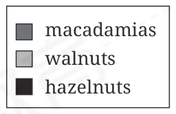
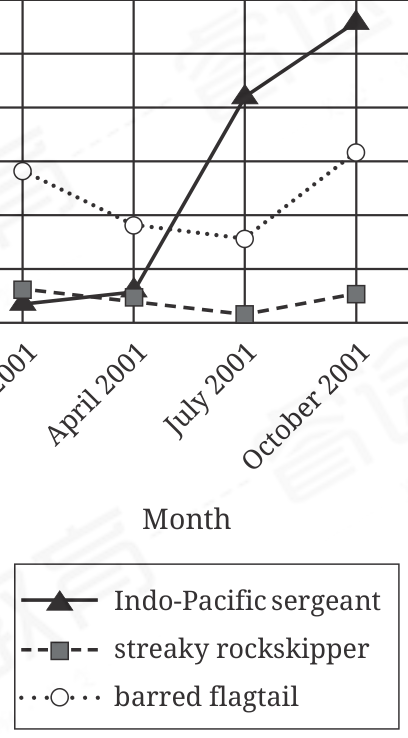

:::q {#Q001 sec=rw no=1}
@material
Lima beans were domesticated in South America. They differ physically from the wild plant they are descended from. In terms of physical structure, summer squash also differs from its wild ancestor. Summer squash is known for its soft rind and mildtasting flesh. Yet its ancestor, the wild Johnny gourd, ______ a hard rind and bitter flesh.

@stem
Which choice completes the text with the most logical and precise word or phrase?

- A. possesses
- B. refuses
- C. requests
- D. assists
! source: p.1
! answer: A
:::

:::q {#Q002 sec=rw no=2}
@material
The Apollo Moon landings (1969–1972) brought solar wind sensors and lunar dust detectors to the Moon and produced large amounts of data, much of which was stored on technologies that are now obsolete. A data-transfer project is working to ______ these data so that the information is available to researcher Philip Metzger, who is investigating the long-term effects of being on the Moon.

@stem
Which choice completes the text with the most logical and precise word or phrase?

- A. improve
- B. salvage
- C. amend
- D. simplify
! source: p.1
! answer: B
:::

:::q {#Q003 sec=rw no=3}
@material
New and interesting research conducted by Suleiman A. Al-Sweedan and Moath Alhaj is inspired by their observation that though studies of the effect of high altitude on blood chemistry are ______, the effect on blood chemistry of living in locations below sea level, such as the California towns of Salton City and El Centro, has received comparatively little notice.

@stem
Which choice completes the text with the most logical and precise word or phrase?

- A. preliminary
- B. sporadic
- C. copious
- D. equivocal
! source: p.2
! answer: C
:::

:::q {#Q004 sec=rw no=4}
@material
In the architectural process called modular construction, a building is manufactured in modules under controlled conditions and then assembled at its intended location. ______ of this approach cite a faster return on investment and a greater potential for reuse and recycling.

@stem
Which choice completes the text with the most logical and precise word or phrase?

- A. Epitomes
- B. Safeguards
- C. Proponents
- D. Components
! source: p.2
! answer: C
:::

:::q {#Q005 sec=rw no=5}
@material
Mohamed Alburaki, Shayne Madella, and colleagues studied genetic diversity in US honey bee populations by identifying specimens' maternal evolutionary lineages and haplotypes (inherited DNA variants). They determined that although C1 and C2j haplotypes occur most frequently in the population overall, another haplotype, A4, is ______ in certain Southern states, including Louisiana.

@stem
Which choice completes the text with the most logical and precise word or phrase?

- A. elusive
- B. conclusive
- C. anomalous
- D. prevalent
! source: p.3
! answer: D
:::

:::q {#Q006 sec=rw no=6}
@material
Land art, or earth art, is characterized by its large scale and the fact that it's often placed in remote or surprising locations. Land art is also notable for the wildly diverse ways in which it is created: Ugo Rondinone's Seven Magic Mountains, for instance, was created by stacking vibrantly painted boulders in seven columns in a desert near Las Vegas, whereas for Circular Surface Planar Displacement Drawing, Michael Heizer made lines in a desert lake bed by driving a motorcycle in certain patterns.

@stem
Which choice best describes the overall structure of the text?

- A. The text compares two works of art, then provides details about the lives of the artists who created them.
- B. The text conveys a definition of a kind of art, then addresses a well-established criticism of the art.
- C. The text outlines a common misconception about a kind of art, then offers an explanation for why that misconception persists.
- D. The text describes a particular genre of art, then cites examples illustrating an important characteristic of that genre.
! source: p.3
! answer: D
:::

:::q {#Q007 sec=rw no=7}
@material
Fossil evidence indicates that the End-Permian mass extinction—the relatively sudden die-off of about 90 percent of species (including many species of trilobites)—occurred approximately 252 million years ago. Researchers have identified the effects of toxic gases from volcanoes as a possible initial cause of this mass extinction. But mass extinctions, while abrupt in geological terms, unfold over thousands or millions of years: it's likely that multiple factors drove extensive species loss.

@stem
Which choice best states the function of the underlined portion in the text as a whole?

- A. It concedes that the pace of mass extinctions as described in the information that follows is perceived differently when considered from another point of view.
- B. It offers support for an earlier claim about the primary cause of a mass extinction that is then qualified by the information that follows.
- C. It expands on the uncertainty mentioned earlier regarding the pace of extinction of species of trilobites relative to that of other species.
- D. It emphasizes that a question about the beginning of a mass extinction raised by the researchers mentioned earlier is still unresolved.
! source: p.4
! answer: A
:::

:::q {#Q008 sec=rw no=8}
@material
The following text is from Yung Wing's 1909 memoir My Life in China and America.

We landed in New York on the 12th of April, 1847, after a passage of ninety-eight days of unprecedented fair weather. The New York of 1847 was altogether a different city from the New York of 1909. It was a city of only 250,000 or 300,000 inhabitants; now it is a metropolis rivaling London in population, wealth and commerce. The whole of Manhattan Island is turned into a city of skyscrapers, churches and palatial residences.

@stem
Which choice best states the main idea of the text?

- A. Yung has experienced significant personal growth in the time since his arrival to New York City in 1847.
- B. New York City has become more developed and populated since Yung's arrival in 1847.
- C. Yung did not enjoy the journey to New York City as much as he had anticipated.
- D. New York City is more populated than London is.
! source: p.4
! answer: B
:::

:::q {#Q009 sec=rw no=9}
@material
Pollination syndromes are suites of floral traits that have independently evolved as a result of selection pressure exerted by pollinators; chiropterophilous (bat-pollinated) flowers, for example, frequently exhibit a strong, musty scent. In a review of previous studies covering 417 plant species, Victor Rosas- Guerrero et al. concluded that the syndromes reliably predict angiosperms' most effective pollinators. However, in a response paper, Jeff Ollerton et al. note that Rosas-Guerrero et al. may have inadvertently ignored inconsistencies in how authors of previous studies evaluated floral traits.

@stem
What does the text most strongly suggest about the study conducted by Rosas-Guerrero et al.?

- A. Due to the difficulty of gathering representative research on angiosperms, the study may have included previous research with a focus too heterogeneous to be comparable.
- B. A limitation in the methodology used by the researchers may entail that the study's conclusion is not well supported.
- C. The approach selected by the researchers enabled them to sort through and remove obviously incomplete or inconsistent data before conducting their analysis.
- D. Because the study contained data on a limited number of plant species, its conclusion is accurate for those species but cannot be applied to species not in the study.
! source: p.5
! answer: B
:::

:::q {#Q010 sec=rw no=10}
@material
Prices of Nuts Sold by Growers

in the United States, 2016/17 to 2019/20 Seasons

Price per pound (dollars)

Season

macadamias

walnuts

hazelnuts

The US Department of Agriculture's Fruit and Tree Nuts Outlook is a document that covers a variety of subjects, from the increasing availability of fresh fruit to the effect of stinkbug damage on pear crops. A student studying agricultural economics is consulting a graph in the document that shows the prices for which several types of nuts have been sold by growers in the United States over four growing seasons from 2016 to 2020. The student wishes to determine in which season walnuts reached their lowest price. Consulting the graph, the student finds that this season was the ______

@stem
Which choice most effectively uses data from the graph to complete the statement?

- A. 2017/18 season.
- B. 2016/17 season.
- C. 2019/20 season.
- D. 2018/19 season.
! source: p.6
! answer: D
:::

:::q {#Q011 sec=rw no=11}
@material
Peter Pan is a 1911 novel by J.M. Barrie. In the fantasy novel, a dog named Nana is a nurse (nanny) for the children in the Darling family—Wendy, John, and Michael. The narrator describes Nana as planning for events like a human would: ______

@stem
Which quotation from Peter Pan best illustrates the claim?

- A. "Nana, who had been barking distressfully all the evening, was quiet now."
- B. "On John's [soccer] days [Nana] never once forgot his sweater, and she usually carried an umbrella in her mouth in case of rain."
- C. "While [Mrs. Darling] slept she had a dream."
- D. "Mrs. Darling loved to have everything just so, and Mr. Darling had a passion for being exactly like his neighbours."
! source: p.7
! answer: B
:::

:::q {#Q012 sec=rw no=12}
@material
Fish Population in a Taiwanese

Tide Pool, January 2001 to

October 2001

Number of individual

fish observed

July 2001

October 2001

April 2001

January 2001

Month

Indo-Pacific sergeant

streaky rockskipper

barred flagtail

Lin-Tai Ho and colleagues counted fish in a tide pool in Taiwan at several times during the year and found that some species had a significantly higher maximum population count than others. For example, the highest count for the Indo-Pacific sergeant was 28 individuals in October of 2001, whereas the highest count for the streaky rockskipper was ______

@stem
Which choice most effectively uses data from the graph to complete the example?

- A. 38 individuals in October of 2001.
- B. 16 individuals in October of 2001.
- C. 3 individuals in January of 2001.
- D. 13 individuals in January of 2001.
! source: p.8
! answer: C
:::

:::q {#Q013 sec=rw no=13}
@material
Sidebells wintergreen (Orthilia secunda) plants are native to Alaska, where harsh conditions have historically impeded potential invasive species. As the boreal climate has warmed in recent decades, however, Siberian peashrub (Caragana arborescens) plants have established themselves in Alaska. It has been suggested that warming-induced delays in the onset of subfreezing temperatures in autumn can benefit invasives more than native species; to evaluate this possibility, biologists Christa Mulder and Katie Spellman tracked O. secunda and C. arborescens, along with other native and invasive species, over several years, concluding that invasives are advantaged by delays in subfreezing temperature onset in Alaska.

@stem
Which finding, if true, would most directly support Mulder and Spellman's conclusion?

- A. Although O. secunda and C. arborescens tended to stop producing leaves at about the same time in years with historically typical temperature patterns, C. arborescens stopped producing leaves sooner than O. secunda did in years with late subfreezing temperature onset.
- B. Although significant interannual variations in subfreezing temperature onset were observed during the study, neither C. arborescens nor O. secunda showed any significant interannual variation in the cessation of leaf production.
- C. Although O. secunda and C. arborescens both tended to produce leaves later into autumn in years with late subfreezing temperature onset, the extension was much greater for C. arborescens than for O. secunda.
- D. Although O. secunda and C. arborescens both tended to produce more leaves overall in years with late subfreezing temperature onset than they did in years with historically typical temperature patterns, the years with late subfreezing temperature onset also had early growing season onset in spring.
! source: p.9
! answer: C
:::

:::q {#Q014 sec=rw no=14}
@material
The state of Wyoming has classified the western mosquitofish as an invasive species that could harm some of the state's native species. But researchers Alejandro Camacho and Jason McLachlan have pointed out that "invasive" and "native" are labels that describe temporary circumstances. Changes in Earth's climate may force animals from their current ranges. Climate changes may also create good habitats in areas where a species couldn't live previously. These observations suggest that ______

@stem
Which choice most logically completes the text?

- A. Wyoming was previously home to some western mosquitofish but they were outcompeted by invading species.
- B. changes in Earth's climate are likely to result in the western mosquitofish establishing itself as a native species in locations other than Wyoming.
- C. Wyoming may eventually need to reexamine its designation of the western mosquitofish as invasive.
- D. it's appropriate for Wyoming to designate certain species as invasive but the state should designate the western mosquitofish as native.
! source: p.10
! answer: C
:::

:::q {#Q015 sec=rw no=15}
@material
Many ranching terms come from Spanish. For example, the word "lasso" (a rope) ______ from the Spanish word lazo, and "rodeo" (a roundup) derives from rodear. This is because the first Anglo, African, and Native American cattle ranchers in the southwestern US learned the trade from Spanishspeaking Mexican vaqueros, or cowboys.

@stem
Which choice completes the text so that it conforms to the conventions of Standard English?

- A. derive
- B. were deriving
- C. have derived
- D. derives
! source: p.10
! answer: D
:::

:::q {#Q016 sec=rw no=16}
@material
A preserved specimen of the marine protist N. pachyderma collected from the North Atlantic has been identified as the species lectotype, a term ______ that this specimen serves as the basis for all formal scientific descriptions of the species.

@stem
Which choice completes the text so that it conforms to the conventions of Standard English?

- A. is indicating
- B. indicated
- C. has indicated
- D. indicating
! source: p.11
! answer: D
:::

:::q {#Q017 sec=rw no=17}
@material
Debuting in 1982, Arriving SFO: Photographs by William T. Larkins is just one of the ______ that have been curated by the staff of the San Francisco International Airport.

@stem
Which choice completes the text so that it conforms to the conventions of Standard English?

- A. hundreds of exhibits
- B. hundred's of exhibits
- C. hundreds of exhibits'
- D. hundreds of exhibit's
! source: p.11
! answer: A
:::

:::q {#Q018 sec=rw no=18}
@material
After touching down on Mars on May 25, 2008, the Phoenix lander spent 161 days exploring the geology of the red planet, including its many ______ To aid in communication, scientists gave informal names like Dodo and Neverland to some of the smaller yet notable rocks discovered.

@stem
Which choice completes the text so that it conforms to the conventions of Standard English?

- A. craters and rock's.
- B. craters and rocks.
- C. crater's and rock's.
- D. crater's and rocks.
! source: p.12
! answer: B
:::

:::q {#Q019 sec=rw no=19}
@material
Leptoptilos dubius, also known as the greater ______ can be found in places like Ang Tropeang Thmor in Cambodia and the Inner Gulf of Thailand, but more than 80 percent of this endangered stork species is found in Assam, India. There, wildlife biologist Dr. Purnima Devi Barman is on the front lines of a conservation effort that aims to bring adjutants back from near extinction.

@stem
Which choice completes the text so that it conforms to the conventions of Standard English?

- A. adjutant
- B. adjutant—
- C. adjutant;
- D. adjutant,
! source: p.12
! answer: D
:::

:::q {#Q020 sec=rw no=20}
@material
In July 2021, consumer goods cost less in Chile than in ______ to data from the Organisation for Economic Co-operation and Development. A set of consumer goods priced at 100 US dollars (USD) in the United States would cost 62 USD in Chile but 110 USD in Luxembourg.

@stem
Which choice completes the text so that it conforms to the conventions of Standard English?

- A. Luxembourg. According
- B. Luxembourg, according
- C. Luxembourg, and according
- D. Luxembourg; according
! source: p.13
! answer: B
:::

:::q {#Q021 sec=rw no=21}
@material
Broadcasting from Jicarilla Apache Nation in north central New Mexico, the Native-run radio station KCIE 90.5 FM does much to serve the local Jicarilla-speaking community. ______ it broadcasts local news and music as well as programming in the Jicarilla language.

@stem
Which choice completes the text with the most logical transition?

- A. As a result,
- B. Instead,
- C. Nevertheless,
- D. Specifically,
! source: p.13
! answer: D
:::

:::q {#Q022 sec=rw no=22}
@material
From mountains to monuments, deserts to rainforests, and isolated islands to teeming cities, the sites on UNESCO's World Heritage List are chosen because they hold cultural or natural value that the organization wishes to preserve for future generations. ______ in 1981, UNESCO recognized the importance of Australia's Great Barrier Reef, the world's largest coral reef system, by adding it to the list as a natural heritage site.

@stem
Which choice completes the text with the most logical transition?

- A. By contrast,
- B. In other words,
- C. Next,
- D. Accordingly,
! source: p.14
! answer: D
:::

:::q {#Q023 sec=rw no=23}
@material
Some bands choose a name that's as unique as possible to distinguish themselves from other bands. The indie rock band Starsailor, ______ took a different approach. They chose to name themselves after a song by a well-known musician, Tim Buckley.

@stem
Which choice completes the text with the most logical transition?

- A. secondly,
- B. by contrast,
- C. for example,
- D. therefore,
! source: p.14
! answer: B
:::

:::q {#Q024 sec=rw no=24}
@material
The Brahin meteorite, discovered in Belarus in 1810, weighs approximately 1,814 pounds and is the seventh-largest stony-iron meteorite ever discovered on Earth. The Morito meteorite, discovered in Mexico in 1600, is much larger at 22,300 pounds. ______ the latter is an iron meteorite, and a size difference between meteorites of different compositions isn't unexpected.

@stem
Which choice completes the text with the most logical transition?

- A. In conclusion,
- B. As a result,
- C. In other words,
- D. Admittedly,
! source: p.15
! answer: D
:::

:::q {#Q025 sec=rw no=25}
@material
While researching a topic, a student has taken the following notes:

• In 2022, Gorky Valencia was part of a research team that conducted a survey of species in the Alto Mayo region of Peru.

• The team was surprised to discover 27 previously unknown species, including 10 new butterfly species.

• Among these was a new species of skipper butterfly.

• According to team lead Trond Larsen, the researchers were "blown away" by how many new species they found.

@stem
The student wants to emphasize the researchers'reaction to the Alto Mayo survey results. Which choice most effectively uses relevant information from the notes to accomplish this goal?

- A. Referring to the team's discovery of 10 new butterfly species, team lead Trond Larsen emphasized the researchers' reaction to the survey results.
- B. The research team discovered 27 previously unknown species in Alto Mayo, including a new species of skipper butterfly.
- C. According to team member Gorky Valencia, the Alto Mayo researchers were "blown away"by the discovery of a new species of skipper butterfly.
- D. The researchers were so surprised by the number of new species they found that the team lead reported that they were "blown away" by the results.
! source: p.15
! answer: D
:::

:::q {#Q026 sec=rw no=26}
@material
While researching a topic, a student has taken the following notes:

• An isthmus is a strip of land that connects two larger pieces of land across an expanse of water.

• It is also known as a land bridge.

• The Isthmus of Panama is located in Central America.

• It connects North America to South America.

@stem
The student wants to provide a specific example of an isthmus. Which choice most effectively uses relevant information from the notes to accomplish this goal?

- A. There is a land bridge in Central America.
- B. An isthmus, also known as a land bridge, is a strip of land that connects two larger pieces of land across an expanse of water.
- C. In Central America, North America is connected to South America.
- D. One example of an isthmus is the Isthmus of Panama in Central America.
! source: p.16
! answer: D
:::

:::q {#Q027 sec=rw no=27}
@material
• India Arie is an African American singer and songwriter.

• The media outlet All Music has described her music as having "glistening acoustic guitar, churchy organ, and smooth, supple beats."

• Her first studio album, Acoustic Soul, was released in 2001.

• It features the song "Part of My Life."

• David Spak played percussion on the album.

@stem
Which choice most effectively uses information from the given sentences to specify David Spak's contribution to India Arie's music?

- A. India Arie is an African American singer and songwriter whose music has been described as having "glistening acoustic guitar, churchy organ, and smooth, supple beats."
- B. Acoustic Soul, India Arie's first studio album, features David Spak.
- C. David Spak played percussion on India Arie's 2001 album Acoustic Soul.
- D. Featuring the song "Part of My Life," Acoustic Soul is India Arie's first studio album.
! source: p.16
! answer: C
:::
