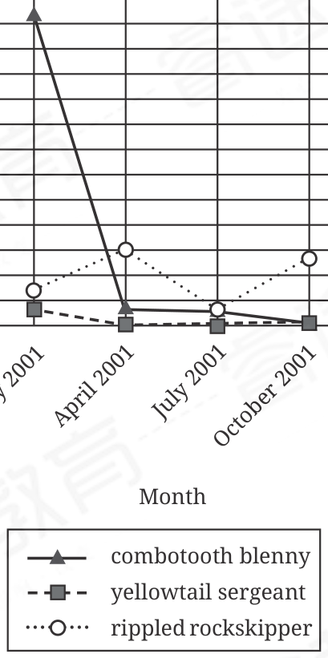

:::q {#Q001 sec=rw no=1}
@material
The recovery program led by Marisel López-Flores has dramatically increased the population size of the endangered Amazona vittata, the endemic parrot of Puerto Rico. Given that A. vittata corresponds in physiology, behavior, and ecology to endangered Amazona species elsewhere in the Caribbean, the conservation approach developed by López-Flores may be ______ across the genus.

@stem
Which choice completes the text with the most logical and precise word or phrase?

- A. redeemable
- B. replicable
- C. comprehensible
- D. observable
! source: p.1
! answer: B
:::

:::q {#Q002 sec=rw no=2}
@material
Although oil shocks—such as the 51% rise in oil prices between November 1973 and February 1974— can strongly affect individual consumers, Gbadebo Oladosu and colleagues have shown that at the level of national economies, their effects are often quite ______. The effect of recent oil shocks on the gross domestic product of India, for example, was only slightly greater than zero.

@stem
Which choice completes the text with the most logical and precise word or phrase?

- A. variable
- B. subdued
- C. persistent
- D. beneficial
! source: p.1
! answer: B
:::

:::q {#Q003 sec=rw no=3}
@material
Steiger Butte Drum, a family ensemble from the Klamath Tribes of the Pacific Northwest, collaborated with composer Michael Gordon to create Natural History, a work featuring traditional drumming and vocals alongside an orchestra and chorus. Steiger Butte Drum's participation is ______ to the piece: members not only contributed to its composition but also must be included in all performances.

@stem
Which choice completes the text with the most logical and precise word or phrase?

- A. tangential
- B. integral
- C. subsequent
- D. analogous
! source: p.2
! answer: B
:::

:::q {#Q004 sec=rw no=4}
@material
The following text is adapted from Susan Glaspell's 1917 play The People. Oscar, a writer at a newspaper called The People, is writing at a table when a woman enters the office to speak to the editor.

THE WOMAN: This is the office of The People?

OSCAR: Um-hum.

THE WOMAN: (Excitedly.) I came to see the author of those wonderful words.

OSCAR: (Rising.) Which wonderful words?

THE WOMAN: About moving toward the beautiful distances.

OSCAR: (Loses interest and returns to his writing.): Oh. Those are Mr. Wills' wonderful words.

THE WOMAN: Could I see him?

OSCAR: He isn't here yet. He's just back from California. Won't be at the office till a little later.

@stem
Which choice best states the function of the underlined portion in the text as a whole?

- A. To depict Oscar as a polite and professional representative of the newspaper
- B. To suggest that Oscar is annoyed that the woman's visit has interrupted his work
- C. To indicate that Oscar had been expecting the woman to come to the office
- D. To show Oscar's brief hope that the woman is fond of his writing
! source: p.2
! answer: D
:::

:::q {#Q005 sec=rw no=5}
@material
Vertical gene transfer involves the transmission of genetic material from a parent to offspring; horizontal gene transfer, on the other hand, involves the exchange of genetic material between organisms not in a parent-offspring relationship. While horizontal gene transfer is common among prokaryotes—singlecelled organisms, such as the bacteria Enterococcus cecorum and Lactobacillus curvatus—it has rarely been observed among eukaryotes (multicellular organisms). However, new studies suggest that horizontal gene transfer is more common in eukaryotes than originally thought.

@stem
Which choice best states the function of the underlined sentence in the text as a whole?

- A. It argues that two biological phenomena are more similar than they may initially appear to be.
- B. It explains a biological process by contrasting it with a somewhat similar process.
- C. It explains why a common perception of a biological process is flawed.
- D. It proposes a direction for future research into a biological phenomenon.
! source: p.3
! answer: B
:::

:::q {#Q006 sec=rw no=6}
@material
Some researchers posit that the species inhabiting the South Pacific island of Grande Terre belong to clades that predate the island's split from remnants of the former supercontinent Gondwana around 80 million years ago. A study conducted by Jérôme Murienne et al. found, however, that the crown age (the age of the most recent common ancestor of all living and extinct species in the clade) of the clade of cockroaches on Grande Terre is 2.7 million years; Murienne et al. further found that the crown age of the clade of cockroaches in the South Pacific generally is approximately 4.7 million years.

@stem
Which choice best describes the overall structure of the text?

- A. It describes an idea that some researchers have put forward, then presents study results that are incompatible with that idea.
- B. It presents a possibility that some researchers have raised, then describes a study that clarifies their reasons for doing so.
- C. It explains a view some researchers have advanced, then discusses study results that led them to reconsider that view.
- D. It identifies a discrepancy between a hypothesis some researchers have proposed and related research findings, then explains that discrepancy.
! source: p.3
! answer: A
:::

:::q {#Q007 sec=rw no=7}
@material
Text 1 In a seminal 1979 study, Daniel Kahneman and Amos Tversky presented students and college faculty from Israel, Sweden, and the United States with hypothetical questions involving financial decisions. Finding that participants' responses indicated that losses have a greater psychological impact than equivalent gains do, the researchers formulated the concept of loss aversion, which has since informed research in fields ranging from consumer psychology to medicine.

Text 2 Dana Zeif and Eldad Yechiam conducted an experiment in which study participants from five countries were exposed to financial choices that involved potential losses of either relatively minor sums of money, such as 20 US dollars (low-stakes contexts), or more substantial sums, such as 100 US dollars (high-stakes contexts). The researchers concluded that only the latter contexts were associated with loss aversion.

@stem
Based on the texts, how would Zeif and Yechiam (Text 2) most likely respond to Kahneman and Tversky's finding (Text 1)?

- A. By agreeing that experimental results support the idea that some people tend to be more cognizant of financial losses than of gains
- B. By observing that researchers' ability to assess feelings about financial decisions is contingent on gathering adequate data about gains and losses
- C. By disputing Kahneman and Tversky's claim that a tendency to place excessive emphasis on financial losses accounts for the loss aversion observed in fields such as consumer psychology and medicine
- D. By contending that the attitude toward financial losses that Kahneman and Tversky observed is contingent on the magnitude of outcomes
! source: p.4
! answer: D
:::

:::q {#Q008 sec=rw no=8}
@material
The Bingo Palace is a 1994 novel by Ojibwe writer Louise Erdrich. It explores how historical events affect families on a reservation in rural North Dakota. The Bingo Palace is typical of Erdrich's work. Her writing usually focuses on portrayals of everyday life in Ojibwe communities. Yet some of her novels have fantastical plots and take place outside Ojibwe communities. For example, her 2016 novel The Antelope Woman is essentially fantasy fiction, and the otherworldly events in its plot are set in an urban Indigenous community in Minneapolis.

@stem
According to the text, what is one way that The Antelope Woman differs from most of Erdrich's work?

- A. It has been adapted into a movie.
- B. Its main characters are Ojibwe.
- C. It isn't set in a rural Ojibwe community.
- D. It contains very little dialogue.
! source: p.4
! answer: C
:::

:::q {#Q009 sec=rw no=9}
@material
Lin-Manuel Miranda's 2015 hip-hop musical Hamilton depicts historical political figure Alexander Hamilton as a self-made man who, through sheer determination, transcends his humble origins to become a key participant in the founding of the United States. This depiction of Hamilton establishes him as a compelling and well-defined protagonist but obscures other facets of the historical person's views, namely his elitism and mistrust of the democratic politics of some of his contemporaries. In effect, the musical's portrayal of Hamilton fails to convey the ideological complexity that a more nuanced portrayal might have suggested.

@stem
The text most strongly suggests that particular aspects of Hamilton's political beliefs may have been omitted from the musical in part to achieve which effect?

- A. To create an unambiguous thematic presentation of Hamilton's life
- B. To suggest why certain contributions by Hamilton to US history have been overlooked
- C. To encourage modern audiences to emulate Hamilton's politics
- D. To challenge the prevailing historical consensus about Hamilton
! source: p.5
! answer: A
:::

:::q {#Q010 sec=rw no=10}
@material
Prices of Nuts Sold by Growers

in the United States, 2016/17 to 2019/20 Seasons

Price per pound (dollars)

Season

walnets hazelnuts almonds

The US Department of Agriculture's Fruit and Tree Nuts Outlook is a document that covers a variety of subjects, from the influence of changing climate on agricultural production to the forecast for yields of apple crops. A student studying agricultural economics is consulting a graph in the document that shows the prices for which several types of nuts have been sold by growers in the United States over four growing seasons from 2016 to 2020. The student wishes to determine in which season walnuts reached their lowest price. Consulting the graph, the student finds that this season was the ______

@stem
Which choice most effectively uses data from the graph to complete the statement?

- A. 2018/19 season.
- B. 2016/17 season.
- C. 2019/20 season.
- D. 2017/18 season.
! source: p.5
! answer: A
:::

:::q {#Q011 sec=rw no=11}
@material
Fish Population in a Taiwanese

Tide Pool, January 2001 to

October 2001

Number of individual

fish observed

0 5 10 15 20 25 30 35 40 45 50 55 60 65

July 2001

April 2001

October 2001

January 2001

Month

combotooth blenny

yellowtail sergeant

rippled rockskipper

Lin-Tai Ho and colleagues counted fish in a tide pool in Taiwan at several times during the year and found that some species had a significantly higher maximum population count than others. For example, the highest count for the combtooth blenny was 62 individuals in January of 2001, whereas the highest count for the yellowtail sergeant was ______

@stem
Which choice most effectively uses data from the graph to complete the example?

- A. 13 individuals in January of 2001.
- B. 72 individuals in January of 2001.
- C. 3 individuals in January of 2001.
- D. 15 individuals in April of 2001.
! source: p.6
! answer: C
:::

:::q {#Q012 sec=rw no=12}
@material
Declining fishing technology costs and overexploitation of near-shore fishing grounds have made isolated oceanic reefs, which often lack regulatory protections, increasingly attractive to commercial and sport fishers. A team led by Octavio Aburto-Oropeza surveyed the biomass density and species composition of two isolated reefs: Alacranes, a protected (fishing prohibited) reef 135 kilometers from the Yucatan Peninsula, and Bajos del Norte, an unprotected reef 25 kilometers further out to sea. Species at the highest level of the trophic pyramid constituted 34% of the biomass at Alacranes and 10% of the biomass at Bajos del Norte. Aburto-Oropeza and colleagues attribute this difference to the two reefs'difference in regulatory status.

@stem
Which finding, if true, would most directly support Aburto-Oropeza and colleagues' explanation?

- A. Commercial and sport fishers tend to disproportionately remove species at the highest trophic level.
- B. Some of the species that compose the highest trophic level at Bajos del Norte are not found at Alacranes.
- C. Total biomass at Alacranes is much greater than total biomass at Bajos del Norte, though the reefs' biomass densities are similar.
- D. It is somewhat more expensive for commercial and sport fishers to reach Bajos del Norte than it is to reach Alacranes.
! source: p.7
! answer: A
:::

:::q {#Q013 sec=rw no=13}
@material
The great egret and the white ibis are long-legged birds that live in wetlands, like the Everglades in Florida. Laura D'Acunto and colleagues wanted to know how these birds choose an area in which to live. They looked at features of the birds' habitats, such as the extent of tree-canopy coverage in the area and how deep the water is during breeding season. They found that although only great egrets prefer areas with deep water during breeding season, both great egrets and white ibises prefer areas that have standing water for more than 60 days per year. The researchers therefore concluded that neither species is very drawn to areas where ______

@stem
Which choice most logically completes the text?

- A. there is standing water for far fewer than 60 days per year.
- B. species with breeding seasons longer than 60 days are likely to be present.
- C. there are any features that attract the other species.
- D. there is relatively deep water during the breeding season.
! source: p.7
! answer: A
:::

:::q {#Q014 sec=rw no=14}
@material
Researchers Eugeni Vidal-Tortosa and Robin Lovelace looked at the relationship between street lighting in a city and people's willingness to ride a bicycle. Their results suggest that poor street lighting can deter new or inexperienced cyclists from riding in a city but has little effect on experienced cyclists. Therefore, increasing the number of streetlights in a city could potentially ______

@stem
Which choice most logically completes the text?

- A. decrease the number of experienced cyclists riding in the city.
- B. increase the number of new or inexperienced cyclists riding in the city.
- C. decrease the number of new or inexperienced cyclists riding in the city.
- D. increase the number of experienced cyclists riding in the city.
! source: p.8
! answer: B
:::

:::q {#Q015 sec=rw no=15}
@material
Research into whether floating mats of macroalgae affect the prevalence of microphytobenthos (MPB)— benthic, or bottom-dwelling, microalgae—has produced varying results: Amber Hardison and colleagues determined that macroalgae do not impact MPB, whereas Julio Bohórquez and colleagues observed that benthic chlorophyll concentrations (a common measure of MPB biomass) increased in the presence of macroalgae. Hypothesizing that macroalgal mats have a negative effect on MPB biomass, Alice F. Besterman and Michael L. Pace surveyed mudflats in Hummock Cove and other coastal sites in Virginia. Because Besterman and Pace did not find a significant correlation between benthic chlorophyll concentrations and the abundance of macroalgal mats, it can be concluded that ______

@stem
Which choice most logically completes the text?

- A. their hypothesis about the relationship between macroalgae and MPB was not supported and their finding was instead consistent with that of Hardison and colleagues.
- B. differences between their study design and that of Bohórquez and colleagues likely explain the discrepancy in the two studies' findings about the responses of MPB to macroalgal mats.
- C. although this finding was consistent with that of Bohórquez and colleagues, trends in MPB biomass are likely not a result of stresses caused by macroalgae.
- D. rather than inhibiting chlorophyll production in MPB, as they had hypothesized, macroalgal mats may positively affect chlorophyll production.
! source: p.8
! answer: A
:::

:::q {#Q016 sec=rw no=16}
@material
Many ranching terms come from Spanish. For example, the word "rodeo" (a roundup) ______ from the Spanish word rodear, and "mustang" (a wild horse) derives from mesteñas. This is because the first Anglo, African, and Native American cattle ranchers in the southwestern US learned the trade from Spanishspeaking Mexican vaqueros, or cowboys.

@stem
Which choice completes the text so that it conforms to the conventions of Standard English?

- A. derive
- B. were deriving
- C. derives
- D. have derived
! source: p.9
! answer: C
:::

:::q {#Q017 sec=rw no=17}
@material
A voluntary workforce established to make improvements to public lands, parks, and forests across the US, the Civilian Conservation Corps (CCC)—though widely popular—was not without its critics. For Aldo Leopold, the CCC was implicated in what ______ "Idle CCC camps," he wrote, "presented a widespread temptation to build new and often needless roads."

@stem
Which choice completes the text so that it conforms to the conventions of Standard English?

- A. did he view as unnecessary development.
- B. he viewed as unnecessary development.
- C. did he view as unnecessary development?
- D. he viewed as unnecessary development?
! source: p.9
! answer: B
:::

:::q {#Q018 sec=rw no=18}
@material
Though it was designated as mission ______ mission was actually the ninety-third flight under NASA's Space Shuttle Program.

@stem
Which choice completes the text so that it conforms to the conventions of Standard English?

- A. STS-88, and the
- B. STS-88. The
- C. STS-88 the
- D. STS-88, the
! source: p.10
! answer: D
:::

:::q {#Q019 sec=rw no=19}
@material
The epic poem The Ramakien dates back to the 17th century. Originally ______ in Thai, it has since been translated into other languages.

@stem
Which choice completes the text so that it conforms to the conventions of Standard English?

- A. had been written
- B. was written
- C. is written
- D. written
! source: p.10
! answer: D
:::

:::q {#Q020 sec=rw no=20}
@material
Trade with neighboring civilizations contributed to the success of the Srivijaya Empire, which reigned in Southeast Asia from around 600 CE to 1200 CE. By supplying tin, medicines, and wood to societies that lacked these valuable ______ Srivijaya Empire grew not only in wealth but also in power and influence.

@stem
Which choice completes the text so that it conforms to the conventions of Standard English?

- A. items; the
- B. items the
- C. items. The
- D. items, the
! source: p.11
! answer: D
:::

:::q {#Q021 sec=rw no=21}
@material
In his 2023 collection The Diaspora Sonnets, Filipino American poet Oliver de la Paz leverages the sonnet form's "diamond-like quality of precision," as he describes it. The poems often adhere scrupulously to the form's centuries-old conventions, such as its characteristic fourteen-line length. In the twelve-line poem "Diaspora Sonnet at the Feeders Before the Freeze," ______ de la Paz playfully subverts sonnet conventions, the poem's truncated length conveying a sense of abruptness.

@stem
Which choice completes the text with the most logical transition?

- A. by contrast,
- B. for example,
- C. fittingly,
- D. similarly,
! source: p.11
! answer: A
:::

:::q {#Q022 sec=rw no=22}
@material
Nineteenth-century Modernista architects championed nature in their designs. Granted, the domed rooftop and painted floral designs of Casa Estapé, a Modernista private home designed by Bernardí Martorell i Rius, couldn't exactly grow in a forest. ______ one sees natural influences in Martorell i Rius's penchant for curves (rather than right angles) and plant- and animal-inspired flourishes.

@stem
Which choice completes the text with the most logical transition?

- A. In other words,
- B. Still,
- C. Similarly,
- D. Furthermore,
! source: p.12
! answer: B
:::

:::q {#Q023 sec=rw no=23}
@material
• A wind farm uses turbines to convert wind into electrical power.

• Offshore wind farms tend to produce more electricity than farms on land (onshore).

• Offshore wind farms tend to be more expensive to build and maintain than onshore ones.

• Eurus Wind Farm is an onshore wind farm in Oaxaca, Mexico.

@stem
Which choice most effectively uses information from the given sentences to explain the advantages of onshore wind farms over offshore ones?

- A. Though they don't produce as much electricity as offshore wind farms, onshore farms are usually cheaper to build and maintain.
- B. Whether onshore or offshore, wind farms harness the power of wind to generate electricity.
- C. Like other wind farms, Eurus Wind Farm in Oaxaca, Mexico, uses turbines to turn wind power into electricity.
- D. Oaxaca, Mexico, is home to Eurus Wind Farm.
! source: p.12
! answer: A
:::

:::q {#Q024 sec=rw no=24}
@material
While researching a topic, a student has taken the following notes:

• Wilkie Collins's mystery novel The Woman in White first appeared in a London literary magazine.

• The novel was published in forty weekly installments between November 1859 and August 1860.

• Every installment ended with a moment of unresolved suspense.

• The Woman in White became extremely popular as readers eagerly anticipated the next week's entry.

• The magazine's sales increased to a recordbreaking 100,000 copies per issue.

@stem
The student wants to emphasize how popular The Woman in White became when it was first published. Which choice most effectively uses relevant information from the notes to accomplish this goal?

- A. Collins's novel The Woman in White was published in forty weekly installments between November 1859 and August 1860.
- B. The Woman in White, a mystery novel, first appeared in a London literary magazine.
- C. Every installment of The Woman in White ended with a moment of unresolved suspense, which led readers to eagerly anticipate the next week's entry.
- D. The Woman in White became so popular that sales of the magazine it appeared in increased to a record-breaking 100,000 copies per issue.
! source: p.13
! answer: D
:::

:::q {#Q025 sec=rw no=25}
@material
While researching a topic, a student has taken the following notes:

• The Mohs scale of mineral hardness is a tenpoint scale that orders minerals by hardness based on their ability to scratch other minerals.

• Minerals with larger numbers are harder than minerals with smaller numbers and can leave visible scratches on them.

• Minerals with smaller numbers are softer than minerals with larger numbers and cannot leave visible scratches on them.

• The mineral gypsum has a Mohs scale number of 2.

• The mineral apatite has a Mohs scale number of 5.

• The mineral topaz has a Mohs scale number of 8.

@stem
The student wants to emphasize apatite's Mohs scale number. Which choice most effectively uses relevant information from the notes to accomplish this goal?

- A. Apatite, gypsum, and topaz can be ordered by their ability to leave visible scratches on other minerals.
- B. Apatite has a Mohs scale number of 5, which means that it is harder than gypsum (2) but softer than topaz (8).
- C. In the Mohs scale of mineral hardness, topaz (8) is ranked higher than gypsum (2).
- D. Topaz, which has a Mohs scale number of 8, can scratch both gypsum and apatite.
! source: p.13
! answer: B
:::

:::q {#Q026 sec=rw no=26}
@material
While researching a topic, a student has taken the following notes:

• Stop motion animation (SMA) is a filmmaking technique that involves manipulating characters (puppets, clay figures, etc.) by hand in minute increments.

• Each change in position is meticulously captured in a series of images that, when played back, give the illusion of motion.

• Producer Travis Knight: "It's a process that dates back to the dawn of cinema, with a charm and a warmth and a beauty that other forms of animation...do not have. And because you effectively get one opportunity to get it right, every shot is a high-wire act."

• Knight: SMA is "raw and it's imperfect. It's also undeniably human."

@stem
The student wants to emphasize the aesthetic qualities of SMA by quoting Knight. Which choice most effectively uses relevant information from the notes to accomplish this goal?

- A. As Knight says, "you effectively get one opportunity to get it right" when meticulously capturing the series of images that, when played back, give it the illusion of motion.
- B. The handmade, "imperfect" look of stop motion animation, says Knight, lends this "undeniably human" technique a "charm and a warmth and a beauty."
- C. Stop motion animation is imperfect, making every shot "a high-wire act," Knight says.
- D. With its puppets and clay figures, stop motion animation, Knight says, "dates back to the dawn of cinema."
! source: p.14
! answer: B
:::

:::q {#Q027 sec=rw no=27}
@material
While researching a topic, a student has taken the following notes:

• An isthmus is a strip of land that connects two larger pieces of land across an expanse of water.

• It is also known as a land bridge.

• The Isthmus of Tehuantepec is located in Mexico.

• It connects the southern tip of Mexico to the northern part of Mexico.

@stem
The student wants to provide a specific example of an isthmus. Which choice most effectively uses relevant information from the notes to accomplish this goal?

- A. An isthmus, also known as a land bridge, is a strip of land that connects two larger pieces of land across an expanse of water.
- B. In Mexico, the southern tip of Mexico is connected to the northern part of Mexico.
- C. One example of an isthmus is the Isthmus of Tehuantepec in Mexico.
- D. There is a land bridge in Mexico.
! source: p.14
! answer: C
:::
