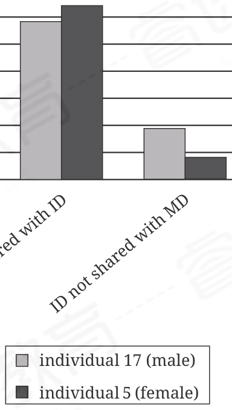

:::q {#Q001 sec=rw no=1}
@material
Like all hummingbirds, Heliodoxa jacula has high metabolic needs and is thus expected to prefer flowers with copious nectar, but María A. Maglianesi et al. found that nectar volume poorly predicted interaction frequencies between plants and hummingbirds, including H. jacula. If, they concluded, nectar volume does in fact mediate hummingbirds' foraging, its precise role remains ______

@stem
Which choice completes the text with the most logical and precise word or phrase?

- A. elusive
- B. ephemeral
- C. incredulous
- D. incipient
! source: p.1
! answer: A
:::

:::q {#Q002 sec=rw no=2}
@material
Emerging bioacoustics technologies have______ longstanding challenges to wildlife research by enabling scientific observation without a human presence in the field. For example, these tools have been used for continuous, unattended monitoring of insect species and for tracking nocturnal birds when they move into inaccessible areas of wetlands where traditional observation methods fail.

@stem
Which choice completes the text with the most logical and precise word or phrase?

- A. attributed
- B. underpinned
- C. surmounted
- D. subjugated
! source: p.1
! answer: C
:::

:::q {#Q003 sec=rw no=3}
@material
As a work of scholarship, Advancing U.S. Latino Entrepreneurship (2020) is notable for its ______. Featuring contributions from Ruth E. Zambrana, Linda Matthews, and others, it explores contemporary issues while also providing context dating all the way back to the sixteenth century on Latino populations and their experiences with business and commerce.

@stem
Which choice completes the text with the most logical and precise word or phrase?

- A. terseness
- B. scope
- C. impartiality
- D. reputation
! source: p.2
! answer: B
:::

:::q {#Q004 sec=rw no=4}
@material
The ______ of leaf-vein architectures—the branching venation of Pteris cretica, the hierarchical netlike venation of Clematis pitcheri, and others—likely resulted from competing selective pressures to maximize fluid transport, photosynthesis, and robustness against herbivory. The associated trade-offs may account for the range of adaptations in different lineages.

@stem
Which choice completes the text with the most logical and precise word or phrase?

- A. multifariousness
- B. obstinacy
- C. entanglement
- D. culpability
! source: p.2
! answer: A
:::

:::q {#Q005 sec=rw no=5}
@material
The metal featured in both the structure of the Shimogamo Machiya Villa by Takuma Ohira and the hardware in the One-Room Residence of 5 Layers by Matsuyama Architect and Associates is representative of a trend in contemporary Japanese interior design to juxtapose sleek, modern accents with traditional organic materials such as cypress. The prominent featuring of metal stems from the post–World War II emphasis on technological progress, while more traditional natural materials help preserve longstanding architectural and aesthetic approaches.

@stem
Which choice best describes the overall structure of the text?

- A. The text names projects that are noteworthy for their inclusion of certain materials and then explains past important uses of the materials.
- B. The text distinguishes between two aesthetic approaches to architecture and then submits that one approach has had more of a longterm impact than the other has had.
- C. The text introduces the salient characteristics of two buildings and then details the historical events that occasioned the buildings' designs.
- D. The text cites examples of a design trend and then briefly establishes the principles underlying the trend.
! source: p.3
! answer: D
:::

:::q {#Q006 sec=rw no=6}
@material
Text 1 In separate studies, Marine Fernandez and colleagues and Sanâa Wahbi and colleagues examined whether plants transfer nutrients to one another using a common mycorrhizal network (CMN)—a lattice of fungal strands in the soil. Fernandez and colleagues excluded all pathways other than the CMN by using barriers to keep the plants' root systems separate while allowing mycorrhizal strands through—an essential step Wahbi and colleagues' study did not take.

Text 2 Fernandez and colleagues took the necessary precaution of separating the plants' root systems (thereby excluding root-to-root transmission). However, any barrier used must allow the threadlike hyphae of a CMN to pass through, and this permeability would also allow liquids through. Thus, the researchers' experimental design cannot ensure that any nutrient transfer observed can be attributed to a CMN and not to some other pathway.

@stem
Based on the texts, the author of Text 1 and the author of Text 2 would most likely agree with which statement?

- A. Excluding root-to-root transfer of nutrients between plants is sufficient to evaluate whether any observed nutrient transfer involved a CMN.
- B. It is impossible to determine whether a CMN is the mechanism for any observed nutrient transfer unless root-to-root transfer is precluded.
- C. A barrier that is impervious to both roots and fungal strands is necessary to examine nutrient transfer via a CMN.
- D. Wahbi and colleagues' study did not find convincing evidence of nutrient transfer between individual plants.
! source: p.3
! answer: B
:::

:::q {#Q007 sec=rw no=7}
@material
Probabilistic models generate predictions based on outcomes of analogous past events, but even as these models project likely outcomes, they implicitly acknowledge that lower-frequency events may occur instead. Because they accommodate multiple potential outcomes, such models may seem incompatible with causal determinism—the view that particular outcomes are inevitable given certain preconditions. But complete foreknowledge of relevant conditions is generally unavailable, suggesting that a state of uncertainty ultimately prevails in which outcomes can be predicted but not definitively foretold.

@stem
What does the text most strongly imply about the relationship between probabilistic models and causal determinism?

- A. The predictive use of probabilistic models represents a rejection of causal determinism because such models associate a single event with multiple potential outcomes.
- B. The predictive use of probabilistic models can be reconciled with acceptance of causal determinism because causal determinism does not necessarily entail the existence of absolute certainty.
- C. Probabilistic models reflect the influence of causal determinism because their predictions of future outcomes are informed by concrete information about past events.
- D. Probabilistic models can be understood as compatible with causal determinism only when their predictions of future events overwhelmingly favor one potential outcome.
! source: p.4
! answer: B
:::

:::q {#Q008 sec=rw no=8}
@material
Average Overlap between Immature Orangutans' Diets (ID) and Their Mothers'

Diets (MD)

% of diet

ID not shared with MD

MD shared with ID

individual 17 (male)

individual 5 (female)

Male orangutans typically disperse from the territory in which they were born when they reach maturity, whereas females typically do not. Beatrice Ehmann and her colleagues hypothesized that this difference in life trajectory should be reflected in the diets of immature orangutans: males should share fewer of their mothers' dietary preferences than females do since those preferences tend to be particular to the food resources available in the local area and may be of relatively low utility beyond it. The researchers calculated the percent of mother orangutans' diets shared with their offspring's diets and the percent of immature orangutans' diets not shared with their mothers' diets.

@stem
Which choice best describes data from the graph that support Ehmann and colleagues' hypothesis?

- A. The percent of individual 5's mother's diet that was shared with individual 5's diet ranged from approximately 59% to approximately 65%, whereas the percent of individual 17's mother's diet that was shared with individual 17's diet ranged from approximately 8% to approximately 19%.
- B. The percent of the mother's diet shared with its offspring's diet was smaller for individual 17 than for individual 5, and the percent of the individual's diet not shared with its mother's diet was greater for individual 17 than for individual 5.
- C. Neither individual 17 nor individual 5 had a diet that consisted mostly of food not shared with the individual's mother's diet, whereas more than half of both individuals' mothers'diets were shared with their offspring's diets.
- D. The majority of the diet of the mother of individual 5 was shared with the diet of individual 5, whereas significantly less than half the diet of the mother of individual 17 was shared with the diet of individual 17.
! source: p.5
! answer: B
:::

:::q {#Q009 sec=rw no=9}
@material
Proportion of the Three Most Commonly Exhibited

Mobility Patterns, in the US

and Cote d' Ivoir

0.8

Proportion

0.6

0.4

0.2

US 2 US 3 US 4 CI 2 CI 3 CI 4

Mobility pattern by country

measured

model: emphasis density

model: emphasis preferences

Researchers used anonymous location data from the US and Côte d' Ivoire to document people's daily patterns of mobility, using these results to test the efficacy of the researchers' predictive computer model. In each country, unidirectional cycles among two, three, or four locations were empirically the most common pattern types; the graph shows each of these pattern types as a proportion of all pattern instances found for that country (e.g., the measured value for CI 3 in the graph, 0.12, indicates that the three-location pattern constituted 12% of all pattern instances in the Côte d' Ivoire data). The researchers ran their model twice under different assumptions, concluding that emphasizing the salience of local population density over personal preferences generally yielded the best results.

@stem
Which choice most effectively uses data from the graph to illustrate the researchers' conclusion?

- A. Under the assumption that preferences are more salient than density, the US 2 and CI 2 proportions were predicted to be in the range of 0.3 to 0.5, placing them farther from the measured values than were those predicted under the other assumption.
- B. Under the assumption that density is more salient than preferences, the US 2 and CI 2 proportions are approximately 0.65 and 0.85, respectively, significantly higher than the values predicted under the other assumption and thus farther than those predictions from the measured values.
- C. Under the assumption that preferences are more salient than density, the two-location patterns (US 2 and CI 2) were predicted to be most frequent in the data even though neither proportion was projected to exceed 0.5, well below the proportion predicted under the other assumption.
- D. Under the assumption that preferences are more salient than density, the US 2 and CI 2 proportions were predicted to be approximately 0.45 and 0.35, respectively, both below the measured values, whereas under the other assumption, the model overestimated the proportion for US 2 and overestimated that for CI 2.
! source: p.6
! answer: A
:::

:::q {#Q010 sec=rw no=10}
@material
The bird species Hemitriccus josephinae (the boatbilled tody-tyrant) practices a foraging strategy known as sallying (catching insects in flight and returning to a perch to eat them), enabling it to scan for prey and predators simultaneously. Conversely, Myrmotherula axillaris (the white-flanked antwren), with which H. josephinae shares territory in French Guiana, practices foliage gleaning (picking insects off leaves), substantially limiting the bird's field of vision while foraging. Biologist Ari Martínez and colleagues hypothesized that the greater vulnerability inherent in the latter strategy is reflected in greater sensitivity to predator warning signals from neighboring species.

@stem
Which finding, if true, would most directly support Martínez and colleagues' hypothesis?

- A. When Martínez and colleagues played alarm calls from another local bird species, M. axillaris displayed predator-avoidance behavior, whereas H. josephinae did not display any behavioral change.
- B. When Martínez and colleagues played control sounds of random noise, only M. axillaris displayed predator-avoidance behavior, whereas both M. axillaris and H. josephinae displayed such behavior when alarm calls from another local bird species were played.
- C. When Martínez and colleagues played H. josephinae alarm calls, only H. josephinae displayed predator-avoidance behavior, whereas both H. josephinae and M. axillaris displayed such behavior when M. axillaris alarm calls were played.
- D. When Martínez and colleagues played alarm calls from a species that does not share territory with H. josephinae and M. axillaris, H. josephinae displayed predator-avoidance behavior, whereas M. axillaris did not display any behavioral change.
! source: p.7
! answer: A
:::

:::q {#Q011 sec=rw no=11}
@material
There is a growing belief that teaching medical students about art alongside standard science and clinical coursework helps them become more observant, develop greater patient empathy, and strengthen their communication skills. But some medical program educators are skeptical, questioning if arts and humanities experiences can be clearly shown to have any worthwhile advantages for their students. Research into the effectiveness of arts programs for medical students by Neha Mukunda and her colleagues found that evidence is largely anecdotal and based on studies that were short in duration, limited to single institutions, or restricted to small numbers of students. To strengthen the evidence base in support of incorporating humanities into the coursework for medical students, then, ______

@stem
Which choice most logically completes the text?

- A. institutions may need to provide medical students with exposure to larger numbers of artworks than have been used in previous studies.
- B. larger-scale, multi-institutional research studies tracking outcomes for medical students over longer periods are needed.
- C. researchers must prove that scientific training alone is insufficient for developing clinical skills.
- D. medical schools should highlight more student testimonials about how arts education benefits their clinical abilities.
! source: p.8
! answer: B
:::

:::q {#Q012 sec=rw no=12}
@material
Habitat management areas and other types of protected areas (PAs) are established to promote conservation, but because they restrict certain economic activities, it is widely believed that they hinder local economic development. However, a study by Anubhab Gupta and team investigating five PAs, including Lower Zambezi National Park (a terrestrial PA in Zambia) and the Mamanuca Islands (a marine PA in Fiji), estimated the impact of tourism on these regions and concluded that tourism likely results in increased household incomes in local communities. But whereas terrestrial PAs were in remote places with few alternative amenities to attract tourists, marine PAs were close to additional amenities not part of the PA. Thus, the researchers conceded that although ______

@stem
Which choice most logically completes the text?

- A. economic activity in the tourism sector in communities around Lower Zambezi can likely be attributed to interest in it as a protected area, economic activity in tourism around the Mamanuca Islands may be unrelated to the PA.
- B. the establishment of both PAs likely benefited their respective local economies, such gains likely derived mainly from the tourism industry in Lower Zambezi and from industries unrelated to tourism in the Mamanuca Islands.
- C. tourism at the Mamanuca Islands and surrounding regions likely fluctuated erratically in the period shortly after the PA was created, tourism at Lower Zambezi remained largely stable.
- D. household income increased in the areas surrounding both PAs, it likely grew at a much faster rate for households near the Mamanuca Islands than for households near Lower Zambezi.
! source: p.8
! answer: A
:::

:::q {#Q013 sec=rw no=13}
@material
The subscription economy has rapidly expanded to include a wide range of products—from children's toys to cloud storage—in part because consumers appreciate the convenience of automatic payments. But as a study by Neale Mahoney and team shows, consumers are typically inattentive to automatic payments and remain subscribed to services long after their value has worn off. The study also found that subscribers were much more likely to discontinue a service when they had to make an active renewal decision (for example, when they need to update payment information to remain subscribed) than at other times. The researchers therefore concluded that a regulation requiring all subscribers to complete payments manually would likely ______

@stem
Which choice most logically completes the text?

- A. enable dissatisfied subscribers to save more money than they would without such a regulation in place but at the expense of a feature that may have induced them to subscribe initially.
- B. decrease subscribers' valuation of the subscription services at a faster rate than if no such regulation were implemented.
- C. deter attentive consumers from subscribing in the first place but would have little effect on whether inattentive consumers decide to subscribe.
- D. result in reduced average subscription durations, but the overall experience of the longest-subscribing consumers would improve.
! source: p.9
! answer: A
:::

:::q {#Q014 sec=rw no=14}
@material
By occupying the Earth-Moon L2 Lagrange point, where the gravitational forces from Earth and the Moon are in equilibrium, the THEMIS satellite— which studies Earth's magnetosphere—maintains a constant orbital position relative to the Moon. The orbital stability of objects positioned at a Lagrange point is not ______ space craft occupying the Earth- Moon L2 Lagrange point still need to make occasional adjustments, using small amounts of fuel to fine-tune their positions.

@stem
Which choice completes the text so that it conforms to the conventions of Standard English?

- A. perfect, though,
- B. perfect, though;
- C. perfect, though
- D. perfect; though
! source: p.9
! answer: B
:::

:::q {#Q015 sec=rw no=15}
@material
Some places that were once part of the Spanish Empire, such as Luxembourg, reveal few traces of a past connection to Spain, linguistic or otherwise. In contrast, Cuba broke free from the Spanish Empire in the nineteenth century yet still bears its imperial history in its language, Spanish ______ spoken by most current residents of Cuba.

@stem
Which choice completes the text so that it conforms to the conventions of Standard English?

- A. is being
- B. will be
- C. being
- D. is
! source: p.10
! answer: C
:::

:::q {#Q016 sec=rw no=16}
@material
Breaking ties with the Soviet Union in 1991 catalyzed a host of infrastructural changes for the newly independent Uzbekistan, among them a new country dialing code from the International Telegraph and Telephone Consultative Committee ______ incoming international telephone calls to reach the country.

@stem
Which choice completes the text so that it conforms to the conventions of Standard English?

- A. had enabled
- B. enabled
- C. would enable
- D. enabling
! source: p.10
! answer: D
:::

:::q {#Q017 sec=rw no=17}
@material
For her 2010 installation "Dubling," Brazilian artist Elida Tessler extracted every gerund from James Joyce's novel ______ capped empty wine bottles and creating 4,311 postcards featuring images of Dublin's River Liffey, she forged a visual connection between the flowing waters so central to Joyce's narrative and the novel's stream-of-consciousness style.

@stem
Which choice completes the text so that it conforms to the conventions of Standard English?

- A. Ulysses by stamping all 4,311"-ing" verbs onto individual corks that
- B. Ulysses, stamping all 4,311"-ing" verbs onto individual corks. That
- C. Ulysses, stamping all 4,311"-ing" verbs onto individual corks that
- D. Ulysses. Stamping all 4,311"-ing" verbs onto individual corks that
! source: p.11
! answer: D
:::

:::q {#Q018 sec=rw no=18}
@material
Located on the Elbe River in Germany, the city of Magdeburg was a member of a powerful mercantile alliance that dominated northern European trade between the 13th and 17th ______ a loose confederation of cities from eleven modern-day countries, it has been described as a precursor to today's European Union.

@stem
Which choice completes the text so that it conforms to the conventions of Standard English?

- A. centuries; the Hanseatic League,
- B. centuries, the Hanseatic League,
- C. centuries—the Hanseatic League;
- D. centuries: the Hanseatic League,
! source: p.11
! answer: C
:::

:::q {#Q019 sec=rw no=19}
@material
Michael Veal of Yale University, along with researchers Jeff Todd Titon of Brown University and Maureen Mahon of New York University, ______ on the advisory team for the Timeline of African American Music, an interactive digital resource that explores African American musical history from the 1600s to the present day.

@stem
Which choice completes the text so that it conforms to the conventions of Standard English?

- A. serve
- B. have served
- C. are serving
- D. serves
! source: p.12
! answer: D
:::

:::q {#Q020 sec=rw no=20}
@material
When constructing grain storage silos with reinforced concrete, engineers anticipate that the material will develop cracks under heavy loads; the reinforcing lattice of steel bars embedded within the concrete is meant to accommodate this inevitability rather than thwart it entirely. ______ it is only upon cracking that reinforced concrete can actuate the full support of the steel. Until then, the steel's role is largely passive, and the concrete behaves more or less like unreinforced concrete.

@stem
Which choice completes the text with the most logical transition?

- A. Indeed,
- B. Nevertheless,
- C. However,
- D. Thus,
! source: p.12
! answer: A
:::

:::q {#Q021 sec=rw no=21}
@material
Although the Indo-European language of Rushani has only about 18,000 living speakers, most in Tajikistan, the New York City–based Endangered Language Alliance has identified a group of Rushani speakers in the city's borough of Queens. ______ in the borough's Rego Park neighborhood, these speakers are both helping to ensure Rushani's survival and contributing to the city's unmatched linguistic diversity.

@stem
Which choice completes the text with the most logical transition?

- A. Likewise,
- B. For example,
- C. Consequently,
- D. There,
! source: p.13
! answer: D
:::

:::q {#Q022 sec=rw no=22}
@material
Karel Čapek's 1920 play R. U. R. (Rossum's Universal Robots), in which artificial workers overthrow their masters, left an indelible mark on the science fiction genre, and the English language, by introducing the term "robot" (derived from the Czech word robota, meaning "indentured labor" or "drudgery"). ______ Čapek's play also contributed to a venerable literary and mythological tradition: using artificial beings as mirrors and foils for humanity.

@stem
Which choice completes the text with the most logical transition?

- A. Beyond the simple coining of a term,
- B. Ultimately limited in its lasting influence,
- C. By achieving such a lofty goal,
- D. Despite its creation of such an iconic trope,
! source: p.13
! answer: A
:::

:::q {#Q023 sec=rw no=23}
@material
While researching a topic, a student has taken the following notes:

• Atoms in a solid state are ordered and cannot move freely; atoms in a liquid state are disordered and can move three-dimensionally.

• Under high pressure and heat, potassium forms an unusual dual structure: a solid lattice of atoms (the host) surrounds partially liquid atom chains (the guest).

• This hybrid state (chain melt) was previously thought to be a transitional phase between solid and liquid states.

• A 2019 study confirmed that even under extreme heat, the host structure remained solid while the guest structure did not become fully liquid.

• These guest atoms exhibited disorder but were confined to one-dimensional movement by the host.

• Chain melt was determined to be a stable, distinct state.

@stem
The student wants to explain why potassium is not fully liquid in a chain melt state. Which choice most effectively uses relevant information from the notes to accomplish this goal?

- A. In chain melt, some potassium atoms exhibit liquid-like disorder but remain confined by a solid lattice, preventing the free threedimensional movement of a fully liquid state.
- B. A chain-melt state involves a dual structure of a solid host lattice surrounding partially liquid chains of potassium atoms.
- C. A 2019 study confirmed that potassium atoms do not become fully liquid under high pressure and heat; instead, they enter chain melt, a transitional phase between solid and liquid states.
- D. Because potassium atoms remain disordered in chain melt even under extreme heat, they cannot reach a fully liquid state.
! source: p.14
! answer: A
:::

:::q {#Q024 sec=rw no=24}
@material
While researching a topic, a student has taken the following notes:

• Aenos National Park is a Dark Sky Park located on the Greek island of Kefalonia.

• Aotea Great Barrier Island is a Dark Sky Sanctuary located on the North Island of New Zealand.

• Dark Sky Sanctuaries and Dark Sky Parks are two types of areas where the night sky has very little light pollution, as designated by the International Dark Sky Places (IDSP) program.

• The luminance (brightness) of the sky can be measured in magnitudes per square arcsecond (mag/arcsec2), with a higher number indicating a darker sky.

• The average nighttime luminance of a Dark Sky Park must meet or exceed 21.2 mag/arcsec2.

• The average nighttime luminance of a Dark Sky Sanctuary must meet or exceed 21.5 mag/ arcsec2.

@stem
The student wants to emphasize a difference between Dark Sky Sanctuaries and Dark Sky Parks. Which choice most effectively uses relevant information from the notes to accomplish this goal?

- A. The luminance of Aotea Great Barrier Island exceeds 21.5 mag/arcsec2, while Aenos National Park, by contrast, has very little light pollution.
- B. A Dark Sky Park must have very little light pollution and a luminance of 21.2 mag/arcsec2 or greater—a decidedly stricter set of criteria than those required of a Dark Sky Sanctuary.
- C. The required average nighttime luminance of a Dark Sky Sanctuary exceeds that of a Dark Sky Park.
- D. Though Aotea Great Barrier Island is a Dark Sky Sanctuary, IDSP also designates Dark Sky Parks.
! source: p.14
! answer: C
:::

:::q {#Q025 sec=rw no=25}
@material
While researching a topic, a student has taken the following notes:

• In the 1940s, geneticist Barbara McClintock discovered mobile segments of DNA.

• McClintock called these segments "controlling elements," but they are now commonly known as transposable elements (TEs).

• TEs are capable of altering gene expression as they change position within a cell's genome.

• In 1950, geneticist Esther Lederberg discovered a process (the lysogenic cycle) by which bacteria-infecting viruses (phages) pass their genetic material to a host cell's descendants.

• Phage DNA will enter a bacterial host cell and incorporate itself into the host cell's genome.

• When the host cell divides, the phage DNA replicates along with the host's DNA.

@stem
The student wants to compare McClintock's discovery with Lederberg's. Which choice most effectively uses relevant information from the notes to accomplish this goal?

- A. McClintock's and Lederberg's discoveries provided insight into how phage DNA uses the lysogenic cycle to change position within the genome of a bacterial host cell.
- B. Both McClintock and Lederberg were geneticists: McClintock found that phage DNA could be passed to bacterial host cells, and Lederberg identified DNA segments that can change position within genomes.
- C. While McClintock first discovered DNA segments capable of altering gene expression, Lederberg's discovery provided geneticists with a better understanding of how TEs move within host cells.
- D. Like McClintock's discovery, which revealed moving DNA segments within a cell's genome, Lederberg's discovery also involved DNA mobility, showing how phage DNA will enter a bacterial host cell and incorporate itself into the cell's genome.
! source: p.15
! answer: D
:::

:::q {#Q026 sec=rw no=26}
@material
While researching a topic, a student has taken the following notes:

• People in Central America first began domesticating turkeys around1,800 years ago.

• They raised turkeys for their eggs and as guards.

• People in eastern Europe first began domesticating horses around 6,000years ago.

• They raised horses for transportation and for plowing fields.

@stem
The student wants to emphasize a difference between the domestication of turkeys and that of horses. Which choice most effectively uses relevant information from the notes to accomplish this goal?

- A. Though turkeys were domesticated longer ago than horses, both were raised for the same purposes.
- B. While horses were first domesticated 6,000 years ago, turkeys were domesticated more recently, around 1,800 years ago.
- C. People in Central America and eastern Europe first began domesticating turkeys and horses around 1,800 years ago.
- D. Turkeys were first domesticated in eastern Europe, whereas the domestication of horses first occurred in Central America.
! source: p.16
! answer: B
:::

:::q {#Q027 sec=rw no=27}
@material
While researching a topic, a student has taken the following notes:

• Abraham Cresques was a fourteenth-century Majorcan cartographer of portolan charts.

• Francesco Pizigano was a fourteenth-century Venetian cartographer of portolan charts.

• Portolan charts were early nautical charts that mapped the waterways of the Mediterranean and Black Seas.

• Portolan charts in the Venetian tradition tended to be sparse in illustrations.

• Those in the Majorcan tradition tended to be richly illustrated.

• In Majorcan charts, the Atlas Mountains are depicted as a palm tree, and Bohemia is depicted as a horseshoe.

@stem
The student wants to make a distinction between the two portolan traditions. Which choice most effectively uses relevant information from the notes to accomplish this goal?

- A. Being in the Majorcan tradition, the portolan charts of Abraham Cresques differed from those of the Venetian cartographer Francesco Pizigano.
- B. While portolan charts in the Majorcan tradition tended to be richly illustrated, those in the Venetian tradition mapped the waterways of the Mediterranean and Black Seas.
- C. Unlike Venetian portolan charts, which could include illustrations of palm trees and horseshoes, Majorcan charts were sparse in illustration.
- D. Majorcan portolan charts, unlike their sparser Venetian counterparts, tended to be richly illustrated.
! source: p.16
! answer: D
:::
