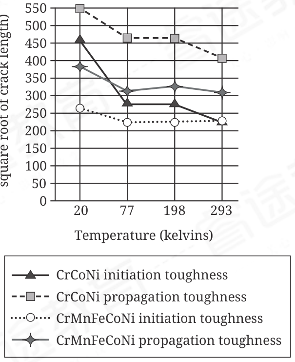

:::q {#Q001 sec=rw no=1}
@material
Danza Azteca arose in the 1500s when the traditions of the Pame people ______ those of other tribes in Central Mexico, creating a hybrid dance form that spread across Mexico and later to Mexican communities in the US. Pame influences can still be seen in the performances by groups like Danza Azteca Xochipilli, which is based in East Los Angeles.

@stem
Which choice completes the text with the most logical and precise word or phrase?

- A. deferred to
- B. intermingled with
- C. advocated for
- D. corresponded to
! source: p.1
! answer: B
:::

:::q {#Q002 sec=rw no=2}
@material
In a 2020 paper, Arya Udry et al. cautioned that although similarities in the isotopic signatures of elements detected in Mars's atmosphere and in Martian meteorites recovered on Earth make it tempting to treat the geochemical properties of the meteorites as ______ those of Mars's interiors, Mars's geology cannot be ascertained based solely on meteorite-sample analyses.

@stem
Which choice completes the text with the most logical and precise word or phrase?

- A. contrivances of
- B. proxies for
- C. catalysts of
- D. deterrents to
! source: p.1
! answer: B
:::

:::q {#Q003 sec=rw no=3}
@material
As the use of non-oil energy resources has increased, the relationship between oil shocks—such as the 9% rise in oil prices in February 1969—and national economic activity has ______. Indeed, Gbadebo Oladosu and colleagues showed that the effect of recent oil shocks on the gross domestic product of the United Kingdom was only slightly greater than zero.

@stem
Which choice completes the text with the most logical and precise word or phrase?

- A. acquiesced
- B. abated
- C. oscillated
- D. reverted
! source: p.2
! answer: B
:::

:::q {#Q004 sec=rw no=4}
@material
The Federalist Papers are a collection of 85 essays written by Alexander Hamilton, John Jay, and James Madison. They were published pseudonymously in the Independent Journal and other New York newspapers in 1787–88 and argue that New Yorkers should vote to ratify the proposed United States Constitution. Though the authorship of most of the individual essays is certain, that of a few is in question: for instance, while No. 15, "The Insufficiency of the Present Confederation to Preserve the Union," was surely penned by Hamilton, No. 52, "The House of Representatives," may have been written by either Hamilton or Madison.

@stem
Which choice best states the main purpose of the text?

- A. To summarize a contentious argument made in a collection of essays
- B. To point out that some essays in a notable collection were written by one person, while others were written by two people
- C. To present the publication history of a collection of essays
- D. To describe a collection of essays and address what is known about their authorship
! source: p.2
! answer: D
:::

:::q {#Q005 sec=rw no=5}
@material
The Museum of Modern Art (MOMA) in New York City has an exhibition of video games that includes Katamari Damacy from 2004, which museum visitors can play on site, and Eve Online from 2003, which visitors can see only in a video presentation. MOMA claims the video presentations are only for games that would be impractical to display in a playable form, but video games are an inherently interactive medium, a feature that is grossly absent in a videoonly presentation.

@stem
Which choice best describes the function of the underlined portion in the text as a whole?

- A. It presents a misconception about video games that the author believes is evident in MOMA's choice about which video games to exhibit.
- B. It provides MOMA's rationale for a decision that the author critiques.
- C. It details a criticism of MOMA that the author defends against in the remainder of the sentence.
- D. It introduces a fact about video games that the author thinks MOMA did not appropriately consider when choosing which video games to exhibit.
! source: p.3
! answer: B
:::

:::q {#Q006 sec=rw no=6}
@material
The following text is from Anne Spencer's 1922 poem"Translation."

We trekked into a far country, My friend and I. Our deeper content was never spoken, But each knew all the other said. He told me how calm his soul was laid By the lack of anvil and strife."The wooing kestrel," I said, "mutes his mating-note To please the harmony of this sweet silence."

@stem
Which choice best describes the function of the reference to "anvil and strife" in the text as a whole?

- A. It symbolizes the speaker's friend's view that meaningful work and social engagement are core components of a fulfilling life.
- B. It illustrates how the speaker and her friend do not need to be explicit about their feelings to understand each other well.
- C. It represents a strong contrast to the speaker's friend's current experience of tranquility.
- D. It emphasizes a dissimilarity between the emotions of the speaker and her friend and the sights and sounds of nature.
! source: p.3
! answer: C
:::

:::q {#Q007 sec=rw no=7}
@material
Studies of the population density of cougars (Puma concolor) have yielded a range of results, which may in part reflect differences in the effectiveness of the methods that researchers have used in their studies. If, for example, the use of helicopter surveying tends to lead to overestimates of cougar population density, that may explain why the study by ______

@stem
Which choice most effectively uses data from the table to complete the example?

- A. Richard A. Beausoleil et al. required a study area of 7,939 square kilometers, while the study by David M. Choate et al. required a study area of 780 square kilometers.
- B. David M. Choate et al. reported a maximum density of 10.24 individuals per 100 square kilometers, higher than that reported by several other studies.
- C. Sean M. Murphy et al. reported a maximum density of only 1.65 individuals per 100 square kilometers, lower than that reported by several other studies.
- D. P. Ian Ross and Martin G. Jalkotzy reported a maximum density of 4.70 individuals per 100 square kilometers, while the study by Richard A. Beausoleil et al., which used biopsy darting, reported a lower maximum density.
! source: p.4
! answer: B
:::

:::q {#Q008 sec=rw no=8}
@material
Autofiction is an emerging literary form that incorporates autobiographical writing into fiction. Practitioners of autofiction emphasize the autobiographical aspects of their work by patterning their protagonists' lives after their own, typically naming their protagonists after themselves. Autofiction usually borrows formal elements from autobiographical writing too, including its first person point of view and its use of a narrative voice so forthright that it borders on confessional. Ocean Vuong's 2019 novel On Earth We're Briefly Gorgeous is a representative work of autofiction, one that erases the distinction that fiction typically observes between authors and the characters they create.

@stem
Which statement, if true, would most strongly support the text's description of On Earth We're Briefly Gorgeous?

- A. The novel's protagonist bears an obvious resemblance to Vuong himself, and in interviews Vuong speaks of the protagonist as a sort of alter ego, yet the protagonist refers to himself as "Little Dog" throughout the novel and never divulges his actual name.
- B. The novel portrays the upbringing of the protagonist, a young writer, in a working-class Vietnamese American family that is virtually identical to Vuong's family, and the protagonist narrates the novel in a tone that many reviewers describe as surprisingly frank.
- C. On Earth We're Briefly Gorgeous makes use of imagery in much the same way that contemporary poetry does, exploiting certain images—butterflies, for example—for their emotional or conceptual associations; in this way, Vuong blurs the distinction between poetry and fiction.
- D. Although the narrative of On Earth We're Briefly Gorgeous proceeds in a largely chronological fashion, as narratives do in most works of fiction, the form of Vuong's narrative is unique: the novel consists of a single long letter that the protagonist, a soft-spoken young man, has written to his mother.
! source: p.5
! answer: B
:::

:::q {#Q009 sec=rw no=9}
@material
Projected Percent Change in Agricultural Production

and Market Price under Tariff-Elimination Scenario

Percent change in market prices

Country Percent change in

total production

Brazil +6.28 +3.19

Canada +3.74 +0.84

India –1.34 –1.98

Japan –7.18 –3.00

A tariff is a tax on imported goods intended to protect domestic producers of similar goods from international competition. Eliminating tariffs can lead to an influx of cheaper imported goods, lowering prices; in a place where domestic production is relatively expensive, this influx can suppress domestic production, as the country's consumers favor more cheaply produced imported goods over domestically produced ones. A student consults a table showing projected changes in production and average market prices of agricultural commodities in four countries in a tariff-elimination scenario. Based on the data, the student claims that compared with India and Japan, agricultural production in Brazil and Canada is likely relatively inexpensive.

@stem
Which choice most effectively uses information from the text and data from the table to support the student's claim?

- A. Brazil and Canada are the only countries shown that are projected to see both an increase in agricultural production and a reduction in agricultural prices in the absence of tariffs.
- B. Although eliminating tariffs would likely cause agricultural market prices to decrease in most locations, it would likely cause agricultural market prices to increase in both Brazil and Canada.
- C. In the absence of tariffs, total agricultural production in Brazil and Canada would likely exceed that in India and Japan.
- D. Although agricultural production in India and Japan would likely decrease if tariffs were eliminated, it would likely increase in both Brazil and Canada.
! source: p.6
! answer: D
:::

:::q {#Q010 sec=rw no=10}
@material
Fracture Toughness Values for CrMnFeCoNi and CrCoNi

at Various Temperatures

square root of crack length)

(megapascals times the

Fracture toughness

20 77 198 293 0 50 100 150 200 250 300 350 400 450 500 550

Temperature (kelvins)

CrCoNi initiation toughness

CrCoNi propagation toughness

CrMnFeCoNi initiation toughness

CrMnFeCoNi propagation toughness

High entropy alloys (HEAs) typically combine five or more elements in roughly equal proportions, and medium entropy alloys (MEAs) typically combine three or four elements in similar proportions. HEAs and MEAs are known for withstanding cracking at extremely low (cryogenic) temperatures relatively well, though their fracture toughness generally falls as temperature does. Dong Liu et al. investigated the fracture toughness (both the initiation and propagation toughness) of the HEA CrMnFeCoNi and its MEA derivative CrCoNi and concluded that the alloys' toughness performance differs from that of most HEAs and MEAs.

@stem
Which choice best describes data in the graph that support Liu et al.'s conclusion?

- A. The changes in initiation toughness and propagation toughness were greater between 20 kelvins and 77 kelvins than between 77 kelvins and 198 kelvins for both CrMnFeCoNi and CrCoNi.
- B. CrCoNi outperformed CrMnFeCoNi at 20 kelvins in both initiation toughness and propagation toughness even though it is composed of fewer elements.
- C. For both CrMnFeCoNi and CrCoNi, initiation toughness and propagation toughness were lower at 293 kelvins than at 20 kelvins.
- D. Both CrMnFeCoNi and CrCoNi showed substantially higher propagation toughness than initiation toughness throughout the range from 20 kelvins to 293 kelvins.
! source: p.7
! answer: C
:::

:::q {#Q011 sec=rw no=11}
@material
The Clouds is a 423 BCE play by Aristophanes, originally written in ancient Greek. At the time, professional intellectuals called sophists taught customers rhetorical techniques to use in public speaking, along with providing instruction in other subjects. In the play, Aristophanes satirizes sophists as having an exaggerated sense of their own wisdom, as seen when the character ______

@stem
Which choice most effectively uses a quotation from a translation of The Clouds to illustrate the claim?

- A. Socrates, a sophist, says to a customer, "Do not then always revolve your thoughts about yourself; but slack away your mind into the air."
- B. Socrates, a sophist, says to a new customer,"Come, then, take care that, whenever I propound any clever dogma about abstruse matters, you [seize] immediately."
- C. Strepsiades says of a sophist business, "There dwell men who in speaking of the heavens persuade people that it is an oven, and that it encompasses us, and that we are the embers. These men teach, if one give them money, to conquer in speaking, right or wrong."
- D. Strepsiades encourages his son to learn to be a sophist, saying, "If you have any concern for your father's patrimony, become one of them."
! source: p.8
! answer: B
:::

:::q {#Q012 sec=rw no=12}
@material
Mexico City Monterrey 729 3,474,971 3,202,091 domestic

A study of commercial airline routes that carried the greatest number of passengers in 2017 and 2018 shows that, in general, domestic routes (routes within a single country) carried many more passengers than international routes. However, a few international routes were so popular that they carried more travelers than some of the most highly traveled domestic routes, as can be seen when comparing the ______

@stem
Which choice most effectively uses data from the table to complete the example?

- A. distance between Mexico City and Monterrey with the distance between Jakarta and Singapore.
- B. number of passengers who traveled between Mumbai and Delhi in 2017 with the number who traveled between Hong Kong and Manila during that same year.
- C. number of passengers who traveled between Jakarta and Singapore in 2017 with the number who traveled that same route in 2018.
- D. number of passengers who traveled between Jakarta and Singapore in 2018 with the number who traveled between Mexico City and Monterrey during that same year.
! source: p.9
! answer: D
:::

:::q {#Q013 sec=rw no=13}
@material
Cane is a 1923 novel by Jean Toomer. In the novel, Toomer mentions a road in rural Georgia called Dixie Pike and describes it as having a deep connection to a faraway place, writing, ______

@stem
Which quotation from Cane most effectively illustrates the claim?

- A. "And when the wind is from the South, soil of my homeland falls like a fertile shower upon the lean streets of [Washington, DC]."
- B. "The Dixie Pike has grown from a goat path in Africa."
- C. "[Fern and I] walked down the [Dixie] Pike with people on all the porches gaping at us."
- D. "[The wagon] bumps, and groans, and shakes as it crosses the railroad track."
! source: p.9
! answer: B
:::

:::q {#Q014 sec=rw no=14}
@material
Many contemporary Indigenous painters practice a specifically Indigenous mode of abstraction; for example, Dyani White Hawk assembles compositions out of motifs common in the beadwork and other traditional arts of her tribe. In contrast, the prominent Indigenous practitioners of abstract painting during the mid-twentieth century, such as the Kiowa artist T.C. Cannon, typically aligned their compositional strategies with Abstract Expressionism—a school of painting dominated by European American artists— instead of with traditionally nonrepresentational forms of Indigenous art. Thus, in the case of Cannon's generation, the identification of an abstract painting as Indigenous art tends to ______

@stem
Which choice most logically completes the text?

- A. depend not on stylistic details but instead on an awareness of the artist's identity.
- B. obscure the Indigenous origins of certain motifs associated with Abstract Expressionism.
- C. deny the extent to which cultural identity influences an artist's work.
- D. place a greater emphasis on the artist's biography than on the aesthetic merit of the painting.
! source: p.10
! answer: A
:::

:::q {#Q015 sec=rw no=15}
@material
Paleoanthropologists have struggled to determine the onset of consistent clothing use by hominids. The appearance of hide-scraping tools by 780,000 years ago (780 Ka) enabled clothing production but does not entail it, and while clothing is thought to have been thermally superfluous for anatomically modern humans in their African range around their emergence by 300 Ka, it was essential for the persistence of humans outside Africa by 70 Ka. Melissa Toups et al. proposed a novel proxy: the evolution of the clothing-exclusive variant of the human-exclusive parasite Pediculus humanus (head lice), which Toups et al. date to as early as 170 Ka. This variant could not have emerged and survived without ample ecological niches, so if Toups et al. are correct, then ______

@stem
Which choice most logically completes the text?

- A. the spread of regular clothing use among humans after approximately 70 Ka may have been motivated by factors other than the thermal benefits that clothing provides.
- B. a substantial proportion of humans must have regularly worn clothing long before humans permanently inhabited areas cold enough to necessitate doing so.
- C. it is unlikely that hominids other than anatomically modern humans produced or wore clothing even though tools enabling the production of clothing existed well before the emergence of humans.
- D. humans most likely began regularly wearing clothing at some point after 170 Ka but before approximately 70 Ka.
! source: p.10
! answer: B
:::

:::q {#Q016 sec=rw no=16}
@material
In biology, many initially disordered systems will naturally move toward greater order according to the principle of self-organization, a conceptual framework for pattern ______ biologists believe can be used to explain a range of organic phenomena, from population dynamics to the sociality of bees and ants.

@stem
Which choice completes the text so that it conforms to the conventions of Standard English?

- A. formation that some
- B. formation; some
- C. formation, that some
- D. formation. Some
! source: p.11
! answer: A
:::

:::q {#Q017 sec=rw no=17}
@material
Dong Lai and Diego J. Muñoz's work on circumbinary disk accretion—a process in which, due to gravity, material from an orbiting disk spirals inward and accumulates onto two stars or black holes—relies heavily on simulations. Lai and Muñoz recognize the need for direct ______ recommending evolving binary star systems as a promising avenue for future study.

@stem
Which choice completes the text so that it conforms to the conventions of Standard English?

- A. observation. However,
- B. observation, however;
- C. observation; however,
- D. observation, however,
! source: p.11
! answer: D
:::

:::q {#Q018 sec=rw no=18}
@material
Conceptual artist Joan Jonas's first work, Wind (1968), is a silent film depicting people on a beach struggling to move about in extremely windy conditions. Wind has been recognized for bringing the principles of postmodern dance—which demystifies traditional choreography by foregrounding features of movement that ballet and other classical dance forms obscure (such as clumsiness, weightiness, resistance, and ______ to video.

@stem
Which choice completes the text so that it conforms to the conventions of Standard English?

- A. gravity)
- B. gravity),
- C. gravity);
- D. gravity)—
! source: p.12
! answer: D
:::

:::q {#Q019 sec=rw no=19}
@material
In a 2018 study, Joseba Rios-Garaizar et al. concluded that wooden tools excavated from an archaeological site in Spain date to between 50,000 and 137,000 years ago. The reliability of the dates that Rios-Garaizar et al. have posited, which were obtained through processes that determined when buried mineral grains surrounding the tools were last exposed to sunlight, ______ in part upon the researchers' exclusion of mineral grains that lacked adequate sun exposure before burial.

@stem
Which choice completes the text so that it conforms to the conventions of Standard English?

- A. having depended
- B. depending
- C. depends
- D. depend
! source: p.12
! answer: C
:::

:::q {#Q020 sec=rw no=20}
@material
In recent years, the Irish writer Mary Tighe (1772– 1810), whose poetry was widely read during her lifetime, has been rediscovered by contemporary audiences—a resurgence of interest that is largely due to literary scholars such as Harriet Kramer Linkin, whose work ______ the richness of Tighe's poems and the poet's historical importance to the Romantic literary movement encourages a broader rethinking of British Romanticism itself.

@stem
Which choice completes the text so that it conforms to the conventions of Standard English?

- A. highlighting
- B. has highlighted
- C. highlights
- D. is highlighting
! source: p.13
! answer: A
:::

:::q {#Q021 sec=rw no=21}
@material
In 1977, legendary Puerto Rican performer Rita Moreno won an Emmy Award, making her one of the rare talents to earn the highest honors in television, music, film, and stage entertainment—the Emmy, Grammy, Oscar, and Tony ______ the achievement is known as "winning the EGOT."

@stem
Which choice completes the text so that it conforms to the conventions of Standard English?

- A. awards, respectively;
- B. awards, respectively—
- C. awards; respectively
- D. awards, respectively,
! source: p.13
! answer: A
:::

:::q {#Q022 sec=rw no=22}
@material
In a given rock formation, Eifelian rock from 393.3 million years ago might directly abut Toarcian rock from 184.2 million years ago. But how could this happen? Time did not actually stand still during the intervening 209.1 million years; ______ this geologic unconformity likely resulted from natural processes removing sedimentary material from the stratigraphic record.

@stem
Which choice completes the text with the most logical transition?

- A. moreover,
- B. however,
- C. for instance,
- D. rather,
! source: p.14
! answer: D
:::

:::q {#Q023 sec=rw no=23}
@material
Many historical accounts of the 1930s focus on the widespread movement of people from dust bowl– ravaged Great Plains states to faraway California. However, a 2016 study of 1940 census data complicates this popular narrative; ______ researchers determined, migrants in states hardest hit by prolonged droughts and dust storms—Colorado, Kansas, Oklahoma, and Texas—merely relocated within the region.

@stem
Which choice completes the text with the most logical transition?

- A. more often,
- B. nevertheless,
- C. for this reason,
- D. additionally,
! source: p.14
! answer: A
:::

:::q {#Q024 sec=rw no=24}
@material
While researching a topic, a student has taken the following notes:

• The French Republican calendar was used in France from 1793 to 1805.

• Each month was divided into three weeks of ten days each, followed by five supplemental days.

• Each day was named after a plant, animal, agricultural tool, or mineral as a way of honoring an aspect of rural life.

• Prairial is the ninth month in the calendar.

• The third day of Prairial is named Trèfle, which means "clover."

@stem
The student wants to emphasize how the French Republican calendar honored rural life. Which choice most effectively uses relevant information from the notes to accomplish this goal?

- A. Each day in the French Republican calendar's month of Prairial had a unique name.
- B. Each day in the French Republican calendar was given a unique name; the third day of Prairial was no exception.
- C. The ninth month in the French Republican calendar, Prairial, had three weeks that were divided into ten days each.
- D. Each day in the French Republican calendar was given a name honoring an aspect of rural life; for example, a day in Prairial was named for a plant, the clover.
! source: p.15
! answer: D
:::

:::q {#Q025 sec=rw no=25}
@material
While researching a topic, a student has taken the following notes:

• In a 2020 study, researchers in California investigated how many potential nesting sites female wood ducks visited during the nesting season.

• The researchers placed nest boxes throughout the survey area and tagged 138 female wood ducks with radio frequency ID trackers.

• These trackers recorded how many nest boxes each duck visited.

• 67 ducks (48.5%) visited only one nest box.

• 18 ducks (13.0%) visited 10 or more nest boxes.

• Younger ducks were more likely to visit multiple nest boxes.

@stem
The student wants to present the methods used in the 2020 study. Which choice most effectively uses relevant information from the notes to accomplish this goal?

- A. By recording how many nest boxes each duck visited, the researchers discovered that only a relatively small percentage (13.0%) of the ducks visited 10 or more nest boxes.
- B. The researchers investigated each nesting site for signs that it had been visited by the female wood ducks.
- C. The researchers tagged 138 female wood ducks with radio frequency ID trackers and recorded how many nest boxes each duck visited during the nesting season.
- D. After tracking how many nest boxes the 138 wood ducks visited, the researchers found that the younger ducks tended to visit more nest boxes than the older ducks.
! source: p.15
! answer: C
:::

:::q {#Q026 sec=rw no=26}
@material
While researching a topic, a student has taken the following notes:

• Jehuda Cresques was a fourteenth-century Majorcan cartographer of portolan charts.

• Pietro Vesconte was a fourteenth-century Genoese cartographer of portolan charts.

• Portolan charts were early nautical charts that mapped the waterways of the Mediterranean and Black Seas.

• Portolan charts in the Genoese tradition tended to be sparse in illustrations.

• Those in the Majorcan tradition tended to be richly illustrated.

• In Majorcan charts, Bohemia is depicted as a horseshoe, and the Tagus River is depicted as a shepherd's crook.

@stem
The student wants to make a distinction between the two portolan traditions. Which choice most effectively uses relevant information from the notes to accomplish this goal?

- A. Being in the Majorcan tradition, the portolan charts of Jehuda Cresques differed from those of the Genoese cartographer Pietro Vesconte.
- B. While portolan charts in the Majorcan tradition tended to be richly illustrated, those in the Genoese tradition mapped the waterways of the Mediterranean and Black Seas.
- C. Majorcan portolan charts, unlike their sparser Genoese counterparts, tended to be richly illustrated.
- D. Unlike Genoese portolan charts, which could include illustrations of horseshoes and shepherds' crooks, Majorcan charts were sparse in illustration.
! source: p.16
! answer: C
:::

:::q {#Q027 sec=rw no=27}
@material
While researching a topic, a student has taken the following notes:

• Cotton was used as commodity money in ancient Mesoamerica.

• In a commodity money economy, specific goods act as a common unit of monetary exchange that can be used to buy and sell other goods.

• In a barter economy, goods are traded directly between parties without the use of money.

• Economists Bruce Champ and Scott Freeman: bartering requires that "the person with whom you wish to trade must not only have what you want but also want what you have. The inefficiency is apparent; a great deal of time is spent merely finding someone with whom to trade."

• Champ and Freeman: when "individuals might come to accept one particular good in exchange for others even if they do not wish to consume that good . . . barter economies essentially become monetary economies."

@stem
The student wants to paraphrase a quotation from Champ and Freeman to explain the inefficiency of barter economies. Which choice most effectively uses relevant information from the notes to accomplish this goal?

- A. According to Champ and Freeman, the inefficiencies of barter economies become apparent when goods are traded between parties without the use of money.
- B. Champ and Freeman argue that inefficient barter economies can become monetary economies if a good becomes a unit of exchange.
- C. The precise alignment of desires that barter economies require, Champ and Freeman contend, makes them inefficient.
- D. In a barter economy, Champ and Freeman contend, goods are traded directly between parties without the use of money, leading to inefficiency.
! source: p.16
! answer: C
:::
