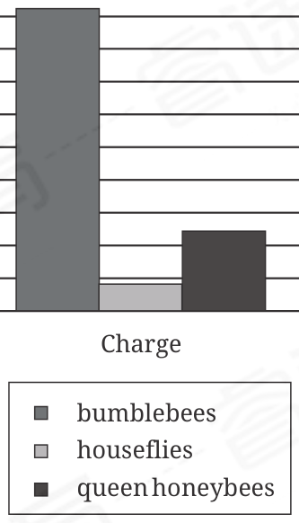

:::q {#Q001 sec=rw no=1}
@material
The following text is from Lilliam Rivera's 2020 novel Never Look Back. The text describes the narrator's friend Pheus, a young musician, after finishing a performance during a church service.

Pheus pulls a handkerchief from his back pocket and wipes his forehead. I mime a quiet clap for him. He does a slight bow and flashes his dimples. This is where Pheus truly shines. When Pheus is in front of an audience, it's as if he becomes another person, a more heightened version of himself.

@stem
As used in the text, what does the word "truly" most nearly mean?

- A. Impolitely
- B. Really
- C. Obediently
- D. Barely
! source: p.1
! answer: B
:::

:::q {#Q002 sec=rw no=2}
@material
Native Hawaiian fiber artist Marques Hanalei Marzan creates art using the techniques of lauhala weaving. Lauhala weaving is a traditional Hawaiian art form that uses leaves of the hala tree. Often, Marzan doesn't have a specific ______ what the final product will look like when he starts a new piece. Instead, he makes up his designs as he weaves, allowing inspiration to take him in unexpected directions.

@stem
Which choice completes the text with the most logical and precise word or phrase?

- A. admiration for
- B. imitation of
- C. acceptance of
- D. intention for
! source: p.1
! answer: D
:::

:::q {#Q003 sec=rw no=3}
@material
In a study at the Massachusetts Institute of Technology, participants with clinically typical eyesight were shown a drawing of a broken line, with the break in the line situated in a blocked part of their field of vision. The participants still perceived the line as continuous, suggesting that when visual information is incomplete, the brain can ______, filling in what is missing.

@stem
Which choice completes the text with the most logical and precise word or phrase?

- A. captivate
- B. revert
- C. barricade
- D. compensate
! source: p.2
! answer: D
:::

:::q {#Q004 sec=rw no=4}
@material
The following text is from Shirley Jackson's 1951 novel Hangsaman.

Natalie was leaving for her first year in college a week after her brother went back to high school; sometimes twenty-one days resolved itself into three weeks, and seemed endless; sometimes it seemed a matter of minutes slipping by so swiftly that there would never be time to approach college with appropriate consideration, to form a workable personality to take along.

@stem
As used in the text, what does the word"consideration" most nearly mean?

- A. Indecision
- B. Reflection
- C. Kindness
- D. Admiration
! source: p.2
! answer: B
:::

:::q {#Q005 sec=rw no=5}
@material
The Marsalis family is often referred to as "the first family of jazz." Four of the children of celebrated pianist Ellis Marsalis Jr. went on to become performers who are also critically acclaimed: drummer Jason, trombonist Delfeayo, saxophonist Branford, and trumpeter Wynton. Wynton notably went on to become the first jazz composer to win the Pulitzer Prize for Music (for his oratorio Blood on the Fields).

@stem
Which choice best describes the main purpose of the text?

- A. To emphasize why musicians should work together
- B. To show why a particular musician won a major award
- C. To explain why a family of musicians received a nickname
- D. To compare the artistic achievements of several musicians
! source: p.3
! answer: C
:::

:::q {#Q006 sec=rw no=6}
@material
Community science, which involves professional scientists collaborating with members of the public to study a topic, is often an effective and engaging way to conduct research. It can increase the amount of data researchers can collect, allow people to assist with conservation efforts, and build youth confidence in the sciences. This approach was essential to the success of biologist Abbigail Merrill and colleagues'study of how butterfly color relates to flower choice, which included findings from hundreds of students and community members in northwestern Arkansas.

@stem
Which choice best states the function of the underlined sentence in the text as a whole?

- A. It establishes the limits of the conclusion presented in the sentence that follows.
- B. It provides a contrast with an idea presented in the previous sentence.
- C. It identifies the purpose of the study described in the sentence that follows.
- D. It offers details to clarify the claim made in the previous sentence.
! source: p.3
! answer: D
:::

:::q {#Q007 sec=rw no=7}
@material
Text 1 Scientists can learn a lot about the giant ground sloth and other prehistoric sloths from their fossils. But it can be hard to study sloths alive today. In the wild, the maned three-toed sloth and other sloths spend most of their time in trees. They're difficult to observe because of their excellent camouflage and slow movements.

Text 2 Rebecca Cliffe and other scientists can now record the previously hidden activities of tree-dwelling sloths by using a backpack monitor. Such monitors can provide information to correct misconceptions. It was long believed that sloths are slow because of laziness. But, in fact, sloths' slow movements are useful. Being slow protects them from predators with keen eyesight.

@stem
The author of Text 1 and the author of Text 2 both discuss which topic?

- A. The differences between prehistoric and living sloths
- B. How climate change affects sloths
- C. The techniques scientists use to care for sloths
- D. The scientific study of sloths
! source: p.4
! answer: D
:::

:::q {#Q008 sec=rw no=8}
@material
Humans aren't the only ones who use tools. Other animals also find tools helpful. Dolphins use sponges to protect their noses from scratches when foraging on the seafloor. And despite sometimes being thought of as simple, many birds make clever use of tools as well. New Caledonian crows are well known for creating hooks and spears from twigs. Furthermore, greater vasa parrots have been observed using date pits to grind seashells into calcium powder.

@stem
According to the text, what are New Caledonian crows known for?

- A. They live longer than dolphins do.
- B. They create tools out of twigs.
- C. They have larger brains than greater vasa parrots have.
- D. They use date pits as tools.
! source: p.4
! answer: B
:::

:::q {#Q009 sec=rw no=9}
@material
Women like Grace Murray Hopper made important early contributions to the history of US cryptology, a field concerned with secure data communication and storage. Hopper was a US naval admiral and computer scientist who coined the term "debugging" and invented the first compiler program for translating computer code. In this way, Hopper and others like her helped make it possible for more women— such as Maureen Baginski, who currently works in intelligence and supports the FBI—to enter the field of cryptology.

@stem
According to the text, what is the relationship between Hopper and Baginski?

- A. Grace Murray Hopper founded an organization that Maureen Baginski currently works for.
- B. Grace Murray Hopper made earlier contributions to a field that Maureen Baginski currently works within.
- C. Grace Murray Hopper and Maureen Baginski worked together early in their careers.
- D. Grace Murray Hopper taught Maureen Baginski how to securely manage important data.
! source: p.5
! answer: B
:::

:::q {#Q010 sec=rw no=10}
@material
Optimal foraging theory (OFT) holds that animals'foraging behaviors reflect cost-benefit trade-offs that vary by species and with dynamic ecological circumstances. One such circumstance is lunar intensity, which Mary V. Price and colleagues found to be negatively associated with foraging by whitethroated woodrats but Eduardo Fernández-Duque and colleagues found to be positively associated with foraging by Azara's night monkeys. This discrepancy is explicable in terms of OFT: the monkeys' greater reliance on vision means that higher lunar intensity benefits them more than it benefits the woodrats.

@stem
Information in the text best supports which statement about OFT?

- A. It tends to allow for a better understanding of the benefits of ecological circumstances than the costs of those circumstances.
- B. It may be weakened by the finding that the costs and benefits associated with a particular ecological circumstance vary by species.
- C. It can explain why some species act in accordance with cost-benefit trade-offs and others do not.
- D. It can account for observations of different species responding differently to similar ecological circumstances.
! source: p.5
! answer: D
:::

:::q {#Q011 sec=rw no=11}
@material
Number of the 23 Non-native Tree Species Grown in

Three Countries

Number of species

Country 0

Austria

Switzerland

Poland

Elisabeth Pötzelsberger and colleagues gathered data on 23 non-native tree species grown in Europe. They analyzed reports from Austria, Switzerland, and Poland about the number of these species grown by the timber industries in those countries. The researchers concluded that none of these countries'timber industries grow all 23 species.

@stem
Which choice best describes data from the graph that support Pötzelsberger and colleagues' conclusion?

- A. Austria, which reported more of the 23 species than either Switzerland or Poland did, reported fewer than 15 of the species.
- B. Some of the species that Switzerland reported are not among the 23 tree species that Pötzelsberger and colleagues were evaluating.
- C. Austria, Switzerland, and Poland each reported at least 10 of the 23 species.
- D. There are species other than those reported by Poland that are important to its timber industry, but they're native to the country.
! source: p.6
! answer: A
:::

:::q {#Q012 sec=rw no=12}
@material
A student is writing a research paper on the history of irrigation in the United States, situating the development of the Crystal Springs Reservoir (created in San Mateo County, California, in 1888) in a larger historical context. The student claims that California's climate renders irrigation an essential component of agriculture in some parts of the state but not in others.

@stem
Which quotation from a study of California agriculture best supports the student's claim?

- A. "While the low humidity of Southern California's desert areas makes irrigation a requirement if agriculture is to be a success there, the relatively high humidity in the northern parts of the state makes such practices less necessary."
- B. "The irrigation system developed by the Hohokam people in the 7th century CE in what is now Arizona was simple but applied hydraulic engineering design features that are in use today throughout California."
- C. "Sprinkler irrigation systems are a method of irrigating that requires machinery to spray water in all directions. These systems can presently be found in use throughout California."
- D. "The usefulness of irrigation infrastructure in California today cannot be overstated, since it is the most common means of conveying water for agricultural purposes."
! source: p.7
! answer: A
:::

:::q {#Q013 sec=rw no=13}
@material
Maximum Charge Measured

for Various Pollinators

Picocoulombs (pC)

0 100 200 300 400 500 600 700 800 900 1,000

Charge

bumblebees

houseflies

queen honeybees

Terrestrial plants typically carry a negative electrical charge, while bees and other pollinators tend to accumulate a positive charge. A team of researchers therefore hypothesized that electrostatic attraction (mutual attraction between objects with opposite charges) might enhance pollen transmission between plants and their pollinator species. The team's experiments showed that the maximum positive charge of queen honeybees is sufficiently high to facilitate electrostatic pollen transfer, a finding that suggests that ______

@stem
Which choice most effectively uses data from the graph to complete the text?

- A. houseflies should demonstrate the opposite tendency.
- B. the minimum positive charge necessary for a pollinator to induce electrostatic attraction must be greater than 200 pC.
- C. bumblebees and houseflies, having greater maximum charges than queen honeybees have, should not demonstrate this capacity.
- D. bumblebees should also demonstrate this capacity.
! source: p.8
! answer: D
:::

:::q {#Q014 sec=rw no=14}
@material
Great Britain has classified the killer shrimp as an invasive species that could harm some of the country's native species. But researchers Alejandro Camacho and Jason McLachlan have pointed out that "invasive"and "native" are labels that describe temporary circumstances. Changes in Earth's climate may force animals from their current ranges. Climate changes may also create good habitats in areas where a species couldn't live previously. These observations suggest that ______

@stem
Which choice most logically completes the text?

- A. Great Britain was previously home to some killer shrimp but they were outcompeted by invading species.
- B. changes in Earth's climate are likely to result in the killer shrimp establishing itself as a native species in locations other than Great Britain.
- C. Great Britain may eventually need to reexamine its designation of the killer shrimp as invasive.
- D. it's appropriate for Great Britain to designate certain species as invasive but the country should designate the killer shrimp as native.
! source: p.8
! answer: C
:::

:::q {#Q015 sec=rw no=15}
@material
Password strength meters (PSMs) provide real-time feedback to users during the password-creation process about how secure a potential password is. PSMs often include "nudges"—design elements meant to encourage the creation of robust passwords. Other PSMs provide direct guidance on how to create strong passwords. A research team found that the strongest passwords resulted from a combination of these approaches. The team also found that the specific type of nudge (reciprocity, compensation, etc.) did not significantly affect user behavior. It therefore follows that when creating passwords, users receiving ______

@stem
Which choice most logically completes the text?

- A. reciprocity nudges would not be expected to create stronger passwords than users receiving compensation nudges, although users receiving both direct guidance and reciprocity nudges would be expected to create stronger passwords than users receiving only reciprocity nudges.
- B. both compensation and reciprocity nudges would not be expected to create stronger passwords than users receiving reciprocity nudges only, although users receiving direct guidance would be expected to create stronger passwords than users receiving either type of nudge.
- C. direct guidance would not be expected to create stronger passwords than users receiving compensation nudges, although users receiving compensation nudges would be expected to create stronger passwords than users receiving reciprocity nudges.
- D. both direct guidance and reciprocity nudges would not be expected to create stronger passwords than users receiving reciprocity nudges only, although users receiving this combination would be expected to create stronger passwords than users receiving both direct guidance and compensation nudges.
! source: p.9
! answer: A
:::

:::q {#Q016 sec=rw no=16}
@material
The Okavango Delta is a vital water source and hub for biodiversity in southern Africa. Koketso Mookodi, a director of the National Geographic Okavango Wilderness Project (NGOWP) in Botswana, helps educate the public about ______ important place.

@stem
Which choice completes the text so that it conforms to the conventions of Standard English?

- A. both
- B. those
- C. these
- D. this
! source: p.10
! answer: D
:::

:::q {#Q017 sec=rw no=17}
@material
After screening Their Last Ride by Cherokee filmmaker Neta Rhyne, the members of the selection committee for the Native Women in Film Festival were so impressed by the short documentary that they chose ______ as one of the films to be shown at the festival.

@stem
Which choice completes the text so that it conforms to the conventions of Standard English?

- A. it
- B. them
- C. these
- D. those
! source: p.10
! answer: A
:::

:::q {#Q018 sec=rw no=18}
@material
Hiram Rhodes Revels was one of the nearly two thousand African Americans who won a public office during the Reconstruction era, the twelve-year period that followed the Civil War. A politician from Mississippi, ______

@stem
Which choice completes the text so that it conforms to the conventions of Standard English?

- A. 1870 was the year that Revels was elected to the US Senate by his constituents.
- B. Revels was elected to the US Senate in 1870 by his constituents.
- C. in 1870, his constituents elected Revels to the US Senate.
- D. constituents of Revels elected him to the US Senate in 1870.
! source: p.11
! answer: B
:::

:::q {#Q019 sec=rw no=19}
@material
The relationship between grassland arthropod populations and agricultural fertilizers containing macronutrients—such as nitrogen, phosphorus, and potassium—was the focus of a 2008 study in ______ by the researcher David Cuesta, the study examined a variety of arthropod specimens, which had been collected with pitfall traps.

@stem
Which choice completes the text so that it conforms to the conventions of Standard English?

- A. Spain. Led
- B. Spain, led
- C. Spain led
- D. Spain and led
! source: p.11
! answer: A
:::

:::q {#Q020 sec=rw no=20}
@material
Known in Taiwan for hosting its first televised cooking show, renowned ______ Fu Pei-mei taught viewers how to cook Chinese cuisine for almost 40 years. Fu gained acclaim outside of Taiwan as well, particularly from the success of her first bilingual Mandarin-English cookbook, published in 1969.

@stem
Which choice completes the text so that it conforms to the conventions of Standard English?

- A. chef, and culinary instructor
- B. chef and culinary instructor,
- C. chef and culinary instructor
- D. chef, and culinary instructor—
! source: p.12
! answer: C
:::

:::q {#Q021 sec=rw no=21}
@material
A team led by Portuguese researcher Isabel C.F.R. Ferreira found that many species of mushrooms contain chemicals called phenolic compounds, such as 5-O-caffeoylquinic acid and kaempferol. ______ Ferreira detected 5-O-caffeoylquinic acid in Pleurotus ostreatus mushrooms and kaempferol in Sparassis crispa mushrooms.

@stem
Which choice completes the text with the most logical transition?

- A. However,
- B. For this reason,
- C. For example,
- D. Nevertheless,
! source: p.12
! answer: C
:::

:::q {#Q022 sec=rw no=22}
@material
Anthropologist, activist, and musician Lila Downs draws on a variety of Mexican musical genres in her 2023 album La Sánchez. ______ she draws on corridos, rancheras, and other genres of northern Mexico, even though she is from the southern Mexican city of Oaxaca. "La Sánchez is my contribution," Downs says in an interview, "as a southern woman, that also considers this music as hers."

@stem
Which choice completes the text with the most logical transition?

- A. In conclusion,
- B. Rather,
- C. Specifically,
- D. Therefore,
! source: p.13
! answer: C
:::

:::q {#Q023 sec=rw no=23}
@material
The World Cup of men's soccer, one of the biggest sporting events on the planet, brought 32 national teams from six continents to the host country, Germany, in 2006. ______ only 15 teams, most from Europe and the Americas, competed in the 1938 World Cup in France.

@stem
Which choice completes the text with the most logical transition?

- A. In other words,
- B. Therefore,
- C. In contrast,
- D. For instance,
! source: p.13
! answer: C
:::

:::q {#Q024 sec=rw no=24}
@material
Broadcasting from the Nez Perce Tribe's lands in northern Idaho, the Native-run radio station KIYE 88.7 FM does much to serve the local Nez Perce-speaking community. ______ it broadcasts local news and music as well as programming in the Nez Perce language.

@stem
Which choice completes the text with the most logical transition?

- A. As a result,
- B. Instead,
- C. Specifically,
- D. Nevertheless,
! source: p.14
! answer: C
:::

:::q {#Q025 sec=rw no=25}
@material
Al-Andalus, the historical region of the Iberian Peninsula that includes most of modern-day Spain, was ruled by various Arabic-speaking Muslim states between the eighth and fifteenth centuries. ______ many Arabic words, such as "alacrán"—meaning"scorpion"—made their way into the Spanish language.

@stem
Which choice completes the text with the most logical transition?

- A. Consequently,
- B. For example,
- C. Instead,
- D. Specifically,
! source: p.14
! answer: A
:::

:::q {#Q026 sec=rw no=26}
@material
While researching a topic, a student has taken the following notes:

• The Mekong River is in Asia.

• It ranks No. 12 among the longest rivers in the world.

• It is 4,350 kilometers long.

• The Congo River is in Africa.

• It ranks No. 9 among the longest rivers in the world.

• It is 4,700 kilometers long.

@stem
The student wants to compare the lengths of the two rivers. Which choice most effectively uses relevant information from the notes to accomplish this goal?

- A. Among the longest rivers in the world, the Congo River is ranked No. 9.
- B. The Mekong River is shorter than the Congo River.
- C. The Congo River is in Africa, whereas the Mekong River is located in Asia.
- D. The Mekong River in Asia is 4,350 kilometers long.
! source: p.15
! answer: B
:::

:::q {#Q027 sec=rw no=27}
@material
While researching a topic, a student has taken the following notes:

• 2024: Spain and Portugal sponsored a workshop to address recent encounters between Iberian orcas and marine vessels off the Iberian Peninsula.

• Many of the 637 documented incidents involved pods of orcas damaging vessels by ramming, nudging, or biting the rudders.

• Studies of Iberian orcas suggest recent increases in tuna populations have reduced the time the orcas spend hunting by 99%.

• Researchers believe this shift has increased the number of interactions between marine vessels and understimulated orcas.

• The workshop advised mariners to avoid orcas pending further testing of the efficacy of TAST, a harmless acoustic deterrent.

@stem
The student wants to make and support a claim about Iberian orca behavior. Which choice most effectively uses relevant information from the notes to accomplish this goal?

- A. Tuna populations have increased by approximately 99% off the Iberian Peninsula due to changes in the hunting behavior of Iberian orcas.
- B. The recent destructive behavior of Iberian orcas may be the result of understimulation, given that orcas' interactions with marine vessels have increased as the orcas have spent less time hunting.
- C. In 2024, Spain and Portugal sponsored a workshop that addressed incidents where pods of Iberian orcas were ramming, nudging, or biting the rudders of vessels.
- D. As supported by the workshop's analysis of 637 encounters between vessels and Iberian orcas, TAST is a harmless and effective acoustic deterrent.
! source: p.15
! answer: B
:::
