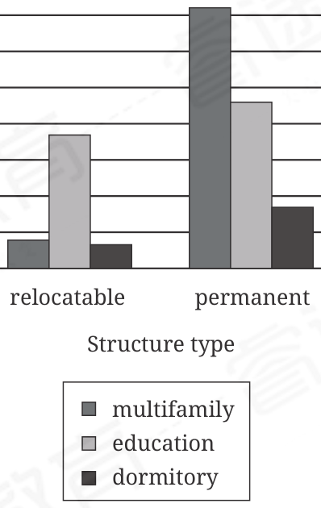

:::q {#Q001 sec=rw no=1}
@material
To ______ concerns that quantified modal statements like "it is possible that all people could speak the same language" aren't evaluable in terms of formal logic because they depend too heavily on the nuances of natural language, Ruth Barcan Marcus developed a purely symbolic, nonlinguistic method of representing such statements as logical propositions.

@stem
Which choice completes the text with the most logical and precise word or phrase?

- A. delineate
- B. vindicate
- C. obviate
- D. corroborate
! source: p.1
! answer: C
:::

:::q {#Q002 sec=rw no=2}
@material
Acer griseum (paperbark maple) has reticulate venation, in which intersecting leaf veins form netlike structures. Though the ______ inherent to this venation pattern makes hydraulic conductance less efficient than in plants with simpler branching veins, it also serves a crucial function: if any veins are damaged, alternative pathways reduce disruptions to fluid circulation.

@stem
Which choice completes the text with the most logical and precise word or phrase?

- A. incongruity
- B. redundancy
- C. complaisance
- D. reprisal
! source: p.1
! answer: B
:::

:::q {#Q003 sec=rw no=3}
@material
The following text is Emily Dickinson's circa 1873 poem "There is no Frigate like a Book." A frigate is a light, fast ship; coursers are swift horses.

There is no Frigate like a Book To take us Lands away Nor any Coursers like a Page Of prancing Poetry— This Traverse may the poorest take Without oppress of Toll— How frugal is the Chariot That bears the Human soul.

@stem
As used in the text, what does the word "frugal" most nearly mean?

- A. Stingy
- B. Inexpensive
- C. Regular
- D. Thoughtful
! source: p.2
! answer: B
:::

:::q {#Q004 sec=rw no=4}
@material
The following text is adapted from Armando Palacio Valdés's short story "The Love of Clotilde," originally published in Spanish in1884. In the text, Don Jerónimo, a financial supporter of theatrical artists, is speaking to a group of people backstage at a theater.

"Today, in the drama, everything is so much dried leaves, a lot of [moonlight], which, they let filter down through the foliage of the trees, a lot of description of dawn and twilight, and a lot of other similar pastry-shop stuff. That's all there is to it! When any fledgling author comes to me with nonsense of that sort, I say to him: 'Get down to the facts! Get down to the facts!' The facts are the drama, which doesn't exist in the great part of the above-mentioned."

@stem
Which choice best states the main purpose of the text?

- A. It emphasizes a character's preference for sophisticated dialogue in plays.
- B. It explains why a character has ceased writing plays.
- C. It illustrates a character's view of the quality of plays of the time.
- D. It conveys a character's dislike for financially supporting playwrights.
! source: p.2
! answer: C
:::

:::q {#Q005 sec=rw no=5}
@material
According to survey data, 58% of online grocery shoppers regularly experience a preferred item being out of stock. In a 2022 study, Dong Hoang and Els Breugelmans demonstrated that a consumer's previous purchase of a product is a strong indicator that the consumer would accept that product in place of an out-of-stock product in the same category. This pattern held true for both product categories in which purchase decisions depend mainly on objective criteria like price (e.g., ketchup) and those in which decisions depend mainly on more subjective criteria like preferred spice level (e.g., pizza).

@stem
Which choice best describes the overall structure of the text?

- A. It offers context about an issue affecting consumers, discusses research showing how past consumer actions prompt occurrences of that issue, and then outlines evidence produced by that research.
- B. It makes a claim about the prevalence of a phenomenon associated with online retail, describes a study of repercussions of that phenomenon for consumers, and then notes the significance of the study's results.
- C. It mentions a challenge faced by a subset of consumers, introduces a key finding from a study of consumer behavior related to that challenge, and then indicates the broad applicability of that finding.
- D. It reports on a trend increasingly observed in online retail, recounts a conclusion made by two researchers investigating that trend, and then presents information that illustrates how the researchers reached that conclusion.
! source: p.3
! answer: C
:::

:::q {#Q006 sec=rw no=6}
@material
Text 1 As part of a study of ungulates (hoofed mammals) native to the Yellowstone River basin, fresh dung samples from identified individuals were collected in the Confederated Salish and Kootenai Tribes Bison Range of Montana. Based on steroidal analysis, on average the bison and elk samples had similar levels of beta-sitosterol and stigmastanol, which distinguished these species' profiles from that of moose.

Text 2 Although fecal-steroidal profile alone is not sufficient to distinguish between samples from bison and those from elk, the relative levels of zoostanols (steroids with animal origins), such as coprostanol and 24-ethylcoprostanol, in sediments at Buffalo Ford Lake in Yellowstone National Park show that bison, elk, or both were the predominant ungulates in the lake's watershed for all strata of sediment examined, going as far back as 2,300 years.

@stem
Which conclusion about steroid profiles is supported by information in both Text 1 and Text 2?

- A. The profiles for bison and elk contain similar concentrations of various steroids.
- B. Each of the ungulate species in the Buffalo Ford Lake watershed has a distinctive and unique steroidal profile.
- C. Some steroids in the bison and elk profiles are more likely than others to be preserved for long time spans.
- D. The profiles of ungulates in and around the Yellowstone basin show that bison and elk have historically been more prevalent than moose in the area.
! source: p.3
! answer: A
:::

:::q {#Q007 sec=rw no=7}
@material
Text 1 James Hogg's poetry, reflecting both the beauty and the challenges of nineteenth-century rural Scotland, demonstrates that an authentic portrayal of nature is possible only through lived experience. As a former shepherd and a self-taught poet, Hogg embedded the rhythms of agrarian life into his verse. This is evident in "Caledonia," which celebrates Scotland's rural identity and the splendor of its landscape.

Text 2 Samuel Taylor Coleridge, like many classically educated Romantic poets, viewed nature with admiration. While his work demonstrates a deep appreciation for nature's beauty, it sometimes lacks the intimate understanding that comes from lived experience. Coleridge's poems, such as "Frost at Midnight," often transform common landscapes into something mystical and awe-inspiring. This approach, while evocative, may not fully portray the realities of the natural world.

@stem
Taken together, the two texts best support which comparison of Hogg and Coleridge?

- A. Hogg's poetry primarily emphasized the impact of human presence on natural settings, while Coleridge's poetry focused on portraying nature as an untouched, divine entity.
- B. Both poets drew inspiration from rural landscapes, but Hogg's work emphasized the seemingly simple aspects of the natural world, while Coleridge's work emphasized singular, transformative encounters with nature.
- C. Both poets deeply appreciated nature, but Hogg's daily immersion in rural life yielded a more intimate understanding than Coleridge's distant and idealized portrayal.
- D. Hogg's intimate observations capture nature's subtle variations more effectively than Coleridge's broader, more generalized depictions.
! source: p.4
! answer: C
:::

:::q {#Q008 sec=rw no=8}
@material
Certain species, such as Kentucky cave shrimp (Palaemonias ganteri), lack functional eyes or ocular organs altogether and rely on other mechanisms for navigation. Xiaoying Chen and colleagues investigated such mechanisms in the Chinese red-headed centipede (Scolopendra subspinipes mutilans), which has no organs with photoreceptors (light-detecting cells) but can sense and avoid sunlight. The researchers placed individual specimens in a clear container (container 1) connected to a container covered in black tape (container 2) and then exposed the containers to simulated sunlight. They observed a rapid increase in the temperature of the centipedes' antennae with the onset of exposure, followed by the centipedes'escape to container 2. Based on their observations, the researchers concluded that thermal receptors in the antennae are likely responsible for light detection in the centipedes.

@stem
Which additional finding from Chen and colleagues'study, if true, would best support the researchers'conclusion?

- A. When body segments other than the centipedes' antennae were monitored, the temperature of these body segments were found to increase in the presence of sunlight.
- B. The centipedes showed the same tendency to move to container 2 when simulated sunlight was accompanied by artificially reduced temperatures.
- C. When their antennae were covered with a reflective material, the centipedes remained exposed in container 1 for longer durations.
- D. Chinese red-headed centipedes are more proficient at detecting light than other centipede species are.
! source: p.4
! answer: C
:::

:::q {#Q009 sec=rw no=9}
@material
Number of Modular Construction Projects

by Building Category

Number of projects

relocatable permanent

Structure type

multifamily

education

dormitory

Modular construction, or a process in which a building is manufactured off-site in sections and assembled onsite, is gaining traction in the architectural industry, given modular construction's multifarious advantages, which range from greater worker safety to the fact that a building can be constructed in a relatively short amount of time. An architecture company wishes to pursue modular construction projects but wants to avoid those in building categories that may already be oversaturated with projects. An executive from the company compiles data about both permanent and relocatable modular constructions of various types and concludes that ______

@stem
Which choice most effectively uses data from the graph to complete the statement?

- A. dormitory projects are likely to be the least profitable opportunity for investment for both permanent and relocatable modular structures.
- B. it is advisable to avoid both permanent and relocatable education projects because they are not the most common of the modular structures.
- C. permanent multifamily modular constructions represent the best opportunity for investment given their relative popularity and the standard nature of their designs.
- D. relocatable multifamily modular constructions represent more desirable opportunities for investment than permanent multifamily modular constructions do.
! source: p.5
! answer: D
:::

:::q {#Q010 sec=rw no=10}
@material
Scholars cite El reino de este mundo, the 1949 novel by Cuban author Alejo Carpentier, as a foundational text of magical realism, the Latin American style of fiction in which antirealistic plot devices—often borrowed from the spiritual and narrative traditions of Indigenous and colonial societies in the Americas— are deployed in an otherwise realistic mode of representation typical of the modern novel. This style has exerted a decisive influence on African authors, including Akwaeke Emezi, whose 2018 novel Freshwater resembles classic magical realist novels in its juxtaposition of literary realism with longestablished cultural traditions—in this case, those of Nigeria.

@stem
Which quotation from a literary scholar would most directly support the claim in the underlined portion of the text?

- A. "Much of the interest of Freshwater derives from the productive tension between its competing influences—namely, Nigerian cultural traditions and the magical realism of Latin America."
- B. "Even as Freshwater alternates between realistic and antirealistic modes of representation, the influence of Nigerian cultural traditions remains constant throughout the novel."
- C. "Akwaeke Emezi establishes a veneer of conventional realism in Freshwater, then punctures that surface with elements drawn from Nigerian cultural traditions, pushing the novel into new creative directions."
- D. "The cultural traditions of Nigeria, which figure so prominently in the magical realist tradition of Latin America, permit realistic as well as antirealistic scenarios—much as Freshwater does."
! source: p.6
! answer: C
:::

:::q {#Q011 sec=rw no=11}
@material
In modern flowering plants, such as the arctic seashore willow, hierarchical reticulate (netlike) venation, which consists of small veins extending from larger central veins, is common, but the earliest vascular plants had nonhierarchical venation. Researchers conducted a simulation using images of Betula alba (a modern flowering plant) leaves and fossil leaves of Lonchopteridium laxereticulosum and Neuropteris heterophylla, extinct pteridosperms (seed ferns) with nonhierarchical reticulate and nonhierarchical branching venation, respectively, to assess the impact of insect folivory (leaf-eating) on vascular function in plants with different venation patterns. They concluded that when experiencing folivory, plants may benefit from hierarchical venation.

@stem
Which finding from the simulation, if true, would most directly support the researchers' conclusion?

- A. Removing central veins in B. alba was much more likely to result in the sudden collapse of vascular function than removing smaller veins in any of the three plant species was.
- B. Vascular function was negatively correlated with the extent of damage to the vein network in B. alba but was positively correlated with the extent of damage in both L. laxereticulosum and N. heterophylla.
- C. In B. alba, decline in vascular function was directly proportional to the extent of vein network damage, but in L. laxereticulosum and N. heterophylla, vascular function declined disproportionately rapidly as loss of vein network increased.
- D. At a given percentage of leaf vein loss, vascular function in B. alba and L. laxereticulosum was much more likely to remain unimpeded than it was in N. heterophylla.
! source: p.7
! answer: C
:::

:::q {#Q012 sec=rw no=12}
@material
Technological discontinuance—when a technological advance, such as the use of wheel fashioning in ceramics in the ancient Levant, is abandoned after sustained adoption—can result when difficulty in accessing resources increases. A dataset of over 4,500 pins, beads, and other gold objects from the Caucasus dating to 4000–500 BCE revealed a drop in the number of gold artifacts from sites in the Middle Kura zone circa 1500 BCE. No such drop occurred in the nearby Middle Araxes zone, but modeling suggests that walking times to the nearest gold ore deposits were comparable in the two regions. Yet, concluding that the abandonment of gold metallurgy in the Middle Kura can't therefore be attributed to proximity to gold deposits depends on the assumption that ______

@stem
Which choice most logically completes the text?

- A. the number of gold objects at Middle Kura sites inversely correlates with distance from the nearest gold deposit.
- B. nothing prevented the peoples of the Middle Kura after 1500 BCE from identifying and exploiting the nearest gold deposits.
- C. evidence of mining infrastructure found at gold deposits across the Caucasus has been accurately dated.
- D. not all the gold objects found at any given site were made with gold sourced from the same deposit.
! source: p.8
! answer: B
:::

:::q {#Q013 sec=rw no=13}
@material
Soil microbial compositions (the species and their relative abundances) can affect plants' disease resistance, leading Lady Grant and colleagues to hypothesize that microbial composition could also affect plants' production of glucosinolates (spicy and bitter compounds). To test this, the team created five compositionally different live-microbe slurries (inoculates) and autoclaved (heated under high pressure) half of each inoculate to create five deadmicrobe inoculates as a control. They planted mustard plants in different pots of previously autoclaved soil, incorporating one of the ten inoculates into each pot. At the study's end, all soils exhibited robust microbial communities. Therefore, it's plausible that ______

@stem
Which choice most logically completes the text?

- A. the autoclaving protocol was insufficient to achieve the intended purpose.
- B. the plants neutralized the microbes introduced to the soil in the inoculates.
- C. autoclaving the inoculates interfered with the affected plants' ability to produce glucosinolates.
- D. the microbial taxa affected the plants'glucosinolate levels in unanticipated ways.
! source: p.8
! answer: A
:::

:::q {#Q014 sec=rw no=14}
@material
A ubiquitous pigment in Indigenous pictorial codices of central and southwest Mexico, Maya blue was prepared by incorporating indigo into a clay substrate—typically palygorskite, which could only be sourced outside these regions. The Codex Selden, a genealogy of a Mixtec royal dynasty, used this formula, though some codices instead relied on sepiolite clay, whose regional availability was offset by decreased stability of the resultant pigment. Tana Elizabeth Villafana et al. report that the Codex Borgia, an aesthetically impressive work from what is now Puebla state, relied on a palygorskite-sepiolite substrate—a combination seen in only one other codex, also from Puebla. This shared origin suggests ______

@stem
Which choice most logically completes the text?

- A. the successful reconciliation of aesthetic principles and logistical challenges, which nonetheless achieved only limited popularity outside Puebla.
- B. the spontaneous development of a hyper-local style of imagery that emerged as a result of efforts to ameliorate the inconvenience of sourcing materials from far away.
- C. a regionally isolated experiment intended to enhance an artistic material that, regardless of its demonstrated inadequacy, had achieved virtually universal acceptance.
- D. a geographically delimited tradition of mitigating dependence on one raw material by diluting it with another that, if less satisfactory, could be sourced more easily by artists.
! source: p.9
! answer: D
:::

:::q {#Q015 sec=rw no=15}
@material
The blue shark and the plaice are ectothermic (coldblooded) fish, whereas the shortfin mako shark and the Atlantic bluefin tuna are regional endotherms— they retain metabolic heat resulting in body temperatures above the ambient water temperature. Modeling the effect of falling ambient temperatures on ectotherms indicated to researchers Haley R. Dolton and colleagues that ectotherms' body temperatures inexorably decrease toward the ambient temperature. Data from wild basking sharks show their body temperatures also decline as the ambient temperature falls, but consistently remain 1.0 to 1.5°C above ambient. This suggests that given a constant ambient water temperature, the basking shark will typically have ______

@stem
Which choice most logically completes the text?

- A. a stable body temperature that exceeds both that of the blue shark and that of the plaice.
- B. a substantially more variable body temperature than both that of the shortfin mako shark and that of the plaice.
- C. a body temperature very near both that of the shortfin mako shark and that of the Atlantic bluefin tuna.
- D. a body temperature equal to the surrounding water temperature, unlike the body temperatures of the blue shark and the Atlantic bluefin tuna.
! source: p.9
! answer: A
:::

:::q {#Q016 sec=rw no=16}
@material
A professor at Hunter College, Susan Epstein works on developing artificial intelligence technology, with a specific focus on multitask ______ learning involves teaching computer models to perform multiple tasks at the same time.

@stem
Which choice completes the text so that it conforms to the conventions of Standard English?

- A. learning. Multitask
- B. learning multitask
- C. learning, which multitask
- D. learning, multitask
! source: p.10
! answer: A
:::

:::q {#Q017 sec=rw no=17}
@material
Using various strategies, plants are able to leverage structural changes to mitigate the effects of ______ for example, a lengthening of the roots increases the plants' water uptake, while in Moldavian dragonhead plants, a reduction in the size of the plants' leaves reduces the rate of water loss through transpiration.

@stem
Which choice completes the text so that it conforms to the conventions of Standard English?

- A. drought, in soybean plants,
- B. drought in soybean plants,
- C. drought in soybean plants:
- D. drought: in soybean plants,
! source: p.10
! answer: D
:::

:::q {#Q018 sec=rw no=18}
@material
Classifying a soil as a calcisol, a type of soil with accumulations of partially soluble salts, requires the evaluation of several criteria. This process involves detecting the presence of any soil horizons, or boundary ______ the material composition, such as the percentages of sand, silt, clay, and organic material; and identifying chemical features, like the pH level and concentration of positive or negative ions.

@stem
Which choice completes the text so that it conforms to the conventions of Standard English?

- A. layers; analyzing
- B. layers, analyzing
- C. layers. Analyzing
- D. layers analyzing
! source: p.11
! answer: A
:::

:::q {#Q019 sec=rw no=19}
@material
The Sino-Tibetan language of Baragaon has only about 7,500 living speakers, most of them in Nepal. However, the New York City–based Endangered Language Alliance has identified a group of Baragaon speakers in the city's borough of ______ in the Richmond Hill neighborhood, these speakers are both helping to ensure Baragaon's survival and contributing to the city's unmatched linguistic diversity.

@stem
Which choice completes the text so that it conforms to the conventions of Standard English?

- A. Queens; where
- B. Queens; where,
- C. Queens where
- D. Queens, where,
! source: p.11
! answer: D
:::

:::q {#Q020 sec=rw no=20}
@material
A team of researchers led by Princeton University's Mary Caswell Stoddard found that birds of the Nectarinia calcostetha species produced eggs with an average length of ______ eggs produced by birds of the Cypsiurus parvus species proved to be longer, with an average length of 1.71 cm.

@stem
Which choice completes the text so that it conforms to the conventions of Standard English?

- A. 1.54 cm. While
- B. 1.54 cm,
- C. 1.54 cm;
- D. 1.54 cm, however,
! source: p.12
! answer: C
:::

:::q {#Q021 sec=rw no=21}
@material
In a 2025 study analyzing the vocalizations of cetacean species, researcher Mason Youngblood applied two metrics more commonly used in the analysis of human ______ the phrases of humpback whales (Megaptera novaeangliae), both laws were observed. In sperm whales (Physeter macrocephalus), only Menzerath's law was observed in the cetaceans' codas.

@stem
Which choice completes the text so that it conforms to the conventions of Standard English?

- A. languages; Menzerath's law and Zipf's law, in
- B. languages, Menzerath's law, and Zipf's law. In
- C. languages: Menzerath's law and Zipf's law. In
- D. languages, Menzerath's law and Zipf's law, in
! source: p.12
! answer: C
:::

:::q {#Q022 sec=rw no=22}
@material
Connecticut is one of a number of US states to introduce legislation to support the incorporation of employee-owned worker cooperatives. It's worth noting that a lack of such legal provisions does not preclude the formation of worker cooperatives. ______ legislation can streamline operations, offer stronger legal protections, and increase tax benefits.

@stem
Which choice completes the text with the most logical transition?

- A. As a result,
- B. Still,
- C. In other words,
- D. For example,
! source: p.13
! answer: B
:::

:::q {#Q023 sec=rw no=23}
@material
Alabama is one of several US states to enact statutes supporting the incorporation of worker cooperatives, businesses with democratic governance. Many scholars testify to the economic sustainability of the co-op model while acknowledging its challenges. ______ those who declare the model inherently unviable can discount documented successes, while those who champion it may understate its challenges.

@stem
Which choice completes the text with the most logical transition?

- A. That said, some experts overlook such nuance;
- B. Nevertheless, how these challenges might be overcome remains contentious;
- C. Ultimately, these complex issues require complex solutions;
- D. Thus, the scholars are skeptical about the co-op model's viability;
! source: p.13
! answer: A
:::

:::q {#Q024 sec=rw no=24}
@material
At the Museum of Natural History in Washington, DC, a single specimen of the planktonic marine organism T. iota is preserved as the reference organism for the species. This specimen is a holotype, meaning it was the basis of the first formal scientific description of T. iota. ______ the reference organism for the planktonic G. rubescens, preserved at the Naturalis Biodiversity Center in Leiden, Netherlands, is a neotype, meaning it acts as a reference organism but is not the exact specimen originally described.

@stem
Which choice completes the text with the most logical transition?

- A. For instance,
- B. By contrast,
- C. Admittedly,
- D. Moreover,
! source: p.14
! answer: B
:::

:::q {#Q025 sec=rw no=25}
@material
While researching a topic, a student has taken the following notes:

• Sand Canyon Pueblo is an Ancestral Puebloan dwelling site located in southwestern Colorado.

• The construction of Sand Canyon Pueblo began around 1250 CE, during the Pueblo III period (1150–1350 CE).

• Long House is an Ancestral Puebloan dwelling site located in southwestern Colorado.

• The construction of Long House began around 1200 CE, during the Pueblo III period.

• Each site contains remnants of the multistory adobe and stone dwellings built by the Ancestral Puebloan civilization.

• The Ancestral Puebloan civilization (approximately 1200 BCE–1600 CE) was the forerunner of modern Pueblo tribal nations.

@stem
The student wants to emphasize a historical similarity between Sand Canyon Pueblo and Long House. Which choice most effectively uses relevant information from the notes to accomplish this goal?

- A. The construction of Long House, like that of Sand Canyon Pueblo, began during the Pueblo III period, which lasted from 1150–1350 CE.
- B. Both Sand Canyon Pueblo and Long House are uninhabited and can be found in southwestern Colorado.
- C. Remnants of multistory adobe and stone buildings can be found in southwestern Colorado, where Sand Canyon Pueblo and Long House are located.
- D. Inhabited from approximately 1200 BCE–1600 CE, Sand Canyon Pueblo and Long House were built by the Ancestral Puebloan civilization, the forerunner of modern Pueblo tribal nations.
! source: p.14
! answer: A
:::

:::q {#Q026 sec=rw no=26}
@material
While researching a topic, a student has taken the following notes:

• Collective Copies Cooperative is a democratically run printing company based in Massachusetts.

• 1914: Webb and Webb's degeneration thesis argued that democratic workplaces will either fail or be forced to adopt hierarchical governance to remain profitable.

• 2012: Diamantopoulos's regeneration thesis argued that workplaces could regenerate (recover from degeneration by reintroducing democratic practices).

• 2022: Unterrainer et al. analyzed data from 73 democratic workplaces to track structural changes over time.

• Collective Copies Cooperative was among the 52.7% of the studied workplaces that resisted degeneration.

• 10.8% of the workplaces had regenerated, 27.0% showed partial signs of degeneration, and 9.5% had fully degenerated and never recovered.

@stem
The student wants to use data to support Diamantopoulos's thesis. Which choice most effectively uses relevant information from the notes to accomplish this goal?

- A. An impressive 52.7% of democratic workplaces studied—including Collective Copies Cooperative—resisted degeneration, lending credence to Diamantopoulos's regeneration thesis.
- B. Signs of degeneration were seen in 27.0% of democratic workplaces studied, supporting Diamantopoulos's assertion that degeneration could be reversed.
- C. Around 10.8% of democratic workplaces in the study successfully used democratic practices to recover from degeneration.
- D. Though Webb and Webb's degeneration thesis insisted on the inevitability of such an outcome, only 9.5% of democratic workplaces studied had fully degenerated and never recovered.
! source: p.15
! answer: C
:::

:::q {#Q027 sec=rw no=27}
@material
While researching a topic, a student has taken the following notes:

• A 2022 study analyzed geotagged social media posts to assess the effect of parks on happiness in 25 US cities.

• The happiness score for posts made in a given city was calculated by comparing the frequencies of words with positive and negative connotations.

• The happiness benefit of a city's parks was the numeric difference between the happiness scores of posts made in parks and posts made elsewhere.

• The park happiness benefit in Columbus, Ohio, was about 0.05.

• The park happiness benefit in Dallas, Texas, was about 0.15.

• The average happiness benefit of parks across all cities was 0.10.

@stem
The student wants to contrast the effect of parks on happiness in Columbus with that in Dallas. Which choice most effectively uses relevant information from the notes to accomplish this goal?

- A. Although parks in both cities had a positive influence on happiness, this benefit was somewhat greater in Dallas than in Columbus.
- B. To contrast the effect of parks on happiness in Columbus and Dallas, the study analyzed geotagged social media posts.
- C. The study found parks in Columbus and Dallas to have a happiness benefit of 0.10, on average.
- D. While Dallas's parks had a positive happiness benefit, this was not true of Columbus's parks, whose happiness benefit was below average.
! source: p.15
! answer: A
:::
