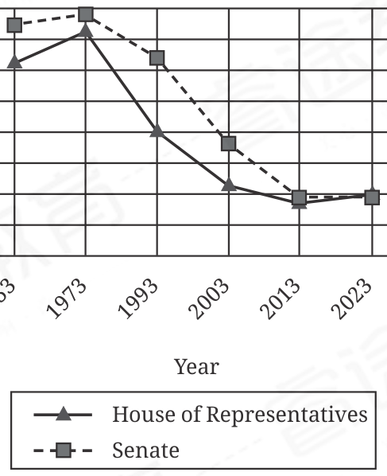

:::q {#Q001 sec=rw no=1}
@material
The following text is adapted from Kenneth Grahame's 1908 novel The Wind in the Willows. The Mole has been found by a friend after getting lost in the woods. It is beginning to snow.

The Mole saw the wood that had been so dreadful to him in quite a changed aspect. Holes, hollows, pools, pitfalls, and other menaces to the wayfarer were vanishing fast, and a gleaming carpet was springing up everywhere, that looked too delicate to be trodden upon by rough feet.

@stem
As used in the text, what does the word "delicate" most nearly mean?

- A. Caring
- B. Fragile
- C. Vacant
- D. Accurate
! source: p.1
! answer: B
:::

:::q {#Q002 sec=rw no=2}
@material
The following text is from Oscar Wilde's 1893 play Lady Windermere's Fan.

MRS. ERLYNNE: I am going to live abroad again. The English climate doesn't suit me. My—heart is affected here, and that I don't like. I prefer living in the south. London is too full of fogs and—and serious people, Lord Windermere. Whether the fogs produce the serious people or whether the serious people produce the fogs, I don't know, but the whole thing rather gets on my nerves.

@stem
As used in the text, what does the word "produce"most nearly mean?

- A. Make available
- B. Adore
- C. Bring about
- D. Attach
! source: p.1
! answer: C
:::

:::q {#Q003 sec=rw no=3}
@material
A study by Augusta D. Gaspar and Joana Carneiro Pinto found that a bank's corporate social responsibility (CSR) efforts, including environmental and social campaigns, improve its corporate image. When CSR was mentioned in bank marketing strategies, favorability scores assigned by study participants tended to ______ the scores assigned by participants when CSR wasn't mentioned.

@stem
Which choice completes the text with the most logical and precise word or phrase?

- A. disturb
- B. exceed
- C. replace
- D. identify
! source: p.2
! answer: B
:::

:::q {#Q004 sec=rw no=4}
@material
Microplastics are a common pollutant in large masses of water like oceans. High concentrations and ______ among particles—variations in size, shape, and material—make it onerous to comprehensively classify the microplastics in a water sample, so Martínez-Salvador et al. are exploring a device to help quickly and accurately identify certain characteristics.

@stem
Which choice completes the text with the most logical and precise word or phrase?

- A. inconsistencies
- B. incompatibilities
- C. restraints
- D. disruptions
! source: p.2
! answer: A
:::

:::q {#Q005 sec=rw no=5}
@material
Adult glass eels can be found off the coast of Maine, but the eels begin their lives in the Sargasso Sea, a biodiverse area in the North Atlantic Ocean where they are born and later return to breed. Though biologists believe they have identified the general area in the Sargasso Sea that is crucial to the endangered eels' survival, little is yet known about how the animals spawn there. Scientists believe that solving the mystery will lead to better conservation of glass eels and their habitat, helping in turn to sustain several other species that rely on them as a food source.

@stem
Which choice best describes the function of the underlined portion in the text as a whole?

- A. It presents a finding from a study that identifies the circumstances required to ensure the survival of glass eels.
- B. It suggests that scientists are more concerned about other species than about glass eels'habitat.
- C. It discusses a role that glass eels and other species serve in supporting the ecosystem of the Sargasso Sea.
- D. It indicates that the benefit of understanding glass eels' spawning behavior extends beyond the eels.
! source: p.3
! answer: D
:::

:::q {#Q006 sec=rw no=6}
@material
In a section of a 1976 essay discussing cinema of the United States, James Baldwin observed that Lady Sings the Blues (1972), a biographical film about jazz singer Billie Holiday, can be said to reflect Holiday's life and the experiences of Black Americans only "by courtesy." According to Baldwin, the failure of this film to authentically represent its subject matter is indicative of a larger trend in films of the era: rather than leveraging the medium's potential to confront difficult truths, filmmakers and studios often resorted to platitudes about contemporary US society.

@stem
Which choice best describes the function of the underlined portion in the text as a whole?

- A. It characterizes the nature of the disconnect Baldwin identified between reality and how it was represented in US cinema.
- B. It conveys Baldwin's rejection of contemporary US cinema in favor of earlier films that are more authentic representations of society.
- C. It illustrates a view of Baldwin's that the text explains departed substantially from the consensus view held by US film critics.
- D. It expresses Baldwin's initial reaction to a US film that the text suggests he would later reconsider.
! source: p.3
! answer: A
:::

:::q {#Q007 sec=rw no=7}
@material
Linguist John McWhorter asserts that translation apps for smartphones and computers are—despite generally failing to convey many nuances— increasingly obviating the need to learn new languages. Advances in language processing technology have greatly boosted the utility of these apps for perfunctory tasks, like inquiring about an item on a menu, and passing interactions; be that as it may, richer communication (e.g., in business dealings or meaningful personal exchanges) often hinges on conversational patterns and gradations of meaning.

@stem
What does the text most directly suggest about translation apps?

- A. They have improved remarkably over time but remain insufficient to support the complexity called for in certain interactions.
- B. They are coming to be embraced by international tourists but are viewed with skepticism by many business professionals.
- C. They are becoming simpler to use but are inconsistent in how comprehensively they cover different languages.
- D. They have gained impressive capabilities but continue to be widely viewed as inadequate for most practical purposes.
! source: p.4
! answer: A
:::

:::q {#Q008 sec=rw no=8}
@material
Michael G. Campana and colleagues' 2017 investigation, which examined the evolutionary origins of a fungal pathogen affecting bats, demonstrates the potential held by museomics—the study of hDNA, genomic data from archival specimens housed in collections such as those at the Smithsonian National Museum of Natural History. Although it is a challenge for evolutionary biologists that past archival storage conditions often resulted in DNA degradation, emerging advances in DNA extraction and sequencing may soon enable hDNA to reveal a range of evolutionary relationships and patterns.

@stem
What does the text most strongly suggest about museomics?

- A. By expanding the types of DNA samples available to researchers, it is becoming a widely used alternative to traditional genomic methods.
- B. As a result of recent technological breakthroughs, it is no longer a challenging approach for evolutionary biologists to use.
- C. It can provide researchers access to DNA from pathogens, but it requires the latest and most advanced laboratory equipment.
- D. It is an approach to the study of evolutionary phenomena that holds much promise for future scientific advances.
! source: p.4
! answer: D
:::

:::q {#Q009 sec=rw no=9}
@material
Richard II is a play from the 1590s by William Shakespeare. Although King Richard has been vanquished by his cousin Henry Bolingbroke, he intimates that he is not entirely ready to show subservience to his cousin, saying, ______

@stem
Which quotation from Richard II most effectively illustrates the claim?

- A. "Still my griefs are mine. / You may my glories and my state depose, / But not my griefs; still am I king of those."
- B. "Alack, why am I sent for to a king, / Before I have shook off the regal thoughts / Wherewith I reign'd? I hardly yet have learn'd / To insinuate, flatter, bow, and bend my knee."
- C. "Am I both priest and clerk? Well then, amen. / God save the King! although I be not he; / And yet, amen, if heaven do think him me."
- D. "I have no name, no title,— / No, not that name was given me at the font,— / But 'tis usurp'd:— Alack the heavy day, / That I have worn so many winters out, / And know not now what name to call myself!"
! source: p.5
! answer: B
:::

:::q {#Q010 sec=rw no=10}
@material
Percentage of US Congress Members Who

Self-Identified as Veterans, 1953–2023

Percent

20 30 40 50 60 70 80

0 10

Year

House of Representatives

Senate

Since the nation's earliest days, both houses of the United States Congress have counted many military veterans among their elected officials, including Hiram L. Fong (who served in the US Army Air Force) and Ralph Harold Metcalfe Sr. (who served in the US Army). A research institute gathered historical data about congressional members who have reported past military experience and determined that ______

@stem
Which choice most effectively uses data from the graph to complete the sentence?

- A. from 2003 to 2023, the House of Representatives had a higher percentage of those members than the Senate did.
- B. from 1953 to 2003, those members constituted a majority in both houses of Congress.
- C. the percentage of those members decreased substantially in both houses of Congress from 1973 to 2013.
- D. the percentage of those members remained fairly consistent, regardless of house, from 1993 to 2023.
! source: p.6
! answer: C
:::

:::q {#Q011 sec=rw no=11}
@material
Mean Adhesion Strength of Graphite and Acrylamide Gel,

at Varying Voltages

Adhesion strength (kPa)

0 5 10 15 20 25 30 35 40 45

0 1 2 3

Voltage (V)

graphite—AAm Pair

Wenhao Xu and colleagues demonstrated that applying a low direct current electrical field to graphite (a conductor) and an acrylamide (AAm) gel can increase how strongly materials adhere to each other. At some voltages, adhesion strength—as measured in kilopascals (kPa) of stress needed to pull the materials apart—was high (more than 30 kPa). But the mere application of a direct current electrical field with positive voltage is not sufficient to cause increased adhesion, as evidenced by the fact that ______

@stem
Which choice most effectively uses data from the graph to complete the statement?

- A. at 0 V, mean adhesion strength was equal to 0 kPa.
- B. at 3 V, mean adhesion strength reached its highest observed level at approximately 30 kPa.
- C. at 2 V, mean adhesion strength was lower than it was at both 1 V and 3 V.
- D. at 1 V, mean adhesion strength was approximately equal to adhesion strength at 0 V.
! source: p.7
! answer: D
:::

:::q {#Q012 sec=rw no=12}
@material
In their chapter of Advancing U.S. Latino Entrepreneurship (2020), Michael J. Pisani and his coauthor analyze data on the Latino population share and the share of Latino-owned businesses (LOBs) in US metropolitan areas with Latino populations that are among the largest in the country. The authors note for nearly all the metropolitan areas included in their analysis, the Latino population share is larger than the share of LOBs. The exception is ______

@stem
Which choice most effectively uses data from the table to complete the statement?

- A. Miami–Fort Lauderdale–West Palm Beach.
- B. Phoenix–Mesa–Scottsdale.
- C. Houston–The Woodlands–Sugar La.
- D. New York–Newark–Jersey City.
! source: p.8
! answer: A
:::

:::q {#Q013 sec=rw no=13}
@material
As a forest wildflower, Erythronium americanum maximizes spring sunlight exposure by using temperature cues to leaf out before surrounding trees do. Warmer springs can drive plants to advance their leaf-out dates (LODs), but sensitivity to temperature varies across species and populations. Studying the changing LODs of trees and wildflowers from Northern Hemisphere temperate forests, Benjamin R. Lee and team found that North American trees are, on average, substantially more sensitive to temperature than either North American wildflowers or European trees are. However, the average sensitivity of North American wildflowers, including E. americanum, is similar to that of European wildflowers, such as Anemone nemorosa. The findings suggest that as spring temperatures reach higher levels earlier, ______

@stem
Which choice most logically completes the text?

- A. A. nemorosa and other European wildflowers may experience shorter growing seasons than E. americanum and other North American wildflowers do.
- B. European wildflowers, such as A. nemorosa, may experience greater variability in the amount of spring sunlight they are exposed to than North American wildflowers, such as E. americanum, do.
- C. LODs of E. americanum and other North American wildflowers may occur later in the spring than those of A. nemorosa and other European wildflowers do.
- D. the average duration of exposure to spring sunlight may decrease at a faster rate for E. americanum and other North American wildflowers than it does for A. nemorosa and other European wildflowers.
! source: p.9
! answer: D
:::

:::q {#Q014 sec=rw no=14}
@material
Pablo Picasso famously subverted the norms of traditional painting: in his cubist paintings he refused to let his expression be constrained, fragmenting objects and figures to present multiple perspectives simultaneously. Though less widely known, Picasso— who once lamented that writers of his time had"limited themselves to moving around words somewhat while respecting the syntax"—also wrote poetry that defied conventional grammar, semantic relationships, and text structure. Thus, the paintings and poems are linked in that ______

@stem
Which choice most logically completes the text?

- A. the poems present many of the same subjects as the paintings but with different thematic approaches.
- B. both types of work are characterized by the simultaneous representation of multiple points of view that Picasso is known for.
- C. the poems are intended to be understood as explanations of the artistic inclinations reflected in the paintings.
- D. both exhibit Picasso's prioritization of creative expression over the standard rules of the art forms.
! source: p.9
! answer: D
:::

:::q {#Q015 sec=rw no=15}
@material
Many works of the Greek philosopher Theophrastus (4th century BCE) are ______ his Historia plantarum, a botanical study, is an extant work: it can still be read.

@stem
Which choice completes the text so that it conforms to the conventions of Standard English?

- A. lost and conversely,
- B. lost. Conversely,
- C. lost, and conversely
- D. lost, conversely,
! source: p.10
! answer: B
:::

:::q {#Q016 sec=rw no=16}
@material
First Lieutenant Jose Torres Caban was a soldier in the United States 65th Infantry Regiment, a Puerto Rico– based regiment of the US Army. In 2016, the United States Congress honored Torres Caban and the other servicepeople of the 65th Infantry Regiment with one of its highest ______ Congressional Gold Medal.

@stem
Which choice completes the text so that it conforms to the conventions of Standard English?

- A. honors (the
- B. honors; the
- C. honors the
- D. honors: the
! source: p.10
! answer: D
:::

:::q {#Q017 sec=rw no=17}
@material
______ a US state when it ratified the US Constitution on January 9, 1788, was thereby empowered, via its representatives to the US Congress, to vote on whether to admit Mississippi as a state on December 10, 1817.

@stem
Which choice completes the text so that it conforms to the conventions of Standard English?

- A. Connecticut officially became
- B. Connecticut, having officially become
- C. Connecticut had officially become
- D. Connecticut would officially become
! source: p.11
! answer: B
:::

:::q {#Q018 sec=rw no=18}
@material
During a 2022 expedition led by research zoologist Andrea Quattrini, scientists discovered a new species of black coral off the coast of Puerto Rico. Like other black corals, the newly discovered species, which they named Aphanipathes puertoricoensis, has coiled branching structures that ______ it survive in the deep sea.

@stem
Which choice completes the text so that it conforms to the conventions of Standard English?

- A. helps
- B. helping
- C. has helped
- D. help
! source: p.11
! answer: D
:::

:::q {#Q019 sec=rw no=19}
@material
Bertie Marshall, a key figure in the history of steel band music in Trinidad and Tobago, made several innovations to the steel ______ wheels so the instrument could be easily transported during Carnival, a cover to protect the pans from the sun, and amplification so the sound of the pans could be better heard over large crowds and other instrumentation.

@stem
Which choice completes the text so that it conforms to the conventions of Standard English?

- A. drum;
- B. drum
- C. drum:
- D. drum,
! source: p.12
! answer: C
:::

:::q {#Q020 sec=rw no=20}
@material
In a chemical equation, the value known as molar mass is useful for converting between the mass of the reactants and the mass of the product. The liquid ______ have molar masses of 156.31 and 226.41 g/mol, respectively.

@stem
Which choice completes the text so that it conforms to the conventions of Standard English?

- A. compounds, undecane (C11H24) and hexadecane (C16H34),
- B. compounds undecane (C11H24) and hexadecane (C16H34),
- C. compounds undecane (C11H24) and hexadecane (C16H34)
- D. compounds, undecane (C11H24) and hexadecane (C16H34)
! source: p.12
! answer: C
:::

:::q {#Q021 sec=rw no=21}
@material
Artists' palettes—the surfaces on which painters arrange and mix their paints—can provide valuable insights into the painters' creative processes. In her 2024 book The Artist's Palette, Alexandra Loske analyzes the palettes of 50 different painters across 500 years. ______ Loske reveals clues about the techniques and practices of such artists as Kerry James Marshall, Artemisia Gentileschi, and Vincent van Gogh.

@stem
Which choice completes the text with the most logical transition?

- A. In doing so,
- B. Lastly,
- C. In comparison,
- D. However,
! source: p.13
! answer: A
:::

:::q {#Q022 sec=rw no=22}
@material
As Iestyn Barr and his team of researchers discovered when establishing the glacial timeline of Antarctica, the Transantarctic Mountains—a 3,500-km mountain range spanning the continent—are home to glaciers of at least 60 million years in age. ______ the researchers concluded, Antarctica had glaciers long before the formation of its continent-wide ice sheet 34 million years ago.

@stem
Which choice completes the text with the most logical transition?

- A. Even so,
- B. Nevertheless,
- C. By contrast,
- D. Thus,
! source: p.13
! answer: D
:::

:::q {#Q023 sec=rw no=23}
@material
• India Arie is an African American singer and songwriter.

• The media outlet BBC Music has described her music as a "blend of hip hop, soul and folk [that is] as subtle as it [is]

• inspired."

• Her first studio album, Acoustic Soul, was released in 2001.

• It features the song "Strength, Courage & Wisdom."

• Avery Johnson played bass on the album.

@stem
Which choice most effectively uses information from the given sentences to introduce Acoustic Soul to an audience already familiar with India Arie?

- A. India Arie's music has been described as a"blend of hip hop, soul and folk [that is] as subtle as it [is] inspired."
- B. Avery Johnson played bass on singer and songwriter India Arie's 2001 album, Acoustic Soul.
- C. "Strength, Courage & Wisdom," a song by singer and songwriter India Arie, is featured on the album Acoustic Soul.
- D. Featuring the song "Strength, Courage & Wisdom," Acoustic Soul is India Arie's first studio album.
! source: p.14
! answer: D
:::

:::q {#Q024 sec=rw no=24}
@material
While researching a topic, a student has taken the following notes:

• The meter of a poem is the rhythmic structure or pattern of accents in its lines.

• Alliterative meter is structured by a pattern of repeated sounds.

• Quantitative meter is structured by a pattern of long and short syllables.

• The Old English poem Widsith uses an alliterative meter.

• The Sanskrit poem Meghadüta uses a quantitative meter.

@stem
The student wants to emphasize a difference between the meters of the two poems. Which choice most effectively uses relevant information from the notes to accomplish this goal?

- A. The Sanskrit poem Meghadüta uses a quantitative meter, while the meter of the Old English poem Widsith uses a pattern of long and short syllables.
- B. The poem Widsith is written in Old English, but Meghadüta is written in Sanskrit.
- C. Alliterative meter is a pattern of repeated sounds, but quantitative meter is a rhythmic structure or pattern of accents.
- D. The lines of the poem Meghadüta uses a pattern of long and short syllables, whereas Widsithʼs lines use a pattern of repeated sounds.
! source: p.14
! answer: D
:::

:::q {#Q025 sec=rw no=25}
@material
While researching a topic, a student has taken the following notes:

• Spinach is a vegetable that contains ascorbic acid, an essential nutrient for humans.

• Every 100 grams (g) of spinach contains 30 milligrams (mg) of ascorbic acid.

• Many animals can make ascorbic acid in their bodies, but humans cannot.

• Humans must get ascorbic acid from foods, including fruits and vegetables.

• Ascorbic acid is also known as vitamin C.

@stem
The student wants to explain why humans must get vitamin C from food. Which choice most effectively uses relevant information from the notes to accomplish this goal?

- A. Since humans cannot make vitamin C in their bodies, they must get this essential nutrient from foods like spinach.
- B. There is 30 mg of vitamin C, an essential nutrient for humans, in every 100 g of spinach.
- C. Many animals can make ascorbic acid, which is also known as vitamin C, in their bodies.
- D. Spinach contains vitamin C, which humans must get from food.
! source: p.15
! answer: A
:::

:::q {#Q026 sec=rw no=26}
@material
While researching a topic, a student has taken the following notes:

• A nonnative species is considered invasive if it causes environmental or economic harm in an ecosystem.

• Water chestnut is a species of aquatic plant native to parts of Europe.

• It can also be found in the northeastern US.

• There, it blocks sunlight and reduces oxygen levels in bodies of water.

• It is considered an invasive species in the US.

@stem
The student wants to indicate one or more regions where water chestnut is causing environmental or economic harm. Which choice most effectively uses relevant information from the notes to accomplish this goal?

- A. Water chestnut can be found in the northeastern US, where it blocks sunlight and reduces oxygen levels in bodies of water.
- B. Water chestnut is native to the northeastern US, but elsewhere it causes environ-mental or economic harm.
- C. Water chestnut is considered invasive because it blocks sunlight and reduces oxygen levels in bodies of water, causing environmental harm.
- D. Water chestnut, an aquatic plant native to parts of Europe, is considered an invasive species.
! source: p.15
! answer: A
:::

:::q {#Q027 sec=rw no=27}
@material
• Calida Garcia Rawles is an African American painter.

• She is known for her large-scale, hyperrealistic paintings depicting African American figures in water.

• The painting The Way of the Wave (16 × 12 in) depicts a bearded man with his arms outstretched floating in the bottom left corner of the canvas.

• Yesterday Called and Said We Were Together (48 × 60 in) depicts two unidentifiable figures with their arms outstretched floating in the upper left of the canvas.

• She paints the water with vivid blue colors, including ultramarine and denim.

• The mood in the paintings is peaceful.

@stem
Which choice most effectively uses information from the given sentences to emphasize a difference between the two paintings?

- A. While some of Rawles's works, such as The Way of the Wave, feature one figure in the composition, Yesterday Called and Said We Were Together features two figures floating in the vivid blue water.
- B. Although the number of figures may differ, constant among Rawles's hyperrealistic works is the peaceful mood that the paintings evoke.
- C. Among the many stunning works of Calida Garcia Rawles is Yesterday Called and Said We Were Together, a peaceful 48-by-60-inch painting depicting two unidentifiable figures floating with their arms outstretched in the vivid blue water.
- D. Calida Garcia Rawles captures the water in paintings such as The Way of the Wave and Yesterday Called and Said We Were Together in vivid hues of ultramarine and denim.
! source: p.16
! answer: A
:::
