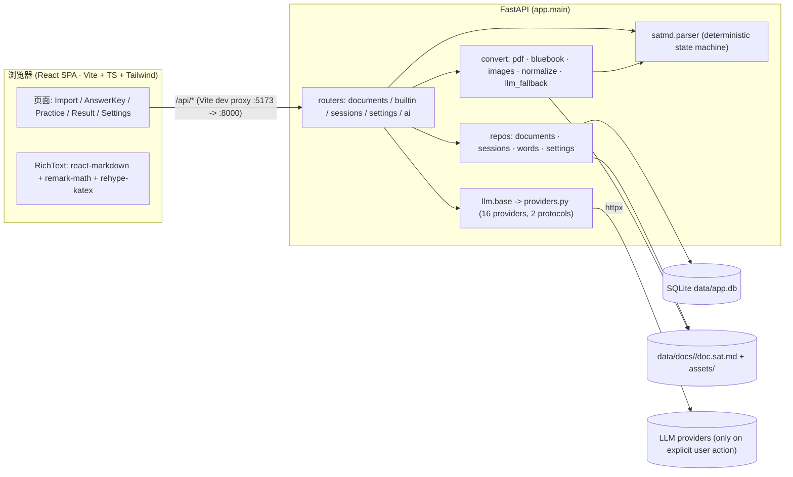
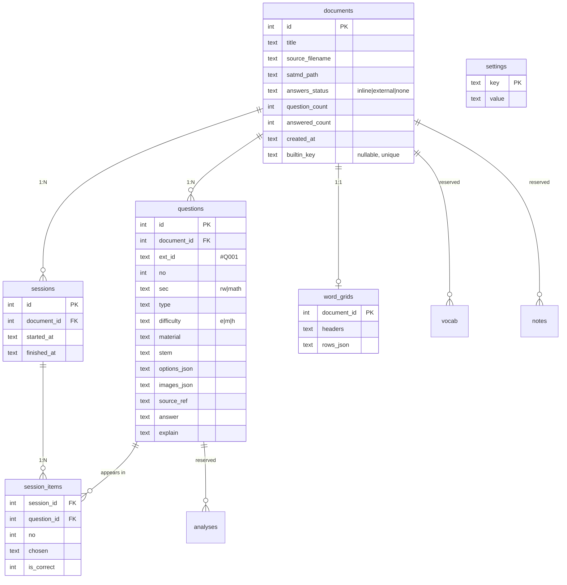

# SATeacher — Architecture

> 本地优先（local-first）的 SAT 刷题工具。单机运行：FastAPI 后端 + React 前端 + SQLite 单文件；PDF 由 PyMuPDF 确定性转换；LLM 仅在用户显式点击时调用（导入主链路 0 token）。
> 基线：`HEAD=abe3a0d`、pytest **164 passed**、`npm run build` 0 错误。
> 相关：`README.md`、`docs/PLAN.md`（决策/批次）、`docs/SAT-MD.md`（格式）、`docs/RENOVATION_PLAN.md`（改造计划）、`ROADMAP.md`。

---

## 1. 系统总览



### 关键不变量（Iron rules）
- **LLM 不在导入主链路**：导入是纯确定性转换，0 token；AI 仅在用户显式点击时调用。
- **正确答案不出后端**：练习接口 `quiz_questions()` 剥掉 `answer` 字段；只有提交/复盘接口返回。
- **本地优先**：全部数据在 `data/`（SQLite 单文件 + 文档/图片），无云依赖。
- **单文件数据库 + 文件系统并存**：SQLite 存索引与结构化题，`doc.sat.md` 存原始 SAT-MD（source of truth），`assets/` 存图片。

---

## 2. 运行形态与数据目录

```
repo/
├── backend/                 FastAPI 应用
│   ├── app/                 源码（见 §5）
│   ├── tests/               pytest（164）
│   └── requirements.txt     fastapi uvicorn pymupdf python-multipart httpx pytest openpyxl weasyprint python-docx cairosvg
├── frontend/                Vite + React 19 + TS + Tailwind 4
│   └── src/                 页面/组件/api client（见 §4）
├── scripts/dev.sh           一键起后端(:8000)+前端(:5173)
├── data/                    运行期数据（gitignore）
│   ├── app.db               SQLite
│   ├── docs/<id>/           doc.sat.md + assets/（每题图片）
│   ├── tmp/                 上传暂存（用完即删）
│   └── exports/             导出产物目录
└── docs/                    PLAN / SAT-MD / RENOVATION_PLAN / ARCHITECTURE
```

环境变量：`SATEACHER_DATA`（数据根，默认 `./data`，测试用临时目录隔离）、`SATEACHER_API`（Vite 代理目标，默认 `http://localhost:8000`）。

---

## 3. 数据模型（ER）



保留但**未使用**的表（历史占位，见改造计划 §7.1）：`analyses`、`vocab`、`notes`、`llm_logs`。

---

## 4. 前端结构

```
App.tsx (BrowserRouter)
├── "/"                     ImportPage        —— 拖放导入 + 流水线(ImportPipeline) + .sat.md 模板 + LibraryList + BuiltinBankCard
├── "/doc/:id/answers"      AnswerKeyPage     —— 答案网格 + 批量粘贴 + 预览
├── "/doc/:id/practice"     PracticePage      —— 全屏 Bluebook 练习
├── "/session/:sid/result"  ResultPage        —— 结果 + ReviewSidebar
└── "/settings"             SettingsPage      —— LLM provider 配置

components/  RichText (markdown+KaTeX+图片) · ReviewSidebar (手风琴: 解析/词汇/AI/导出) · BuiltinBankCard · ImportPipeline · SatMdTemplate · LibraryList
api/client.ts —— 类型化 API client（所有 /api 路径由 Vite 代理）
```

---

## 5. 后端模块图

```
app/
├── main.py                 FastAPI 装配（lifespan=init_db；CORS；6 个 router）
├── db.py                   SQLite 连接/迁移(_migrate)/SCHEMA；路径常量（DOCS_DIR/UPLOAD_TMP/JOBS_DIR/EXPORTS_DIR）
├── imports.py              导入流水线服务：detect → convert → commit（确定性，0 token；PDF/DOCX/SAT-MD 单一代码路径）
├── providers.py            Provider 目录（16 家）+ protocol(openai|anthropic) 解析
├── api/
│   ├── documents.py        导入（调用 imports 服务）/列表/详情/题目/历史/答案/解析/词汇/导出/删除/资源
│   ├── imports.py          暂存导入流水线（POST/GET/commit/cancel/delete；ai-fallback 暂 501）
│   ├── builtin.py          内置题库发现与导入（offline, 0 token）
│   ├── sessions.py         开始/获取/提交/regrade
│   ├── settings.py         读写配置/Provider 目录/probe
│   └── ai.py               AI 讲解（显式触发；唯一 LLM 入口）
├── satmd/parser.py         SAT-MD -> Question[]（确定性状态机 + 结构校验）
├── convert/
│   ├── pdf.py              PDF -> SAT-MD（PyMuPDF：文本/分栏/分块/题号/选项/答案回填/图片；扫描页走 OCR）
│   ├── bluebook.py         Bluebook 双栏 profile
│   ├── docx.py             DOCX -> SAT-MD（python-docx：段落/表格/图片/软换行；zip 安全；复用 pdf 管线）
│   ├── ocr/                跨平台 OCR（扫描 PDF；零 Python 依赖）
│   │   ├── base.py         引擎选择（Vision 优先 → Tesseract）+ OcrLine 契约
│   │   ├── vision.py       macOS Vision（pyobjc，可选；未装则不可用）
│   │   └── tesseract.py    系统 `tesseract` 二进制子进程 + TSV 解析（跨平台，可选）
│   ├── images.py           图片抽取落盘
│   ├── normalize.py        文本清洗 + 行级分类（启发式，无 LLM）
│   ├── llm_fallback.py     确定性失败时的逐页 LLM 打标（verbatim 校验 + 重试 1 次）
│   └── model.py            Item / BuiltQuestion / PageReport 数据结构
├── repos/
│   ├── documents.py        文档/题目持久化 + write/read satmd + 资源
│   ├── imports.py          import_jobs 持久化（状态机）
│   ├── sessions.py         会话与判分（submit / regrade / history）
│   ├── words.py            词汇表 grid（headers + rows_json）
│   └── settings.py         settings 键值
├── export/                  PDF/DOCX 导出（0 token）
│   ├── model.py            ExportDoc/ExportQuestion（聚合题目 + 词汇表）
│   ├── pdf.py              WeasyPrint：HTML/CSS -> PDF（页脚页码、内联图片/SVG）
│   ├── docx.py             python-docx：标题/段落/表格/内联公式 PNG
│   ├── math_render.py      TeX->SVG 桥（Node/MathJax，可选；缺失降级纯文本；进程内缓存）
│   └── mathjax/            Node 桥接（package.json + render.mjs；node_modules 不入库）
└── llm/base.py             统一 LLM 调用（temperature 0、60s 超时、有类型错误）
```

---

## 6. 关键流程

### 6.1 导入（0 token 主链路）

两条入口共用同一服务 `app.imports`：
- `POST /api/documents`：一次性 detect → convert → commit。
- `POST /api/imports`：流水线（detect → convert → **review** → `POST /{id}/commit`），结果暂存 `jobs/<job_id>/`，附**逐页 `PageReport`**；干净转换前端自动提交，有疑点进复核。

```
file ─► app.imports.validate_upload（大小/空/类型）
     ─► app.imports.convert_upload → ImportResult（satmd + assets + warnings + pages）
        ├─ .md/.markdown/.sat.md ──────► decode -> parse -> SAT-MD 文本
        ├─ .docx ──► convert.docx()（python-docx；zip 安全校验）
        │              └── 段落/表格/图片 -> Item 流 ─► 复用 pdf 的题号/选项/答案键管线 ─► SAT-MD
        └── .pdf ──► convert.pdf()
                       ├── 文本层可用 ──► 分栏/分块/题号/选项/答案回填/图片 ─► SAT-MD
                       ├── 页文本密度低（扫描页）──► convert.ocr（Vision→Tesseract）
                       │       └── 无引擎 ──► 友好报错（装 Tesseract 或 macOS Vision）
                       └── 读不出 ─────► (有 key) llm_fallback 逐页打标 ─► SAT-MD 校验
     ─► app.imports.commit() ─► create_document(import_source/used_ai/report_json)
        + set_satmd_path + write_satmd + write_assets + insert_questions  ──►  document
```

内置题库：`backend/app/builtin/<bank>/manifest.json + <unit>/doc.sat.md`，`/api/builtin` 发现，`add` 走同一条 satmd 导入路径（离线、0 token、幂等：`documents.builtin_key`）。当前 1 个 bank、**44 个单元**（2025 Aug–Dec，北美 + 亚太）。

### 6.2 练习与判分

```
POST /api/sessions            -> 建会话，返回 questions（answer 被剥离）
（前端全屏 Bluebook 作答，计时；键盘 A–D / ←→）
POST /api/sessions/{id}/submit-> 按当前答案键判分，写 session_items，返回 items
POST /api/sessions/{id}/regrade -> 补录答案键后按已存 chosen 重判（未提交 409）
```

### 6.3 复盘 / AI / 导出

```
解析（手写，0 token）  PUT  /api/documents/{id}/questions/{qid}/explain     -> 直存 DB（空串清除）
词汇表（0 token）      GET/PUT /api/documents/{id}/words                    -> headers+rows_json
词汇导出（0 token）    GET  /api/documents/{id}/words/export                -> .xlsx（openpyxl）
AI 讲解（显式）        POST /api/ai/answer {document_id, question_id}       -> 仅题干+正确选项；无 key 409
导出（0 token）        GET  /api/documents/{id}/export/{pdf|docx}          -> WeasyPrint + python-docx；数学走 MathJax SVG
```

---

## 7. 当前 API 面（27 条）

| 方法 | 路径 | 作用 |
|---|---|---|
| POST | `/api/documents` | 导入（PDF / DOCX / md / sat.md，一次性） |
| POST | `/api/imports` | 暂存导入流水线（返回逐页报告） |
| GET | `/api/imports/{id}` | 查询导入任务状态/逐页状态 |
| POST | `/api/imports/{id}/commit` | 提交暂存结果落库 |
| POST | `/api/imports/{id}/cancel` | 取消任务 |
| POST | `/api/imports/{id}/ai-fallback` | AI 兜底（暂 501） |
| DELETE | `/api/imports/{id}` | 删除任务 |
| GET/POST | `/api/documents` | 列表 |
| GET/DELETE | `/api/documents/{id}` | 详情 / 删除（级联） |
| GET | `/api/documents/{id}/questions` | 题目（含答案，后端用） |
| GET | `/api/documents/{id}/history` | 练习历史 |
| PUT | `/api/documents/{id}/answers` | 补录答案（A–D 校验，同步 SAT-MD） |
| PUT | `/api/documents/{id}/questions/{qid}/explain` | 手写解析 |
| GET/PUT | `/api/documents/{id}/words` | 词汇表读写 |
| GET | `/api/documents/{id}/words/export` | 词汇表 .xlsx |
| GET | `/api/documents/{id}/export/{fmt}` | 导出 PDF / DOCX（0 token；数学经 MathJax SVG） |
| GET | `/api/documents/{id}/assets/{name}` | 题目图片 |
| POST | `/api/builtin`… | 内置题库发现/添加 |
| GET/POST | `/api/builtin` | 列出题库 |
| POST | `/api/builtin/{bank}/add-all` | 一键加整库 |
| POST | `/api/builtin/{bank}/units/{unit}` | 加单个单元 |
| POST | `/api/sessions` | 开始练习 |
| GET | `/api/sessions/{id}` | 会话详情（不含答案） |
| POST | `/api/sessions/{id}/submit` | 提交判分 |
| POST | `/api/sessions/{id}/regrade` | 补键重判 |
| GET/PUT | `/api/settings` | 读写配置（Key 掩码） |
| GET | `/api/settings/providers` | Provider 目录 |
| POST | `/api/settings/test` | 连通性测试 |
| POST | `/api/ai/answer` | AI 讲解（显式） |
| GET | `/api/health` | 健康检查（含可用 OCR 引擎 `ocr`） |

---

## 8. 相关文档
- `docs/PLAN.md` — 批次交付与决策权威记录
- `docs/SAT-MD.md` — SAT-MD 格式规范 + 结构校验规则
- `docs/RENOVATION_PLAN.md` — 复盘工作台 / 导入 / 导出 的 12 章改造计划（批 7–16）
- `ROADMAP.md` — 路线图
- `HANDOFF.md` — 交接与项目状态